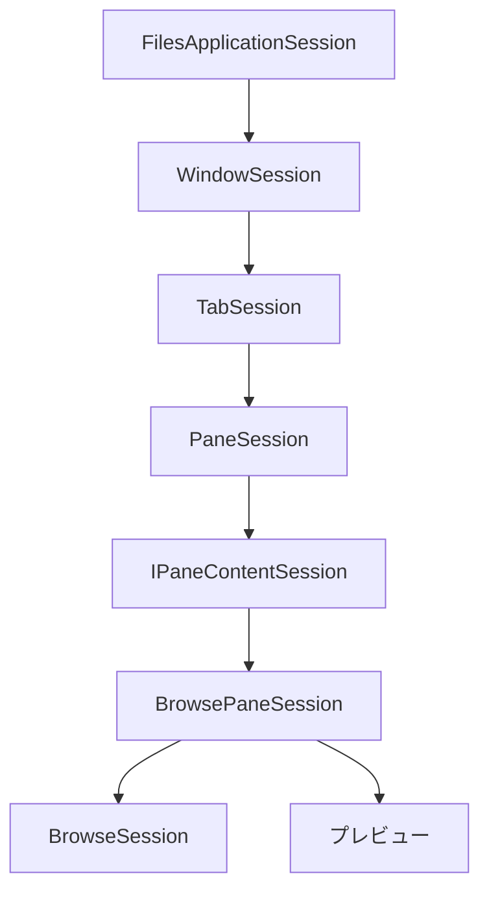
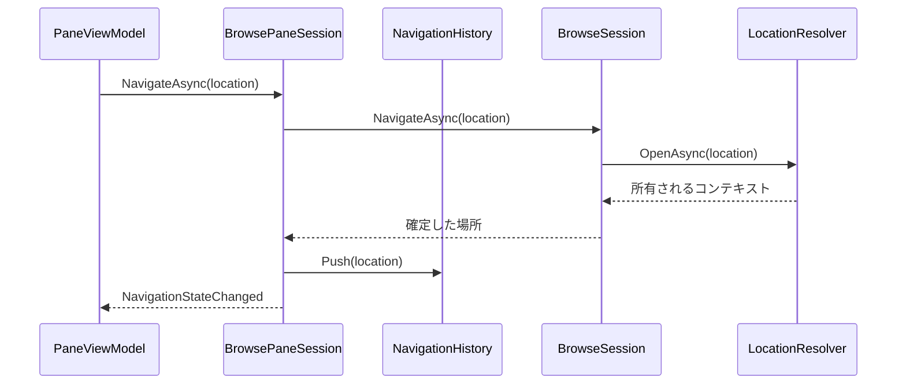
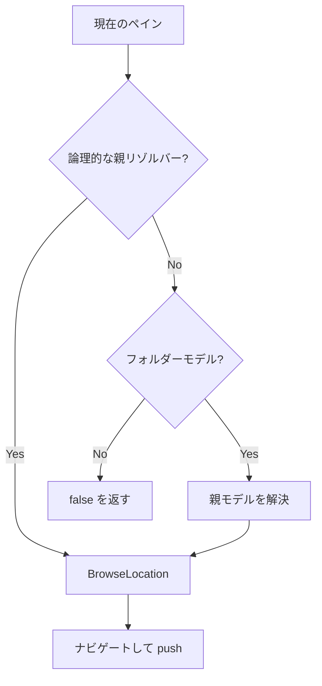
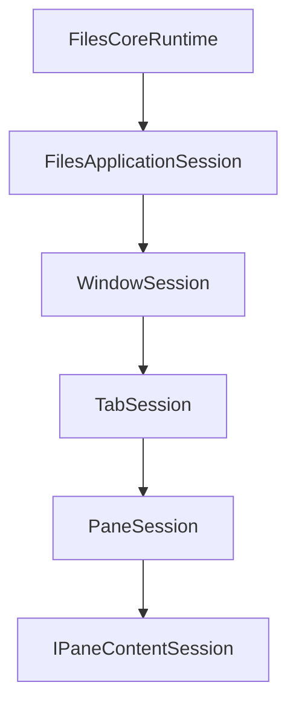

# Shell Session モデルグラフ

`Files.Core.Sessions` は、Files プロセスの UI 非依存な Shell Session 状態グラフです。ViewModel はこのモデルを適応し、
モデルは参照状態を所有しますが WinUI を参照しません。ストレージ CoreModel を Files 向けへ変換する項目 AppModel とは別のグラフです。



## 責務

| モデル | 所有するもの | 所有しないもの |
| --- | --- | --- |
| `FilesApplicationSession` | ウィンドウとアクティブウィンドウの識別情報 | WinUI `Application` やアクティブ化 |
| `WindowSession` | 順序付きタブとアクティブタブ | `Window`、`AppWindow`、タイトルバー |
| `TabSession` | 1～2 個のペイン、アクティブペイン、分割方向 | タブコントロールやドラッグ表示 |
| `PaneSession` | 安定 ID と 1 つの `IPaneContentSession` | content 固有の状態、`Frame`、リストコントロール |
| `BrowsePaneSession` | ナビゲーション履歴、参照セッション、プレビューモデル | viewport、先読みコーディネーター、プレビュー HWND |
| `BrowseSession` | 場所コンテキスト、項目モデル、投影、選択、表示値、ビュー設定 | observable collection や XAML オブジェクト |

モデル ID はプロセス内の相関 ID です。ストレージの識別情報はウィンドウ、タブ、ペインの ID ではなく、
`StorableReference` から得ます。

## 責務の確認

`BrowseSession` は、1 つの参照可能なペインの状態をまとめる aggregate root です。公開面は、
ナビゲーションのトランザクション、アクティブな場所コンテキスト、不変の項目スナップショット、選択、表示状態を調整します。
ブラウザーに関係するすべての処理を詰め込む場所ではありません。

現在の責務の境界は次のとおりです。

| 関心事 | 所有者 |
| --- | --- |
| 戻る/進むの履歴と閲覧 content のライフタイム | `BrowsePaneSession` と `BrowseNavigationHistory` |
| 場所ごとのオープンと列挙 | `IBrowseLocationHandler` と `IBrowseLocationContext` |
| 項目の順序と細粒度のコレクション変更 | `BrowseItemProjection` |
| プロパティとサムネイルのスケジュール | UI が所有する `BrowsePrefetchCoordinator` |
| 選択の整合性 | `BrowseSelectionModel` |
| UI 非依存な表示値キャッシュ | `BrowsePresentationStore` |
| フォルダー変更キューと refresh pump | `BrowseChangeCoordinator` |
| プレビューの選択とライフタイム | `BrowsePreviewModel` |
| 作成、名前変更、コピー、移動、削除 | `IStorageOperationService` |
| observable collection と dispatcher への適用 | Files のコレクションアダプター |
| コマンド、ダイアログ、表示状態 | Files |

`IBrowseSession` を公開境界とし、新しい処理が独自のライフタイム、キュー、整合性不変条件を持つ場合、
責務を直接追加せず、この aggregate の背後に内部コラボレーターを抽出します。現在は選択、表示状態、フォルダー変更キューをそれぞれ分離しています。
ソースファイルを短くするだけの目的で抽出せず、最初の UI コンシューマーで独立してテストできる境界を確認してください。

次のものを `BrowseSession` に入れてはいけません。WinUI 型、observable collection、ローカライズ文字列、コマンド実装、ダイアログ、
Shell 相互運用、ソース固有の分岐、プロセスサービスの検索です。

## Trickle-down MVVM の適用

Shell Session グラフと ViewModel グラフは、同じ所有階層と粒度を保ちます。

| 層 | 原則 | 禁止すること |
| --- | --- | --- |
| Shell Session | 子セッションを作成・所有し、設定済みの依存関係を子へ渡す | WinUI 型、View の一時表示状態、サービスロケーター |
| ViewModel | 直接の Session/AppModel を通知、コマンド binding、表示用コレクションへ適応する | `FilesCoreRuntime`、`IStorageWorkspace`、`IServiceProvider` の探索 |
| View / Control | DP で ViewModel を受け取り、template と code-behind で UI 挙動を所有する | Control 内部実装のための汎用 ViewModel、Core の直接呼び出し |

ViewModel が Core の差分を `ObservableCollection` へ投影する場合は、明示的な UI adapter を合成ルートで作ります。
adapter のために dispatcher や Workspace が必要でも、それを入れ子の ViewModel へ無制限に引き継がないでください。
`WindowPresentationFactory` が Workspace、dispatcher、command manager と子 ViewModel の生成を window scope で合成します。
新しい ViewModel は、直接モデルと専用 presenter/factory だけで構築できることを受け入れ条件にします。

View は次の境界を守ります。`PaneHost` は pane の配置と active 状態だけを扱い、`PaneView` が pane ごとのスクロールを所有します。
`PaneContentView` は typed content presentation の描画、`FolderBrowser` は view mode の選択、各 folder view は入力・選択・viewport の UI 操作を所有します。

## グラフの作成

通常の UI アプリケーションは `FilesCoreRuntime.ShellSession` から準備済みの `FilesApplicationSession` を受け取ります。テストや特殊なホストでは、
`BrowsePaneSessionFactory` からグラフを構築できます。

```csharp
await using var runtime = new FilesCoreBuilder()
	.AddWindowsStorage()
	.Build();

var window = await runtime.ShellSession.CreateWindowAsync(
	HomeLocation.Instance,
	cancellationToken);
var pane = window.ActiveTab!.ActivePane!;
var browsePane = (BrowsePaneSession)pane.Content;
```

`CreateWindowAsync` は 1 つのタブと 1 つのペインを作ります。タブが持てるペインは最大 2 つです。

CLI やバックグラウンドホストは Window/Tab/Pane のサブツリーを作成する必要がありません。`runtime.Workspace` から root や `StorableReference` を解決し、
必要な場合だけ `runtime.StorageOperations` を利用します。コマンドライン構文、標準入出力、終了コードは CLI adapter に置き、Workspace/AppModel へ持ち込みません。

```csharp
var secondPane = await window.ActiveTab!.OpenSplitAsync(
	PaneSplitOrientation.Vertical,
	cancellationToken: cancellationToken);
```

子を閉じると、終了操作が完了する前にサブツリー全体を破棄します。

## ペインのナビゲーション

`BrowsePaneSession` はナビゲーションを直列化します。push が成功すると古い forward 分岐を削除し、replace は現在の履歴エントリを更新します。
戻ると進むでは、参照セッションが宛先を受け入れた後にだけ履歴カーソルを移動します。



履歴にはパスではなく `BrowseLocation` の値を格納します。`FolderLocation` は安定した `StorableReference` を持ち、復旧アドレスを置き換えても重複エントリを作りません。
最新の場所の値が古いエントリを置き換えるため、`LastKnownAddress` は新鮮に保たれます。

`ArchiveLocation` は外側アーカイブの安定した参照と、正規化された論理エントリパスを含みます。スコープ付きアーカイブエントリのソース ID や認証情報を含めてはいけません。

`BrowseNavigationHistorySnapshot` は不変で、カーソルを検証します。多相な `BrowseLocation` の値を明示的なシリアライズスキーマへ変換すれば、
Files の永続化 DTO に適しています。ウィンドウセッションの保存とバージョン管理は、アプリケーションのアクティブ化とユーザー設定ポリシーを含むため Files に属します。

## 上位へのナビゲーション

`BrowsePaneSession.GoUpAsync` はまず、アーカイブのような論理的な場所について `IBrowseLocationParentResolver` を尊重します。アーカイブ内では別の `ArchiveLocation` を作り、
アーカイブのルートからは外側ストレージ項目の親を解決します。その他のフォルダーでは現在の `IFolderModel` を使い、親の安定した参照を取得して一時的な親モデルを作り、
ナビゲーション後に破棄します。ルートまたはフォルダーでない場所では `false` を返します。



## 選択と項目アクセス

選択はモデル参照やアドレスではなく、安定した `StorableKey` の値として `BrowseSession` に保存します。
操作で現在のモデルスナップショットが必要な場合は、`GetFocusedItem()` と `GetSelectedItems()` を使います。
ナビゲーションやフォルダー変更イベントをまたいでスナップショットを保持せず、代わりに `StorableReference` の値を取得してください。

```csharp
var selectedReferences = browsePane.BrowseSession
	.GetSelectedItems()
	.Select(static item => item.Reference)
	.ToArray();
```

## ビューポート処理

folder view は表示されている項目範囲を `BrowsePresentationAdapter` へ報告します。adapter が所有する `BrowsePrefetchCoordinator` は範囲を限定したプロパティとサムネイルを要求し、
`BrowseSession` は古い世代の結果を拒否します。Shell Session に viewport は保存しません。

UI は実体化された要素ごとではなく、範囲が変わった後にこれを呼び出します。コーディネーターは表示範囲を優先し、置き換えられた処理をキャンセルします。

## イベントと UI dispatch

Session/AppModel のイベントは、モデル遷移を確定したスレッドで発生します。WinUI dispatcher 上で実行される保証はありません。Files は次を行います。

1. イベントハンドラーで不変のモデルスナップショットを取得する。
2. ウィンドウ dispatcher に 1 回の更新をキューへ登録する。
3. ViewModel がまだ接続されていることを検証する。
4. 項目の変更を適用するか、observable projection をリセットする。

上位 Session は子の汎用イベントをバブルさせません。collection、active child、layout、navigation はそれぞれ意味別イベントで通知します。イベント呼び出しは購読者の例外を分離してトレースへ書き込みます。

## キャンセルとライフタイム

すべての親が子を所有します。



破棄は冪等です。各モデルは次を行います。

- 新しい変更の受付を停止する。
- ライフタイムトークンをキャンセルする。
- 変更用セマフォを待つ。
- 子イベントの購読を解除する。
- 所有権と逆の順序で子を破棄する。
- 後続の子を放棄せず、クリーンアップ失敗を集約する。

Files はまず ViewModel とアクティブな Shell プレビューセッションを破棄し、その後 `FilesCoreRuntime` を破棄します。
UI スレッドからこれらの非同期破棄経路を同期的にブロックしてはいけません。
