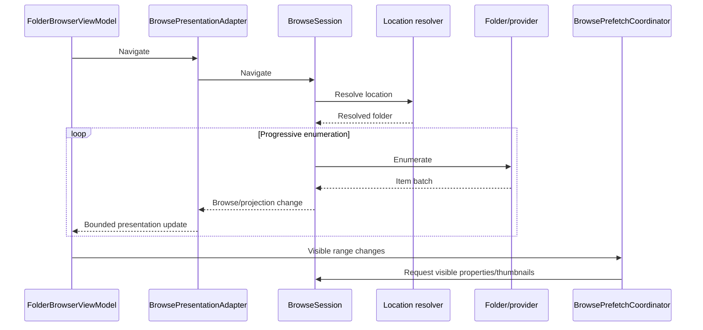

# Browsing architecture

Browsing turns a location reference into progressively available item state without blocking presentation until the whole folder is complete.

## Goals

- low time to first useful content;
- progressive enumeration;
- stable item identity;
- cancellation-safe navigation;
- independent property/thumbnail enrichment;
- bounded presentation work;
- provider independence;
- responsive interaction for very large folders.

## Architectural invariants

1. Enumeration is progressive.
2. Initial items may be published before enumeration completes.
3. A canceled/superseded navigation generation cannot publish into the active generation.
4. Item identity remains stable while metadata is enriched.
5. Properties/thumbnails do not unnecessarily block initial enumeration.
6. UI publication is bounded.
7. Browse state stays provider-agnostic.
8. Sorting, selection, grouping, and enrichment tolerate incomplete datasets while enumeration is active.

## High-level flow



The named types above are current implementation entry points. The contracts described by the flow are more important than those names.

## Navigation generations

Each navigation creates a generation/current-state boundary. When another navigation starts, older work is stale. Generation/current-state checks protect against late enumeration, property results, thumbnail results, change processing, and delayed presentation updates.

A cancellation token alone is insufficient because cancellation is cooperative and work may already have completed before observing the token.

## Progressive enumeration

Favor a small initial publication to reduce first-content latency, then larger bounded batches to reduce notification/dispatch overhead. Exact batch sizes are implementation details.

> Do not wait for the complete folder when useful rows can be shown earlier.

## Projection and identity

Projection maintains ordered/filtered browse state as batches arrive. Frequent incremental work must avoid accidentally becoming a full O(N) reconstruction per item or visible update.

Selection is identity-based state, not presentation-container ownership. Use keyed/indexed lookup for frequent reconciliation rather than repeated full-list scans when possible.

## Properties and thumbnails

Treat metadata as enrichment:

```text
identity + basic row data
    -> row publication
    -> viewport/priority detection
    -> properties / thumbnails
```

Visible and near-visible items should receive priority. Append-only enumeration should not invalidate useful visible-item work unless the underlying item/generation actually became stale.

## Sorting and grouping

Sorting/grouping must work while enumeration is incomplete and after it becomes final. Avoid designs where every appended batch triggers unbounded full sorting/group reconstruction on the UI thread.

## Change notifications

Provider changes can race with enumeration/enrichment. Reconcile by stable identity and bounded diffs where possible rather than forcing an unconditional full reload. See [`../subsystems/change-notifications.md`](../subsystems/change-notifications.md).

## Performance priorities

1. UI responsiveness.
2. Time to first realized/useful row.
3. Responsiveness while enumeration/enrichment continues.
4. Total enumeration completion.
5. Background metadata completion.

Performance measurement and real-folder scenarios are tracked in [issue #5](https://github.com/0x5bfa/ReFiles/issues/5) and documented in [`../development/performance.md`](../development/performance.md).

## Tests protecting this contract

Tests should cover first-row-before-completion behavior, bounded publication, stale navigation rejection, repeated-navigation behavior, stable property enrichment, selection reconciliation, large-folder virtualization, and cleanup during navigation replacement.

## Common mistakes

- waiting for every item before publishing;
- retrieving all thumbnails before rows appear;
- full-list scans on frequent hot paths;
- invalidating all prefetch on append-only updates;
- replacing ViewModels because metadata changed;
- large sort/group work synchronously on the UI thread;
- relying only on cancellation tokens for stale-result safety;
- provider-specific branches in generic browse code.
