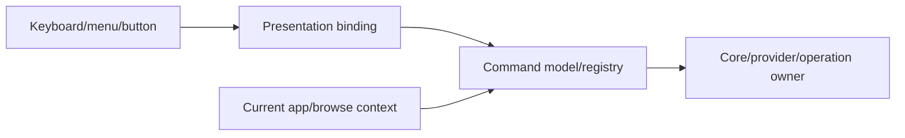

# Command architecture

Commands turn user or application intent into actions without making WinUI controls responsible for storage/application semantics.

## Responsibilities

The command system should:

- define stable command identities/intents;
- expose availability/state from relevant application/Core state;
- route execution to the component that owns the operation;
- allow presentation to bind/invoke without knowing provider internals;
- invalidate command state only when its dependencies change.

## Non-responsibilities

Commands should not become a backdoor for:

- ViewModels inside Core/provider code;
- direct Shell COM calls from controls;
- global state refresh after every browse notification;
- provider-specific branching in generic UI.

## Flow

## State invalidation

`CanExecute`, labels, or related state may depend on selection, current location, capabilities, or operation state. Track those dependencies and refresh affected commands rather than recalculating every command for every item batch.

## Provider capabilities

Commands that need optional provider behavior should query the relevant capability/contract. Unsupported behavior should naturally result in unavailable command state rather than provider-type checks in the UI.

## Long-running work

A command invocation may start asynchronous or out-of-process work; the command object itself does not need to retain operation resources indefinitely. Ownership and progress belong to the appropriate operation/session model.

## Tests

Cover routing, availability changes for relevant dependencies, unsupported capabilities, cancellation/errors, and the absence of unrelated global refresh behavior on hot browse paths.
