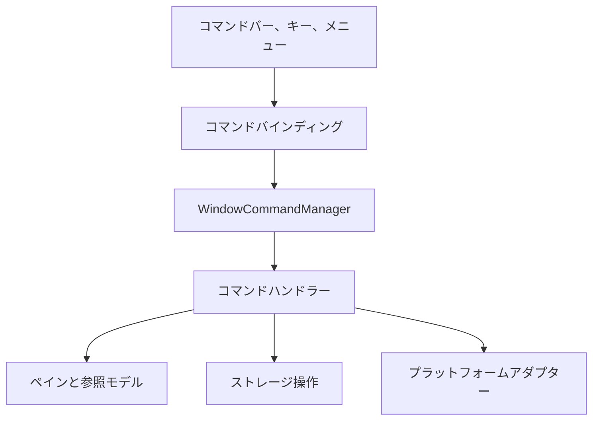
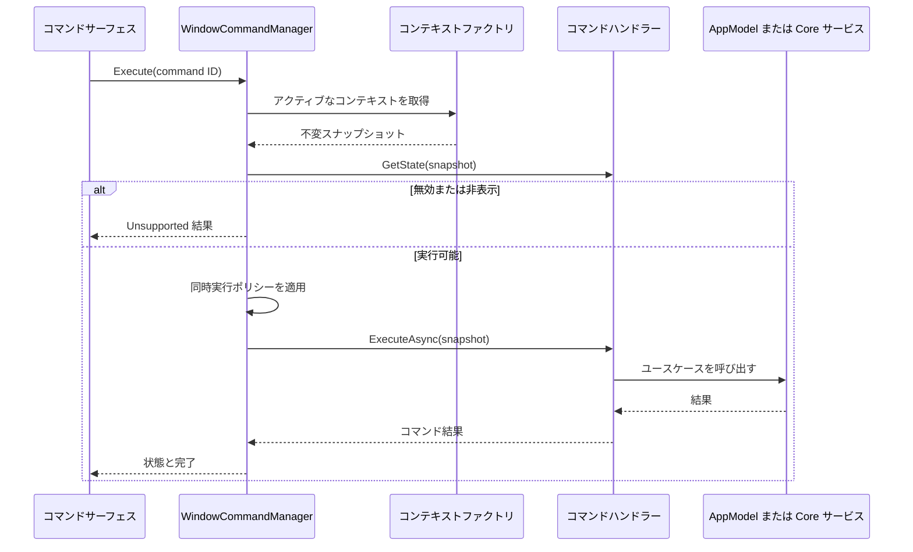
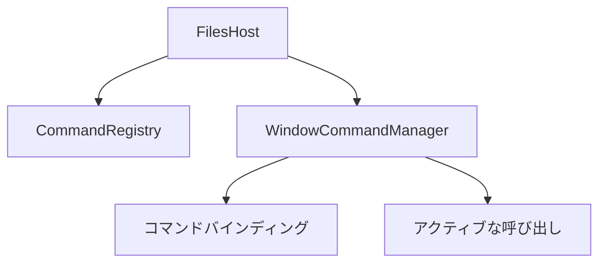

# Files のコマンド実行

Files は、コマンドバー、キーボードショートカット、コンテキストメニュー、コマンドパレット、
自動化から利用できる 1 つのコマンド経路を必要とします。この経路は、ウィンドウ単位の UI 意図を、
Files.Core にすでに実装されているナビゲーションとストレージのユースケースへ適応します。

これはアプリケーション境界です。Files.Core はナビゲーション状態、ストレージ操作要求、ソース選択、
結果の契約を引き続き所有します。Files はローカライズされた表示、入力ジェスチャー、プロンプト、
進行状況 UI、エラーポリシーを所有します。

## 目標

- 組み込みコマンドごとに、ラベル、アイコン、ショートカットから独立した安定した ID を与える。
- 非同期処理が始まる前に不変の呼び出しコンテキストを取得する。
- どの UI サーフェスから呼び出しても同じハンドラーを使う。
- アクティブなウィンドウモデルから有効、表示、チェック状態を導出する。
- キャンセルと同時呼び出しの動作を明示する。
- XAML コントロールを構築せずにハンドラーをテスト可能にする。
- コマンドレジストリをサービスロケーターに変えず、選択範囲に限定したコマンド拡張を許可する。

コマンドシステムは `PaneModel`、`IStorageOperationService`、ソース項目機能の合成、WinUI の入力ルーティングを
置き換えません。これら既存の境界を調整するものです。

## 依存関係の境界



Files.Core は `ICommand`、`XamlUICommand`、ローカライズリソースローダー、ダイアログ、ウィンドウハンドル、
キーボード型を参照してはいけません。Files のハンドラーは、直接渡された AppModel と必要最小限のアダプター
インターフェースには依存できますが、グローバルコンテナーから依存関係を解決してはいけません。

## 提案するソース配置

```text
src/Files/Commands/
  CommandId.cs
  CommandDescriptor.cs
  CommandContext.cs
  CommandState.cs
  CommandExecutionResult.cs
  CommandConcurrencyPolicy.cs
  ICommandHandler.cs
  CommandRegistry.cs
  CommandRegistryBuilder.cs
  WindowCommandManager.cs
  CommandBindingViewModel.cs
  CommandContextFactory.cs
  Adapters/
    NavigationCommandAdapter.cs
    StorageCommandAdapter.cs
    ClipboardCommandAdapter.cs
  Contributions/
    ISelectionCommandSource.cs
    CommandContribution.cs
```

`CommandRegistry` はアプリケーションの合成中に構築する不変のカタログです。`WindowCommandManager` はウィンドウごとに
1 回作成し、そのウィンドウのコマンドの状態と実行のライフタイムを所有します。

## Core の契約

### 安定した識別子と表示

ショートカットとカスタマイズは安定した文字列 ID で永続化します。ローカライズされたラベルや enum の序数を永続化してはいけません。

```csharp
public readonly record struct CommandId
{
	public CommandId(string value)
	{
		ArgumentException.ThrowIfNullOrWhiteSpace(value);
		Value = value;
	}

	public string Value { get; }
}

public sealed record CommandDescriptor(
	CommandId Id,
	string LabelResourceKey,
	string DescriptionResourceKey,
	string IconKey,
	string Group,
	int Order,
	IReadOnlyList<KeyGesture> DefaultGestures);
```

組み込み ID には、`files.navigation.back`、`files.item.rename`、`files.clipboard.paste` のようなバージョンに依存しない
名前空間を使います。ID の削除や名前変更には設定の移行が必要です。

記述子に含めるのはリソースキーとアイコンキーであり、構築済みの WinUI オブジェクトではありません。
`CommandBindingViewModel` がウィンドウ用にキーを解決し、dispatcher に依存するアイコンまたは `XamlUICommand` を作成します。

### 不変の呼び出しコンテキスト

マネージャーはコマンドが呼び出された時点でコンテキストを取得します。

```csharp
public sealed record CommandInvocation(
	CommandInvocationSource Source,
	StorableReference? InvokedItem = null);

public sealed record CommandContext(
	Guid WindowId,
	Guid TabId,
	Guid PaneId,
	BrowseLocation Location,
	ImmutableArray<StorableReference> Selection,
	StorableReference? FocusedItem,
	StorableReference? InvokedItem,
	long BrowseGeneration,
	long ItemsVersion,
	CommandInvocationSource InvocationSource);
```

コンテキストに保持するのは参照とモデル ID であり、`IStorableModel` インスタンスや XAML コントロールではありません。
現在のモデルが必要ならハンドラーが参照をもう一度解決します。現在の参照スナップショットに依存するハンドラーは、
待機したプロンプトやプラットフォーム呼び出しの後に世代と項目バージョンを検証します。

`CommandContextFactory` はウィンドウスコープで、UI dispatcher 上のアクティブなタブ、ペイン、選択、フォーカス項目をアトミックに読み取ります。
ダブルクリックのように呼び出した項目が明確な入力だけは、型付き `CommandInvocation.InvokedItem` として受け取り、現在のペインへの所属を検証してコピーします。
コマンドマネージャーはビューから任意の `object` パラメーターを受け付けません。

### 状態と実行

選択、フォーカス、読み込みの変更で多くのバインディングが同時に無効になるため、状態クエリは安価で同期的でなければなりません。

```csharp
public sealed record CommandState(
	bool IsVisible,
	bool IsEnabled,
	bool IsChecked = false,
	string? DisabledReasonResourceKey = null);

public interface ICommandHandler
{
	CommandId Id { get; }

	CommandConcurrencyPolicy ConcurrencyPolicy { get; }

	CommandState GetState(CommandContext context);

	ValueTask<CommandExecutionResult> ExecuteAsync(
		CommandContext context,
		IProgress<CommandProgress>? progress = null,
		CancellationToken cancellationToken = default);
}
```

`GetState` は AppModel の状態を確認し、`IStorageOperationService.CanHandle` のような安価なメソッドを呼び出せます。
フォルダーの列挙、ネットワークソースへの問い合わせ、COM のアクティブ化、クリップボードの読み取り、UI の表示をしてはいけません。
高コストで未知の状態は、実行時に有用な失敗を返せるなら有効のままにするか、非同期に更新するキャッシュで供給します。

実行は明示的な結果を返します。

```csharp
public enum CommandExecutionStatus
{
	Succeeded,
	Canceled,
	Unsupported,
	PartiallySucceeded,
	Failed,
}

public sealed record CommandExecutionResult(
	CommandExecutionStatus Status,
	IReadOnlyList<CommandItemResult> Items,
	Exception? Error = null);
```

想定されるキャンセルはエラーダイアログではありません。複数項目コマンドでは、部分成功を 1 つの例外に潰さず、項目ごとの結果を保持します。

## レジストリとウィンドウマネージャー

`CommandRegistryBuilder` はプロセスの合成時に明示的なハンドラーファクトリを受け取ります。組み込み ID の重複は拒否します。
`Build` は不変のレジストリを生成し、1 回だけ呼び出せます。

ファクトリには明示的なアプリケーションサービスを渡します。末端のハンドラーに `IServiceProvider`、`FilesCoreRuntime`、レジストリ自体を渡してはいけません。

`WindowCommandManager` の責務:

- 登録されたウィンドウスコープの各コマンドにつき 1 つのハンドラーインスタンスを所有する。
- 各コマンドのアクティブなキャンセルトークンと同時実行ゲートを所有する。
- ビューに安定した `CommandBindingViewModel` インスタンスを公開する。
- アクティブなペイン、選択、参照世代、クリップボードスナップショット、操作状態が変わったら状態を再計算する。
- ウィンドウの dispatcher 上で、まとめられた状態変更通知を 1 回発行する。
- 破棄後の呼び出しを拒否する。

バインディングは WinUI のコマンドインターフェースを表示用アダプターとして実装します。その `Execute` はマネージャーのタスクを開始し、
失敗をウィンドウのエラーポリシーへ転送します。`async void` ハンドラーにコマンドロジックを含めてはいけません。

## 呼び出しの流れ



呼び出し時には状態をもう一度確認します。UI に表示された古い `CanExecute` 値だけで操作を許可してはいけません。

## 同時実行とキャンセル

各記述子が 1 つのポリシーを選択します。

| ポリシー | 動作 | 代表的なコマンド |
| --- | --- | --- |
| `CancelPrevious` | 前の呼び出しをキャンセルしてから新しい呼び出しを開始 | 移動、更新、検索 |
| `RejectWhileRunning` | 1 つだけ実行し、繰り返しを無効化 | 名前変更、作成、プロパティ |
| `Serialize` | 呼び出しを順番にキューへ入れる | クリップボード貼り付け、順序付き一括操作 |
| `AllowParallel` | 個別の進行状況で独立に実行 | 新しいウィンドウで開く |

キャンセルはウィンドウ、ペイン、コマンド呼び出しにリンクします。ペインを閉じるとペインのコマンドをキャンセルし、
ウィンドウを閉じるとそのウィンドウのすべてのコマンドをキャンセルします。プロセスホストを破棄するのは、すべてのウィンドウマネージャーが停止してからです。

ストレージ操作の完了を待つ間に UI dispatcher を占有してはいけません。プロンプトと状態更新は、ウィンドウの `IUiDispatcher` を通じて dispatcher へマーシャリングします。

## ナビゲーションアダプター

`NavigationCommandAdapter` はウィンドウ構築時に直接渡された `PaneModel` を呼び出します。

| コマンド ID | モデル操作 | 状態ソース |
| --- | --- | --- |
| `files.navigation.back` | `GoBackAsync` | `CanGoBack` と `IsLoading` |
| `files.navigation.forward` | `GoForwardAsync` | `CanGoForward` と `IsLoading` |
| `files.navigation.up` | `GoUpAsync` | `CanGoUp` と `IsLoading` |
| `files.navigation.refresh` | `RefreshAsync` | ペイン所属と読み込みポリシー |
| `files.item.open` | `BrowseLocation` を解決するか起動対象を開く | 呼び出し項目、フォーカス項目、選択数 |

開く処理では通常のフォルダー形状より先に `IArchiveEntry` と `IArchiveSource` を確認します。これにより Shell 優先のアーカイブ動作と、
暗号化アーカイブのフォールバックを維持できます。参照できないファイルを開く場合は、フォルダーナビゲーションではなくプラットフォーム起動アダプターへ送ります。
ダブルクリック、Enter、単一クリック設定、コンテキストメニューはすべてこのコマンドへ集約します。
通常ファイルの起動対象、Quick Look、クリック時の参照取得は [Files の項目機能とアクティブ化](files-app-features.md#ファイルを開く) で定義します。

ナビゲーションのキャンセルでは、新しい場所が正常に開くまで履歴を変更しません。ペインが履歴の権威ある所有者です。

## ストレージアダプター

`StorageCommandAdapter` はアプリケーションの意図を既存の `StorageOperationRequest` 値へ変換します。

| コマンド ID | 要求 |
| --- | --- |
| `files.item.rename` | `RenameOperationRequest` |
| `files.item.createFile` | `CreateItemOperationRequest` |
| `files.item.createFolder` | `CreateItemOperationRequest` |
| `files.item.copyTo` | `CopyOperationRequest` |
| `files.item.moveTo` | `MoveOperationRequest` |
| `files.item.delete` | `DeleteOperationRequest` |

アダプターは要求に関する UI ポリシーを所有します。

1. `CommandContext` から参照を取得する。
2. 名前、宛先、競合時の選択、削除確認を要求する。
3. ペインと関連する参照世代がまだ存在することを確認する。
4. `IStorageOperationService` を呼び出す。
5. 進行状況と項目ごとの結果を集約する。
6. 返された参照は、表示またはフォーカスの意図にだけ使う。

成功した操作の後に表示項目コレクションを直接編集することはありません。フォルダー変更通知がセッションを調整します。
ソースが変更通知を提供しない場合、アダプターは操作完了後に範囲を限定した更新を 1 回要求します。

既存の操作要求は意図的に単一項目です。複数選択では範囲を限定したスケジューリングを使い、すべての項目結果を保持します。
将来、ハンドラーが専用の一括要求を追加することはできますが、バックエンドが提供できない原子性を Files が主張してはいけません。

同一ソースの要求は引き続き `IStorageOperationService` を通ります。Windows と FTP 間などソースをまたぐコマンドには、
[クリップボード、ドラッグ/ドロップ、Shell 連携](platform-interactions.md) で説明する別の汎用転送コーディネーターが必要です。

## 動的なコマンド拡張

組み込みコマンドには安定したプロセス登録があります。拡張機能または Shell 以外の統合から提供されるコンテキスト依存コマンドには、
選択範囲に限定したコマンドソースを使います。

```csharp
public interface ISelectionCommandSource
{
	ValueTask<IReadOnlyList<CommandContribution>> GetCommandsAsync(
		CommandContext context,
		CancellationToken cancellationToken = default);

	ValueTask<CommandExecutionResult> ExecuteAsync(
		CommandContributionToken token,
		CommandContext context,
		CancellationToken cancellationToken = default);
}
```

拡張は記述子、ソースが所有する不透明なトークン、作成対象の世代を含みます。選択または参照世代が変わると、マネージャーは拡張を破棄します。

これは `item.Get<ICommand>()` ではありません。コマンドは、複数の選択項目、共通の親、宛先、ウィンドウポリシーに依存することが多く、
項目機能ではそのコンテキストを正しく表現できません。

Windows Shell 動詞には、この拡張契約ではなくネイティブメニューセッションを使います。オーナー描画、動的、入れ子の Shell 拡張を XAML に忠実にコピーできないためです。
Files 標準とプラグインのコマンドでは、この契約を使えます。

## ショートカットと表示

ショートカット設定は `CommandId` をシリアライズされたジェスチャーへ対応付けます。読み込み時には次を行います。

1. 不正なジェスチャーを破棄する。
2. 重複を決定論的に検出する。
3. 既定値より明示的なユーザーバインディングを優先する。
4. 関係のない設定を書き換えずに、解決できない競合を報告する。
5. 一時的に利用できない拡張がカスタマイズを破壊しないよう、未知のコマンド ID を保持する。

入力ルーティングは、コマンドを呼び出す前にアクティブなウィンドウとペインを解決します。プロセス全体のショートカットでも、
ウィンドウスコープの `CommandContext` を生成しなければなりません。

ラベル、説明、アクセスキー、アイコン、オートメーション名は表示メタデータとして残します。ハンドラーにローカライズ文字列を含めたり、UI 要素を構築させたりしません。

## エラーとテレメトリのポリシー

マネージャーは、コマンド ID、呼び出し元、所要時間、最終状態、バックエンドカテゴリを記録します。項目名、パス、FTP 認証情報、
クリップボードの内容、Shell コマンドパラメーターは、既定では記録しません。

Files は結果を次のように扱います。

- キャンセル: エラー UI を表示しない。
- 未サポート: コマンドを無効にするか、簡潔な説明を表示する。
- アクセス拒否: 適用可能な権限または昇格の経路を提示する。
- 部分成功: 失敗した項目だけを表示し、成功した作業は保持する。
- 想定外の失敗: 例外をログに記録し、安定したエラーコードを表示する。

Files がメッセージを選ぶ必要がある場合、ハンドラーはバックエンドのエラーを変更せずに返します。例外を握りつぶしてコマンドを成功したように見せてはいけません。

## 所有権



ホストは不変のレジストリを所有します。各ウィンドウはマネージャー、バインディングオブジェクト、コンテキストファクトリ、購読、アクティブな呼び出しを所有します。
ウィンドウを閉じるときは次の順で行います。

1. 新しいコマンド実行を停止する。
2. アクティブな呼び出しをキャンセルする。
3. 状態入力の購読を解除する。
4. コマンドハンドラーとプラットフォームセッションを破棄する。
5. ViewModel を破棄する。
6. Core のウィンドウモデルを解放する。

## テスト

ユニットテストでは次をカバーします。

- コマンド ID 重複の拒否。
- モデルインスタンスではなく参照を使ったコンテキスト取得。
- 状態の再計算と通知の集約。
- すべての同時実行ポリシー。
- プロンプト中および操作中のキャンセル。
- 古い参照世代の拒否。
- ナビゲーションの対応付けとアーカイブを開く順序。
- ストレージ要求の構築。
- 複数項目の部分成功と同時実行数の制限。
- ショートカット競合の解決。
- 選択変更後の拡張無効化。

偽のハンドラーと直接の AppModel を使います。コマンドテストでは WinUI コントロールを構築しません。小さな Windows 統合スイートでは、
バインディングと dispatcher アダプターだけを検証します。

## 既存コマンドシステムからの移行

現在の `IRichCommand` は、WinUI オブジェクト、ローカライズ、ホットキー、状態、実行を組み合わせ、グローバル IoC からサービスを解決しています。
これをそのまま新しいフォルダーへ移してはいけません。

段階的に移行します。

1. 既存のコマンド設定と互換性のある安定した `CommandId` 値を導入する。
2. レジストリと 1 つのウィンドウマネージャーを構築する。
3. 新しい `PaneModel` に対するナビゲーションハンドラーを実装する。
4. `IStorageOperationService` に対するストレージハンドラーを実装する。
5. 既存のコマンドバーとショートカットサーフェスを `CommandBindingViewModel` に適応する。
6. クリップボードと Shell コマンドをプラットフォームアダプターへ移行する。
7. 古い `IAction` と `IRichCommand` の最終利用者が移行した後、登録を削除する。

移行中は、一時的なレガシーハンドラーが古いアクションを呼び出しても構いません。ただし新しいハンドラーは `Ioc.Default` に依存してはいけません。

### Files への適用

`Files` は、`src/Files/Commands/`でこの command boundary を UI adapter として適用します。

- `App2CommandRegistration.Build()`（改名前の残存型名）が `App` の composition root で一度だけ呼び出され、
  `CommandRegistryBuilder`へstable ID、descriptor、handler factoryを明示登録します。
- `CommandRegistry`はprocess-levelのimmutable catalogです。`MainWindow`から作られた各`RootViewModel`は、
  そのcatalogから独立した`WindowCommandManager`を作成します。
- `CommandBindingViewModel`はWinUIの`ICommand` binding adapterです。`NavigationToolbar`、
  `ToolbarView`、custom `TabView`、native `NavigationView`のHome、folder double-clickは
  `WindowCommandManager`を経由します。
- browsing command はCore modelをXAMLへ公開せず、`RootViewModel`のactive tab/browserと
  `CoreBrowseAdapter`を使います。storage operation、shortcut、localization、extension commandは
  同じ登録境界へ追加します。

これは Trickle-down MVVM の例外ではありません。registry は process scope、manager は window scope、
`CommandContext` は active pane scope とし、ViewModel は binding adapter に留めます。新しい pane/context command は
`RootViewModel` の全体状態を直接読むのではなく、`PaneModel` または明示的な window/pane context から評価します。
Control は `FolderBrowser` や現在の pane の command surface を dependency property で受け取り、
handler や service を Control 内で解決しません。

## 実装順序

1. 値の契約とレジストリビルダーを追加する。
2. `CommandContextFactory` と `WindowCommandManager` を追加する。
3. ナビゲーションハンドラーとユニットテストを追加する。
4. ストレージハンドラー、進行状況の集約、ユニットテストを追加する。
5. WinUI バインディングとショートカットアダプターを追加する。
6. クリップボードとドラッグ/ドロップのコマンドを追加する。
7. Shell とプラグインの拡張を追加する。
8. 対応するレガシーコマンド経路を削除する。

## アンチパターン

次のことをしてはいけません。

- Files.Core に `ICommand` または WinUI 型を追加する。
- 実行時にグローバル IoC からハンドラーを解決する。
- プロンプトまたは長時間の操作をまたいで `IStorableModel` を保持する。
- 永続化するコマンド識別にラベル、インデックス、enum の序数を使う。
- `GetState` でネットワーク、COM、列挙の処理を行う。
- 操作後に `BrowseSessionModel.Items` を変更する。
- 複数選択コマンドを項目機能として表現する。
- ネイティブ Shell メニュー項目を XAML にコピーし、すべての拡張が動作すると仮定する。
- `async void` メソッドに実行やエラー処理を所有させる。
