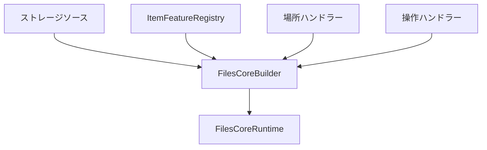
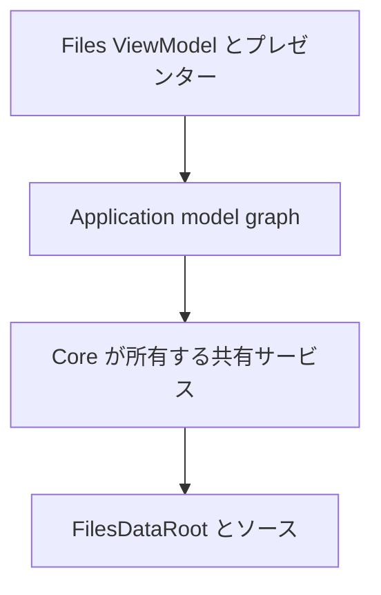

# 合成ルート

`FilesCoreBuilder` は新しいモデルグラフの正式な合成境界です。項目モデルを作成する前に、ソース単位のサービスを集め、
それらを所有する `FilesCoreRuntime` を生成します。



## Core の標準サービス

builder は常に次を登録します。

| サービス | 既定値 |
| --- | --- |
| サムネイルの合成 | `ThumbnailSourceCombiner` による優先度フォールバック |
| プロパティの合成 | `PropertySourceCombiner` による優先度マージ |
| プレビューの合成 | `PreviewSourceCombiner` による優先度ルーティング |
| サムネイルラッパー | 共有 `MemoryThumbnailCache` |
| ビュー設定 | `InMemoryViewSettingsStore` |
| 場所 | `HomeBrowseLocationHandler` と `FolderBrowseLocationHandler` |
| AppModel | `BrowsePaneFactory` と `FilesApplicationModel` |
| 操作 | 登録済みハンドラーを使う `StorageOperationService` |

Files は `Build` の前に、永続化された `IViewSettingsStore` と durable または instrumented な `IThumbnailCache` を注入します。

## Windows の垂直スライス

`AddWindowsStorage` は、1 つの `WindowsStorageSource`、その操作ハンドラー、Windows のサムネイル/プロパティ/フォルダー変更ファクトリ、
ストリームプレビューローダー、Windows Shell プレビューローダー、既定のアーカイブ参照を登録します。

```csharp
var builder = new FilesCoreBuilder(
	viewSettingsStore,
	thumbnailCache);

builder.AddWindowsStorage(
	streamPreviewPolicy: previewAccessPolicy,
	shellPreviewPolicy: shellPreviewPolicy,
	archiveCredentialResolver: archiveCredentials);

await using var runtime = builder.Build();
```

既知のストリーム形式の優先度は 200 です。Windows Shell プレビュー記述子の優先度は 100 です。
ストリームローダーが `null` を返すと Shell ローダーへフォールバックし、ブロック結果は終端結果になります。

`AddWindowsStorage(enablePreviews: false)` は 2 つのプレビュー経路を省略します。寛容な既定ポリシーはテストと初期統合に便利です。
本番の Files では、クラウド hydration、信頼、管理ポリシー、ユーザー設定を考慮するポリシーを注入します。

`AddWindowsStorage(enableArchives: false)` はアーカイブ項目機能とその場所ハンドラーを省略します。
`AddArchiveBrowsing` はカスタムバックエンド、probe、認証情報リゾルバーを使って独立して登録できます。既定のセレクターは Windows Shell を優先度 200、SevenZipSharp を優先度 100 で使います。

## FTP の垂直スライス

各 `AddFtpStorage` 呼び出しは、構成済みの `FtpStorageSource`、その操作ハンドラー、ソース単位のプロパティファクトリを登録します。
汎用ストリームプレビューとアーカイブ参照は 1 回だけ登録し、FTP の `IFile` ストリームを通して動作します。

```csharp
builder.AddFtpStorage(
	new FtpConnectionProfile(
		connectionId: "primary",
		displayName: "Publishing server",
		host: "ftp.example.com",
		securityMode: FtpSecurityMode.ExplicitTls,
		rootPath: "/public"),
	ftpCredentialResolver,
	streamPreviewPolicy: previewAccessPolicy,
	archiveCredentialResolver: archiveCredentials);
```

プロファイルにパスワードを含めてはいけません。Files は保護されたアプリケーション基盤を背後に持つ `IFtpCredentialResolver` を提供します。
保存済みプロファイルごとに `Build` の前に `AddFtpStorage` を 1 回呼び出してください。識別情報、ストリーム所有権、現在のランタイム登録制限は[FTP ストレージソース](ftp-storage.md)を参照してください。

## Core の拡張

バックエンドは、独立した 3 種類の登録を提供します。

```csharp
builder
	.AddStorageSource(source)
	.AddStorageOperationHandler(operationHandler)
	.AddBrowseLocationHandler(
		dataRoot => new SearchBrowseLocationHandler(dataRoot, searchService));

builder.ItemFeatures.Add<IPropertySource>(
	new PropertySourceFactory(propertyReader),
	priority: 50,
	origin: "Git");
```

- ストレージソースは CoreModel を解決し、自分の接続を所有します。
- 項目機能ファクトリは、項目単位のオプション処理を作成します。
- 場所ハンドラーは、型付き `BrowseLocation` の所有されるコンテキストを開きます。
- 操作ハンドラーは、自分が所有する参照の変更を実行します。

項目機能を登録しても、プロセス全体のサービスロケーターエントリは登録されません。`model.Get<T>()` で解決できるのは、そのモデルのレジストリとコンテキストにある項目機能契約だけです。

## ランタイムの公開面

`FilesCoreRuntime` は明示的なルートを公開します。

| プロパティ | コンシューマー |
| --- | --- |
| `Application` | ウィンドウ単位の Files ホスト |
| `PaneFactory` | テストまたはウィンドウ復元を行う特殊ホスト |
| `LocationResolver` | 診断とカスタム AppModel |
| `DataRoot` | ソース検出と明示的な参照解決 |
| `StorageOperations` | コマンドアダプター |
| `ViewSettingsStore` | 設定の診断または移行 |
| `ThumbnailCache` | 無効化とテレメトリ |
| `WindowsShellPreviewSessions` | WinUI Shell プレビュープレゼンター |

これらは構築時の依存関係です。末端の ViewModel には必要な 1 つの AppModel またはアダプターだけを渡し、runtime をサービスロケーターとして渡して使わせないでください。

## Build と dispose の保証

builder は 1 回だけ build できます。重複する `StorageSourceId` と、2 つ目の Shell プレビューセッションファクトリは拒否します。
カスタムハンドラーファクトリの構築に失敗した場合は、作成済みソース、アプリケーションモデル、所有するサービスをすべてクリーンアップし、
クリーンアップ失敗を構築失敗と一緒に集約します。

`FilesCoreBuilder` 自体は非同期で破棄できます。未構築の builder を破棄すると、受け入れたすべてのソースと所有サービスをクリーンアップします。
成功した `Build` は所有権を `FilesCoreRuntime` へ移すため、その後 builder を破棄しても何もせず、runtime が唯一の所有者になります。

runtime は次の順で破棄します。



最初のノードは Files が所有し、runtime より先に破棄しなければなりません。runtime 内部では、アプリケーションモデル、プレビュー STA などの専用サービス、ストレージソースの順に破棄します。
各段階はエラー後も継続し、最終破棄は冪等です。

## アンチパターン

次のことをしてはいけません。

- ウィンドウごとに `Build` を呼ぶ。
- 項目ごとにスケジューラー、キャッシュ、ソースを作る。
- モデル内部でグローバル IoC コンテナーから依存関係を解決する。
- WinUI レンダラーを項目機能として登録する。
- `FilesDataRoot` から借りたソースを Files が破棄する。
- `WindowsStorable` モデルを `StorableReference` の代わりに保持する。
