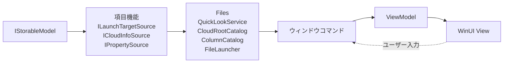
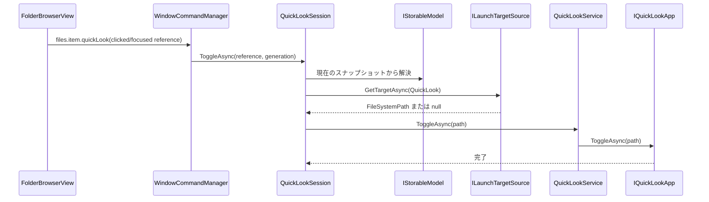
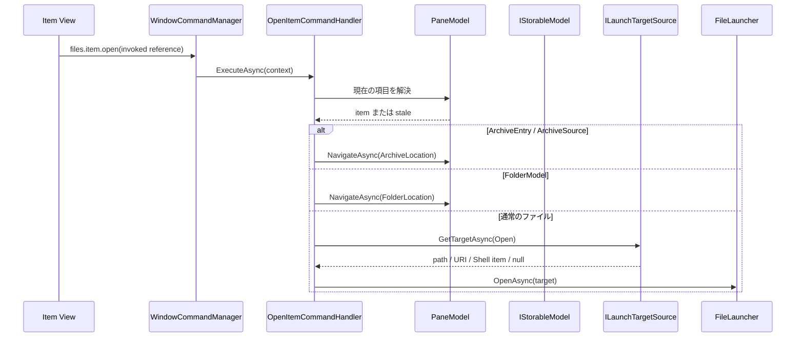
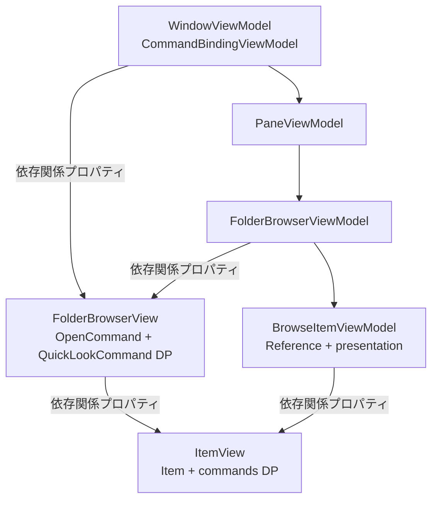

# Files の項目機能とアクティブ化

この文書では、Quick Look、クラウドプロバイダー検出、詳細ビューの列、ファイルを開く操作を、新しい Files と Files.Core のどちらへ置くかを定義します。
これらはすべて項目に関係しますが、同じライフタイムや合成単位ではありません。

## 最初に分けるもの

`model.Get<TFeature>()` が返す項目機能は、1 つの `IStorableModel` に束縛された任意機能です。
インストール済みアプリ、現在のウィンドウ、一覧全体の列、サイドバーのクラウドルートを表すグローバル capability ではありません。

| 関心事 | Files.Core の項目機能 | Files の所有物 | View / ViewModel の役割 |
| --- | --- | --- | --- |
| 通常のプレビュー | `IPreviewSource` | `PreviewPresenter` | スナップショットを表示する |
| Quick Look | `ILaunchTargetSource` | `QuickLookService` とウィンドウごとの `QuickLookSession` | `files.item.quickLook` を呼ぶ |
| クラウド | 任意の `ICloudInfoSource` と `IPropertySource` | `CloudRootCatalog` | サイドバーと同期状態を投影する |
| 列 | `IPropertySource` が値を返す | `ColumnCatalog` が列定義を合成する | 列定義と設定からセルを作る |
| ファイルを開く | `ILaunchTargetSource` | `FileLauncher` | `files.item.open` を呼ぶ |
| フォルダー / アーカイブを開く | `IFolderModel`、`IArchiveSource`、`IArchiveEntry` | コマンドハンドラー | `PaneModel` の状態を投影する |



この分割により、Core は WinUI、インストール済みアプリ、ウィンドウハンドル、アプリ選択 UI を知りません。
Files はストレージソース固有のパス生成やクラウド判定を View に書きません。

### 既存機能の置き場所

新しい契約を増やす前に、既存機能を次の形へ寄せます。

| Files の機能 | 新しい形 |
| --- | --- |
| Tags | 表示と並べ替えは `IPropertySource`、変更はタグ用コマンドハンドラー |
| Git 状態と履歴 | 1 列ごとの機能ではなく、共有 Git reader に基づく `IPropertySource` |
| Shell コンテキストメニュー | ウィンドウを認識するプラットフォームサービス |
| Open With / 既定アプリ | `FileLauncher` |
| ドラッグ用の一時書き出し | 転送セッション。ViewModel は一時パスを所有しない |
| 同期状態や Git バッジ | `BrowseItemPresentation` に投影したプロパティ。型付きのコマンド判断が必要な場合だけ専用項目機能 |

1 列、1 ボタン、1 バッジごとに項目機能を作りません。
同じバックエンド値を列、並べ替え、バッジで使う場合は、共有 reader から 1 回取得して投影します。

## 起動対象

通常のファイルオープンと Quick Look は、どちらも最終的には外部の Windows 機能へ項目を渡します。
View が `IStorableModel.Path` を仮定する代わりに、項目は任意の `ILaunchTargetSource` を公開します。

```csharp
public interface ILaunchTargetSource
{
	ValueTask<LaunchTarget?> GetTargetAsync(
		LaunchPurpose purpose,
		CancellationToken cancellationToken);
}

public enum LaunchPurpose
{
	Open,
	QuickLook,
}

public abstract record LaunchTarget
{
	public sealed record FileSystemPath(string Path) : LaunchTarget;

	public sealed record Uri(System.Uri Value) : LaunchTarget;

	public sealed record WindowsShellItem(
		ReadOnlyMemory<byte> ItemIdList) : LaunchTarget;
}
```

これは「すべての項目をローカルパスへ変換できる」という契約ではありません。

- Windows ファイルシステム項目は `FileSystemPath` を返します。
- 仮想 Shell 項目は、起動側が対応する場合だけ、所有された PIDL のコピーを `WindowsShellItem` として返します。
- URI で開けるソースは `Uri` を返せます。
- FTP やアーカイブ内のファイルは、最初の実装では `null` を返して構いません。
- 将来一時ファイルへ書き出す場合は、一時ファイルの破棄まで所有する別の `LaunchTarget` を追加します。View や ViewModel に一時パスの寿命を持たせません。

`purpose` を渡すのは、通常の関連付け起動が受け付ける対象と Quick Look アプリが受け付ける対象が同じとは限らないためです。
Quick Look 用に URI や Shell PIDL を無理にファイルパスへ変換してはいけません。

## Quick Look

Quick Look は Core のプレビュー機能とは別です。

- `IPreviewSource` は Files の情報ペイン内で表示する `PreviewResult` を返します。
- Quick Look は別プロセスの QuickLook、SeerPro、PowerToys Peek などへ現在の項目を渡します。
- 外部アプリがインストール済みかどうかは、項目の性質ではなくプロセス環境の性質です。

したがって `IQuickLookSource` を全モデルに登録したり、`FilesCoreBuilder` で Quick Look のグローバル有効フラグを作ったりはしません。

### Files の形

名前を簡単に保つため、外部アプリごとの実装を `IQuickLookApp`、選択された実装を使う共有サービスを `QuickLookService` と呼びます。

```csharp
public interface IQuickLookApp
{
	ValueTask<bool> IsAvailableAsync(CancellationToken cancellationToken);

	Task ToggleAsync(
		LaunchTarget.FileSystemPath target,
		CancellationToken cancellationToken);

	Task<bool> TrySwitchAsync(
		LaunchTarget.FileSystemPath target,
		CancellationToken cancellationToken);
}
```

`QuickLookService` はアプリケーションスコープで、次だけを行います。

1. 設定された順序で `IQuickLookApp` の利用可否を確認する。
2. 利用可能な 1 実装をキャッシュする。
3. `ToggleAsync` と `TrySwitchAsync` をその実装へ転送する。
4. アプリ設定またはインストール状態の明示的な更新時にキャッシュを無効化する。

レジストリや名前付きパイプの検出を、選択が変わるたびに行ってはいけません。
既存の `QuickLookProvider`、`SeerProProvider`、`PowerToysPeekProvider` は、最初の移行では `IQuickLookApp` の薄い実装として再利用できます。

### ウィンドウごとのセッション

`QuickLookSession` はウィンドウスコープです。このウィンドウから最初の toggle が成功した後に選択追跡を有効にしたか、
どの `StorableReference` を最後に送ったか、どの選択世代を処理中かを保持します。
外部アプリが独自に閉じられたかを推測して、正確な `IsOpen` として公開しません。



最初の toggle が成功した後はウィンドウが閉じるまで選択を追跡し、新しい参照を解決して `TrySwitchAsync` を呼びます。
外部アプリが閉じていれば switch は表示上の効果を持たず、次の toggle を妨げません。
PowerToys Peek のように切り替えに対応しない実装は `false` を返し、選択変更のたびに別プロセスを起動しません。
古い非同期結果を外部アプリへ送らないように、解決前後でペインの `Generation` と項目の所属を確認します。
ウィンドウを閉じるときは選択購読を解除します。明示的な close プロトコルがない外部アプリへ toggle を送り、閉じるつもりで再表示させてはいけません。
最後のウィンドウを破棄した後で共有 `QuickLookService` を破棄します。

利用できる Quick Look アプリがない、項目がローカルパスを返さない、または対象がフォルダーの場合は、コマンド状態を無効にするか、1 回だけ説明を表示します。
例外を握りつぶして別のプレビュー機能が成功したように見せてはいけません。

## クラウドプロバイダー検出

クラウド検出には、一覧としてのクラウドルートと、1 項目の同期状態という異なる 2 つの結果があります。

### `CloudRootCatalog`

`CloudRootCatalog` は Files のアプリケーションスコープです。Windows の登録済み同期ルートを一度読み、サイドバーと項目判定に使える不変値を公開します。
Windows API とレジストリを読む低レベル実装は `Files.Core/Storage/Windows` に置き、Files はその結果の更新とスナップショットを所有します。

```csharp
public sealed record CloudRootInfo(
	string RootId,
	string ProviderId,
	string DisplayName,
	StorableReference Root,
	ReadOnlyMemory<byte> Icon);

public interface ICloudRootCatalog
{
	IReadOnlyList<CloudRootInfo> Roots { get; }

	event EventHandler? RootsChanged;

	Task RefreshAsync(CancellationToken cancellationToken);
}
```

検出順序は次のとおりです。

1. `StorageProviderSyncRootManager` / `StorageProviderSyncRootInfo` の登録情報。
2. Windows Shell 名前空間と同期ルートの登録情報。
3. 既存互換性のために必要な、OneDrive などの限定された明示的フォールバック。

アイコン、表示名、パスの文字列だけからプロバイダーを推測しません。
レジストリ走査、アイコン読み込み、`DriveItem` 作成を 1 クラスに混ぜず、カタログは UI 非依存の値を返し、サイドバー ViewModel が表示項目へ変換します。
既存の `CloudDrivesDetector` は Windows 用カタログ実装へ、`CloudDrivesManager` はサイドバー ViewModel へ分割して移行します。
`AddWindowsStorage` は Windows 用の読み取り実装を利用可能にするだけです。すべての項目へクラウド機能を付けたり、Files が使わないカタログを起動したりはしません。

### 項目ごとの `ICloudInfoSource`

同期状態やプロバイダー列が必要な項目だけ、任意の `ICloudInfoSource` を持てます。

```csharp
public interface ICloudInfoSource
{
	ValueTask<CloudItemInfo?> GetInfoAsync(
		CancellationToken cancellationToken);
}

public sealed record CloudItemInfo(
	string RootId,
	string ProviderId,
	CloudSyncState SyncState,
	CloudAvailability Availability);
```

Windows 実装は `CloudRootCatalog` のスナップショットと Shell プロパティを使います。
項目ごとにレジストリや全同期ルートを再走査しません。
別のストレージソースがクラウド情報をすでに知っている場合は、そのソース自身の項目機能として値を返せます。

列から利用する値は同じ実装を `IPropertySource` へ適応し、次の安定した ID で公開します。

- `Files.Cloud.Provider`
- `Files.Cloud.Status`
- `Files.Cloud.Availability`

`CloudItemInfo` はコマンドやバッジの型付き判断に使い、`IPropertySource` は並べ替えと列表示に使います。
ViewModel が表示文字列を解析して同期状態を逆算してはいけません。

## 列の合成

列には、何を表示できるかという列定義と、各項目の値という 2 つの面があります。

- 列定義は一覧 / 場所の単位なので、項目機能ではありません。
- 列の値は項目単位なので、`IPropertySource` が返します。
- 表示中の列、幅、順序はユーザー状態なので、`BrowseViewSettings` が保持します。

Files は、現在の `BrowseLocationContext` に対して `ColumnCatalog` を 1 回解決します。
各列のまとまりは、難しい名前を避けて `IColumnSet` と呼びます。

```csharp
public interface IColumnSet
{
	ValueTask<IReadOnlyList<BrowseColumnDefinition>> GetColumnsAsync(
		BrowseColumnContext context,
		CancellationToken cancellationToken);
}

public sealed record BrowseColumnDefinition(
	string PropertyId,
	string DisplayName,
	ColumnValueKind ValueKind,
	double DefaultWidth,
	ColumnAlignment Alignment,
	bool CanSort,
	bool CanGroup);
```

最初の列セットは次のとおりです。

| 列セット | 列定義 | 値 |
| --- | --- | --- |
| Windows Shell | 現在の Shell フォルダーが公開する標準列 | Windows の `IPropertySource` |
| Files 基本 | Shell 列がないソース向けの名前、種類、サイズ、更新日時 | CoreModel と共通 `IPropertySource` |
| Tags | `Files.Tags` | タグ用 `IPropertySource` |
| Git | `Files.Git.Status`、`Files.Git.LastCommitDate`、`Files.Git.LastCommitMessage`、`Files.Git.CommitAuthor`、`Files.Git.CommitSha` | Git 用 `IPropertySource` |
| Cloud | `Files.Cloud.Provider`、`Files.Cloud.Status`、`Files.Cloud.Availability` | クラウド用 `IPropertySource` |

Windows Shell が返す canonical property name を `PropertyId` にします。
canonical name がない Shell 列は PROPERTYKEY から安定 ID を作り、ローカライズされた表示名を永続キーとして使いません。
Files 独自列は必ず `Files.*` 名前空間を使います。
Files が所有する列の `DisplayName` はローカライズリソースから、Shell 列は Shell が返した現在の言語の表示名から作ります。

### 合成規則

1. Windows の場所では Shell の列定義を読みます。別のソースではこの手順を省略します。
2. Files 基本セットは、同じ `PropertyId` がまだなければフォールバック列を追加します。
3. Tags、Git、Cloud の有効なセットを追加します。
4. 同じ `PropertyId` の拡張列が複数あれば登録エラーとし、登録順で偶然上書きしません。
5. `BrowseViewSettings.Columns` の順序、表示状態、幅を適用します。
6. 保存済みだが現在利用できない列は設定から削除しません。Git リポジトリやクラウドルートへ戻ったときに復元します。
7. 設定にない新しい列には、列定義の既定値を適用します。

値の重複は既存の `PropertySourceCombiner` が優先度で解決します。
列定義の重複と値の重複を、同じ仕組みで暗黙に解決してはいけません。

`BrowsePrefetchCoordinator` が要求するのは、表示中の列、並べ替え列、グループ化列、現在のテンプレートが必要とするプロパティだけです。
Git 履歴やクラウド同期状態を、10,000 項目のフォルダー全体に eager に読み込みません。

詳細ビューは `BrowseColumnDefinition` からセルを作り、Git やタグの固定列インデックスを XAML または code-behind に持ちません。
特別な表示が必要なら Files 内の `ValueKind` とテンプレート選択へ閉じ込めます。

## ファイルを開く

ダブルクリック、単一クリックで開く設定、Enter、コンテキストメニューの「開く」、自動化は、すべて安定 ID `files.item.open` を呼びます。
View ごとに異なる `OpenFile` 実装を持ちません。

### 入力の取り込み

ダブルクリックした瞬間に、View はクリックされた項目の `StorableReference` を型付き `CommandInvocation.InvokedItem` として渡します。
`CommandContextFactory` は現在の `Generation` と `ItemsVersion` とともに、不変の `CommandContext` へコピーします。
非同期処理を開始した後で、変更可能な `SelectedItem` を読み直しません。

- ダブルクリックは、複数選択中でもクリックした 1 項目だけを開きます。
- Enter とコマンドバーはフォーカス項目を使います。複数起動を許可するコマンドは、選択参照を明示的に渡します。
- ダブルクリックのイベントハンドラーはコマンドを呼ぶだけです。例外表示や Shell 起動を所有しません。
- コマンドマネージャーは任意の `object` を受け取りません。`InvokedItem` は現在のペインに所属することをコンテキスト生成時に検証します。

### 開く順序

`OpenItemCommandHandler` は現在のペインスナップショットから参照を解決し、次の順序で処理します。
対象は `CommandContext.InvokedItem ?? CommandContext.FocusedItem` です。

1. `IArchiveEntry` を持つフォルダーなら `ArchiveLocation` へ移動する。
2. `IArchiveSource` を持つ外側ファイルなら `ArchiveLocation` へ移動する。
3. 通常の `IFolderModel` なら `FolderLocation` へ移動する。
4. それ以外は `ILaunchTargetSource.GetTargetAsync(Open)` を呼び、`FileLauncher` へ渡す。

アーカイブを通常のフォルダーより先に確認する規則は維持します。



`FileLauncher` は Files のアプリケーションサービスで、Windows の関連付け起動、Open With、所有ウィンドウ付きエラー UI、実行ファイルの確認などを扱います。
`.lnk` や Shell 仮想項目の解決は Windows 用 launcher / 項目機能へ置き、View にショートカット解析を書きません。
画像アプリへ近隣ファイルを渡す最適化は launcher の任意ポリシーであり、基本のオープンフローを変更しません。
ハンドラーは起動対象を値として取得した後、`IStorableModel` を platform 呼び出しやプロンプトへ渡しません。

起動前後に `Generation` と項目所属を再確認します。
ただし OS へ正常に起動要求を渡した後は、選択が変わったことを理由に外部起動を取り消したように見せません。
関連付けがない、対象形式に対応しない、またはターゲットが `null` の場合は、所有ウィンドウ上のローカライズ済み UI で説明します。

## ViewModel と依存関係プロパティ

項目 ViewModel は対象サービスを直接解決しません。ウィンドウの `CommandBindingViewModel` が公開するコマンドを受け取ります。



`FolderBrowserView` は `OpenCommand` と `QuickLookCommand` の依存関係プロパティを受け取り、項目コンテナーへ trickle down します。
`BrowseItemViewModel` は `QuickLookService`、`FileLauncher`、`CloudRootCatalog` を保持しません。
クラウド状態と列値は `BrowseItemPresentation` の不変スナップショットとして届きます。

## 実装順序

1. `ILaunchTargetSource` と Windows ファイルシステム実装を Files.Core に追加する。
2. Files に `FileLauncher` と `OpenItemCommandHandler` を追加し、1 つの詳細ビューのダブルクリックを `files.item.open` へ移す。
3. 残りのビュー、Enter、単一クリック設定、コンテキストメニューを同じコマンドへ移す。
4. 既存 Quick Look 実装を `IQuickLookApp` へ適応し、`QuickLookService` とウィンドウ単位の `QuickLookSession` を追加する。
5. `CloudDrivesDetector` を Windows 用 `CloudRootCatalog` へ分割し、サイドバーをカタログへ接続する。
6. `ICloudInfoSource` とクラウドプロパティを追加する。
7. `ColumnCatalog` と最初の `IColumnSet` を追加し、固定 Git / Tags 列を動的列へ移す。
8. 最後の利用者を移行してから、`NavigationHelpers.OpenFile`、`OpenItemAction`、`LaunchPreviewPopupAction`、静的 `CloudDrivesManager` を削除する。

各段階で、古い実装を新しい契約の内側から一時的に呼ぶことはできます。
新しい View や ViewModel から `Ioc.Default`、静的 manager、ファイルパス前提を追加してはいけません。

## アンチパターン

- Quick Look アプリのインストール状態を `IStorableModel.Capabilities` に置く。
- 項目を開くために ViewModel が `Path` を組み立てる。
- クラウドプロバイダーをアイコンや表示名の文字列で推測する。
- 各項目の表示時にレジストリと同期ルートを走査する。
- Shell、Git、Tags、Cloud の列を固定インデックスで扱う。
- 保存済み列が一時的に利用できないだけで設定から削除する。
- ダブルクリック、Enter、コンテキストメニューで別々のオープン処理を持つ。
- プロンプトや外部アプリ応答を待つ間、`IStorableModel` または WinUI 項目コンテナーを保持する。
