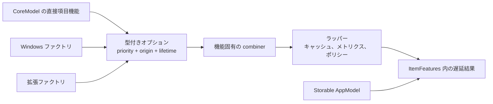
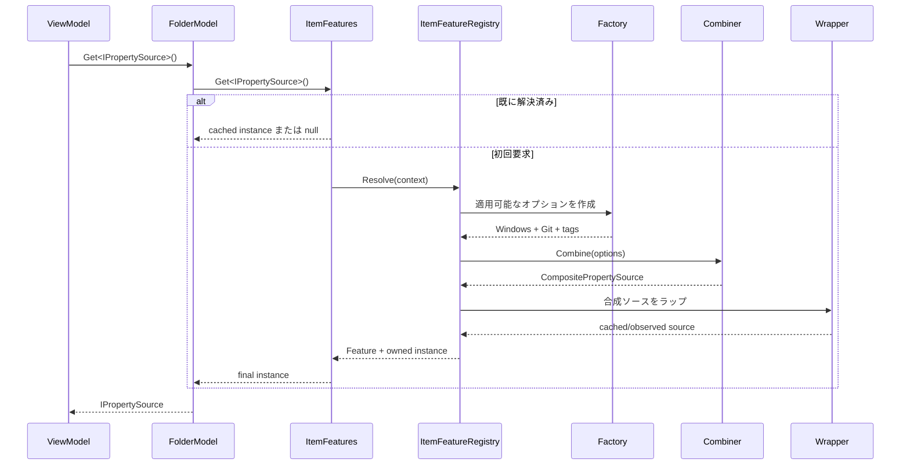
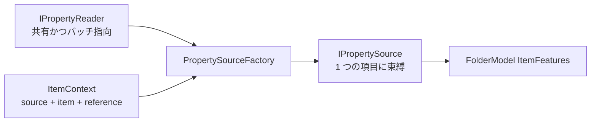
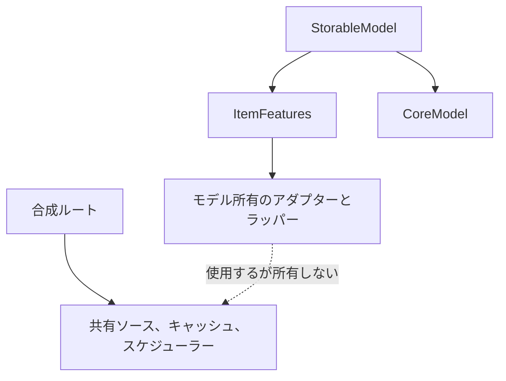

# 項目機能の合成

項目機能は、サムネイル、プレビュー、プロパティ、ウォッチャー、操作など、項目に任意で結び付く処理です。
基底クラスではなく、`IStorable` も継承しません。

AppModel は最終的なセットを公開します。

```csharp
var properties = folderModel.Get<IPropertySource>();

if (properties is not null)
{
	var values = await properties.GetPropertiesAsync(
		new PropertyRequest(["System.Size", "System.DateModified"]),
		cancellationToken);
}
```

`Get<TFeature>()` は `IStorableModel.Features` に対する拡張メソッドです。呼び出し元には簡潔ですが、そのモデルに登録された項目機能契約だけを解決します。
一般的なサービスロケーターではありません。

## 解決フロー

合成ルートは、ファクトリ、契約ごとに任意で 1 つの combiner、ラッパーを登録します。解決はモデルごとに遅延し、キャッシュされます。





ファクトリは、その項目機能契約が初めて要求されたときだけ呼び出します。したがって 10,000 項目を列挙しても、10,000 個のサムネイル、プレビュー、プロパティアダプターを eager に作りません。

## 機能ごとに異なる合成規則

複数の実装に対して常に正しい意味が 1 つあるとは限りません。Files.Core はそのポリシーを明示します。

| 項目機能の形 | 合成規則 | プロトタイプ |
| --- | --- | --- |
| Thumbnail | 優先度の降順でオプションを試し、結果を返したものを使う | `ThumbnailSourceCombiner` |
| Preview | 優先度の降順でルーティングし、`null` は「未処理」を意味する | `PreviewSourceCombiner` |
| Property | すべてのソースをマージし、重複するプロパティ ID は高優先度を優先する | `PropertySourceCombiner` |
| Watcher または mutation service | 通常は実装を正確に 1 つにする | 既定の曖昧性例外または `PriorityItemFeatureCombiner<T>` |
| Archive navigation marker | 適用可能な中で最高優先度の marker を選ぶ | `PriorityItemFeatureCombiner<IArchiveSource>` |
| Command または adornment | 適用可能なオプションをすべて集約する | 契約固有の combiner が順序と重複動作を定義 |

登録済み combiner がない場合、オプション 0 個は `null`、1 個はそのまま返し、複数個は throw します。
これにより、登録順序が気付かないうちに正しさを決めることを防ぎます。

サムネイルチェーンで「次のソースを試す」のは `null` の場合だけです。例外は本当の失敗として伝播します。
そのため低優先度のソースが壊れた高優先度の実装を隠すことはありません。

## 登録例

```csharp
var thumbnailCache = new MemoryThumbnailCache();
var windowsThumbnailBackend = new WindowsShellThumbnailBackend();
var windowsProperties = new WindowsPropertyReader();

var itemFeatureRegistry = new ItemFeatureBuilder()
	.Add<IThumbnailSource>(
		new WindowsThumbnailSourceFactory(windowsThumbnailBackend),
		priority: 0,
		origin: "Windows Shell")
	.Add<IPropertySource>(
		new PropertySourceFactory(windowsProperties),
		priority: 100,
		origin: "Windows Shell")
	.Add<IPropertySource>(
		new PropertySourceFactory(gitProperties),
		priority: 50,
		origin: "Git")
	.SetCombiner<IPropertySource>(new PropertySourceCombiner())
	.SetCombiner<IThumbnailSource>(new ThumbnailSourceCombiner())
	.AddWrapper<IThumbnailSource>(new ThumbnailCacheWrapper(thumbnailCache))
	.Build();

var modelFactory = new StorableModelFactory(itemFeatureRegistry);
```

プラグインは同じ契約に別のファクトリを登録して参加します。`StorableModelFactory` を置き換えたり、`FolderModel` を変更したり、ビジュアルツリーへ入ったりしません。

ラッパーは登録順に実行します。各ラッパーは直前の段階の結果を受け取るため、最後に登録したラッパーが最外側になります。

## 項目束縛ソースと共有リーダー

`IPropertySource` と `IPropertyReader` は意図的に異なるスコープを表します。



- `IPropertyReader` はソース単位またはプラグイン単位です。1 要求で複数の `ItemContext` を問い合わせでき、合成ルートが所有します。
- `IPropertySource` は `model.Get<IPropertySource>()` が返す便利な項目束縛契約です。
- `PropertySourceFactory` は両者をつなぐ小さなアダプターを作ります。
- `BrowsePrefetchCoordinator` は現在の項目束縛ソースを使い、受け入れた値をセッションのスナップショット単位の表示ストアへ公開します。
- 後のバッチ最適化では、互換性のある項目コンテキストをグループ化し、項目束縛契約や UI 向けの結果フローを変更せず同じ reader を直接呼び出せます。

`PropertyRequest` は現在、要求するプロパティ ID だけを持ちます。reader が同じレイテンシー契約を強制できるようになるまで、fast-only オプションは意図的に公開しません。
現在の Windows reader は、対応している小さな typed set を `IShellItem2` から直接読みます。

この分離は他の高価な項目機能にも適用します。項目束縛アクセスは便利ですが、共有 reader または loader は実際の処理をバッチ化、キャッシュ、スロットル、スケジュールできます。

## アーカイブナビゲーション項目機能

`IArchiveSource` は、`IFolder` としても表示される Windows Shell アーカイブを含む外側ファイルを、`ArchiveLocation` の候補として示します。
項目機能の解決中に SevenZip を開いたりバックエンドを選択したりはしません。その非同期処理は `ArchiveBrowseLocationHandler` に属します。

SevenZip ベースのフォルダーは `IArchiveEntry` を直接実装します。これにより外側アーカイブ参照と正規化されたエントリパスを子ナビゲーションのために保持します。
Files は `IArchiveEntry`、次に `IArchiveSource`、最後に通常の `IFolderModel` 形状を確認します。[アーカイブ参照](archives.md)を参照してください。

## Files 機能との境界

項目に関係するすべての処理が項目機能になるわけではありません。

- `ILaunchTargetSource` は 1 項目が通常のオープンまたは Quick Look に渡せる対象を返す項目機能です。
- Quick Look アプリのインストール検出と外部プロセスとの通信は、Files の共有サービスです。
- `ICloudInfoSource` は 1 項目のクラウドルート、同期状態、可用性を返す項目機能です。
- 登録済みクラウドルートの列挙とサイドバー生成は、項目より長く生きる Files のカタログと ViewModel です。
- 列値は `IPropertySource` が返しますが、利用可能な列定義の合成は一覧単位なので Files が所有します。

具体的な契約、列の合成、ダブルクリックからファイルを開く流れは [Files の項目機能とアクティブ化](files-app-features.md) で定義します。

## フォルダー変更

`IFolderChangeSource` は項目束縛のウォッチャー契約です。ソースが明示的に開始し、その後は管理対象の `FolderChange` 値をイベントから配信します。
Shell 通知ハンドル、パス、COM インターフェースをモデル層へ公開しません。

```csharp
if (model.Get<IFolderChangeSource>() is not { } changes)
{
	return;
}

changes.Changed += OnChanged;
await changes.StartAsync(cancellationToken);

void OnChanged(object? sender, FolderChangeEventArgs args)
{
	if (args.Change.RequiresRefresh)
	{
		ReloadFolder();
		return;
	}

	ApplyChange(args.Change);
}

// Detach before disposing the model-bound item feature.
changes.Changed -= OnChanged;
await changes.DisposeAsync();
```

Windows 実装は、`WindowsStorageSource` が所有する `WindowsShellChangeWatcher` 上のモデル束縛イベントソースです。1 つの watcher が 1 つの隠し通知ウィンドウを所有します。
同じフォルダーの登録は共有され、各項目束縛ソースがイベントハンドラーへ配信します。ウィンドウの作成、登録、登録解除、破棄はすべて順序付き Shell STA で実行します。
watcher は Shell 通知がロックされている間に PIDL をコピーし、アンロック後に管理対象コピーだけを公開します。イベントは項目束縛ソースの処理ポンプが発生させ、Shell のウィンドウプロシージャから直接発生させません。

`Faulted` は通知ポンプの終端失敗を報告します。個々の `Changed` ハンドラーの例外は分離してトレースへ書き込み、ネイティブ watcher を停止したり他のコンシューマーへの変更通知を妨げたりしません。

`Created`、`Deleted`、`Renamed`、`Updated` は best-effort の `StorableReference` 値を持ちます。`DirectoryUpdated` と PIDL を具象化できない通知は `RequiresRefresh` を設定します。
コンシューマーは不完全なイベント詳細に依存せず再列挙できます。watcher が通知を `SHGetPathFromIDList` で変換しないため、仮想 Shell 項目と長いパスも表現できます。

## 所有権



- アプリケーションルートは共有ソース、キャッシュ、スケジューラーを所有します。
- `StorableModel` は `ItemFeatures` と CoreModel を所有します。
- `ItemFeatures` は `ItemFeatureLifetime.Item` と記された破棄可能なインスタンスと、combiner/ラッパーが作成した新しい破棄可能な結果を所有します。
- `ItemFeatureLifetime.Shared` は別の所有者が所有するインスタンスを表します。
- combiner とラッパーは、ラップしたオプションや内部の項目機能を破棄してはいけません。`ItemFeatures` がそれらのライフタイムを個別に追跡します。
- `IItemFeatures` は `IDisposable` と `IAsyncDisposable` の両方をサポートします。非同期破棄を優先して待機し、まだ非同期ライフタイムを流せない呼び出し元には同期破棄を互換ブリッジとして使います。
- 長寿命ソースは順序付きネイティブクリーンアップのため `IAsyncDisposable` を公開します。
- 破棄はラッパーとオプションを作成順の逆で実行し、その後 AppModel が CoreModel を破棄します。

CoreModel が直接実装する項目機能は、AppModel が CoreModel 自体をすでに所有しているため、`ItemFeatureLifetime.Shared` を使います。

サムネイルキャッシュのキーには `LastKnownAddress` ではなくソース ID と項目 ID を使います。ウォッチャーと成功した変更は、対象参照に対して `IThumbnailCache.InvalidateAsync` を呼び出します。
ラッパーは抽出前のキャッシュ無効化バージョンを取得し、後で `TrySetAsync` を使います。キャッシュはそのバージョンがまだ最新の場合だけ結果をアトミックに保存します。
そのため古い抽出が、更新で無効化されたエントリを再生成することはありません。
