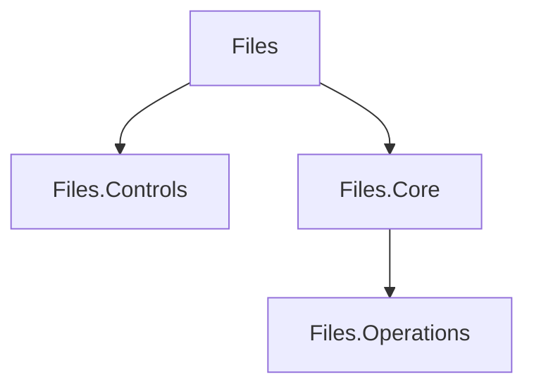

# Layering and code placement

This document answers: **where should this behavior live?** Choose the layer from ownership and semantics, not from whichever project is easiest to reference.

## Dependency direction



The concrete project-reference graph may evolve, but these architectural rules remain:

- presentation may depend on Core;
- Core must not depend on presentation;
- provider implementations must not depend on ViewModels;
- reusable controls must not acquire application/storage ownership;
- the operations host must communicate through explicit contracts.

## Code placement guide

| Concern | Preferred owner |
|---|---|
| Storage abstractions and identity | `Files.Core` |
| Provider contracts and implementations | `Files.Core` provider/platform areas |
| Browse/navigation state | `Files.Core` |
| Capability contracts | `Files.Core` |
| Property/thumbnail/preview retrieval contracts | `Files.Core` |
| Provider-specific retrieval | provider implementation |
| WinUI image creation/decoding | `Files` |
| ViewModels and presentation adapters | `Files` |
| XAML and localized display formatting | `Files` |
| Viewport/focus/visual selection | presentation/UI boundary |
| Generic reusable WinUI controls | `Files.Controls` |
| App-specific control behavior | `Files` |
| Isolated long-running operation execution | `Files.Operations` |

## Example: a new storage provider

Identity, hierarchy, enumeration, streams, capabilities, properties, and operations belong behind Core/provider contracts. Provider-specific authentication UI belongs in `Files`.

Avoid generic code like:

```csharp
if (provider is FtpProvider) { ... }
else if (provider is SomeCloudProvider) { ... }
```

when a capability or provider contract can express the required behavior.

## Example: a Details column

The property's semantic meaning and retrieval belong below the presentation boundary. Localized labels, human-readable formatting, alignment, and visual templates belong in presentation.

Core should not return UI strings solely because a WinUI column needs them.

## Example: thumbnails

Retrieval and cache semantics belong below the UI boundary. Creating WinUI-specific image objects belongs in presentation.

## Review red flags

- `Microsoft.UI.*` dependencies entering `Files.Core`;
- ViewModels in provider implementations;
- provider-type switches in generic browsing/presentation;
- arbitrary-thread Shell calls;
- UI controls disposing storage resources they merely display;
- storage models producing localized presentation strings;
- app-specific state in reusable controls;
- duplicated provider behavior instead of a shared capability.

## Rule of thumb

Ask:

1. Is this behavior meaningful in a non-WinUI client?
2. Does it define application/storage semantics, or only how those semantics are displayed?

If it is meaningful without WinUI, it usually belongs at or below the Core boundary.
