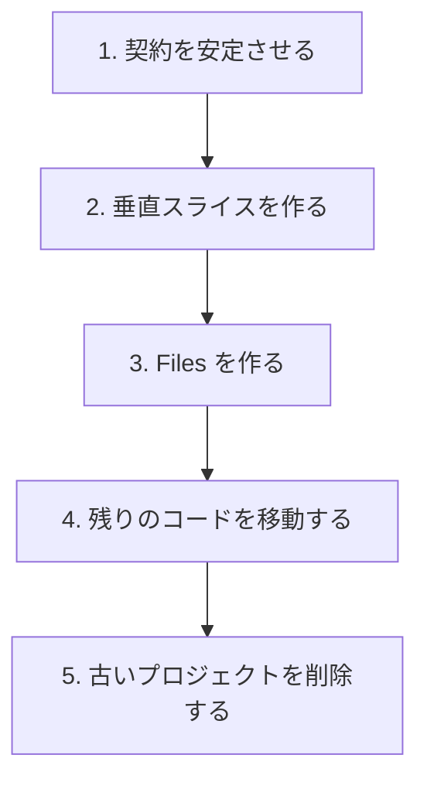
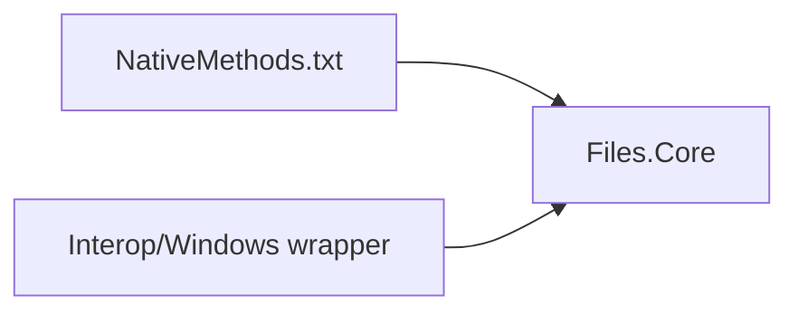

# Files.Core への移行

最終的な物理配置と論理アーキテクチャは別の決定です。プロジェクト間でファイルを移動することと、モデルグラフを置き換えることを同時に行ってはいけません。

## 目標のプロジェクト配置

1 つのアセンブリになっても、1 つのレイヤーになるわけではありません。`Files.Core` ではストレージ契約、ソース、AppModel、参照、操作、相互運用の名前空間とフォルダーを維持します。

## 移行順序の原則

1. 新しいプロジェクトで `IStorageSource`、CoreModel の項目機能、AppModel、参照セッションの所有権を安定させます。
2. 1 つのソースと 1 つのブラウザ経路をエンドツーエンドで実装します。
3. 既存のFiles.Appサービスグラフをコピーせず、`Files` に `FilesCoreRuntime` とUI adapterを合成します。
4. CsWin32 の入力とラッパーを `Files.Core` に所有させ、生成出力をアプリ層から隠します。
5. `Files`のRoot/Tab/Pane/FolderBrowser shellを構成し、presentation、operation、preview、providerを
   独立した vertical slice として移します。

各段階の完了状況は [移行進捗](migration-progress.md) にのみ記録します。

旧 `Files.App` の導入では既存 XAML と Frame を保持した互換 adapter を使いますが、新規の `Files` 機能はこの経路へ戻しません。
`Files` の実装済み境界と所有権は [Files アーキテクチャ](files.md) を参照してください。

### Files shellの移行境界

`Files`のUIは次の順でCoreの所有階層へ接続します。

`RootView`はwindow単位の`TabView`と`NavigationToolbar`を所有し、native `NavigationView`を直接宣言します。
そのContentへ`ToolbarView`、`PaneHost`、`TerminalView`、`InfoPane`を配置します。`PaneHost`の各paneは
`PaneContentView`を通して`FolderBrowser`、`SettingsView`、`WebView`を差し替えます。
`FolderBrowser`は`DetailsFolderView`、`GridFolderView`、`ListFolderView`を同じhostへ投影します。
これらは独立したview surfaceであり、新しいTerminal/Preview/Info/Shelf paneや表示モードは対応するhostへ追加し、
`MainPage`へ戻しません。`DetailsFolderView`はListViewを使う基本的な詳細表示の契約を提供し、列定義や高度な表示設定は
独立したview sliceとして追加します。

`Files` の navigation、tab、pane、folder double-click は `src/Files/Commands/` の stable command ID へ集約します。
process-level `CommandRegistry` は `App2CommandRegistration`（改名前の残存型名）で構築し、window ごとの
`WindowCommandManager`が各ViewModelとcontrolへbindingを提供します。Coreはこの境界からWinUI型を参照しません。

## 相互運用コードの所有権

Files.Core が CsWin32 の生成を所有します。

生成出力は追跡対象外のままにし、直接編集してはいけません。アセンブリが移動しても、既存の `Windows.Win32` 名前空間は維持します。

正確な導入スライスは [Files アーキテクチャ](files.md) を参照してください。旧 UI の互換境界は [Files.App の Core 統合](files-app.md) を参照します。

## 競合の抑制

- 既存のストレージサービスに大きな互換性クラスを追加して新しい契約を実装させない。
- リポジトリ全体の型置換より、垂直な機能境界を優先する。
- `Files.Core` が Windows を対象にしていても、WinUI を入れない。
- ファイルがアセンブリ間を移動している間も、項目機能契約と Windows のスレッド境界を安定させる。
- プロジェクト統合は機械的な依存関係変更として扱い、論理レイヤーを潰す許可とはみなさない。
