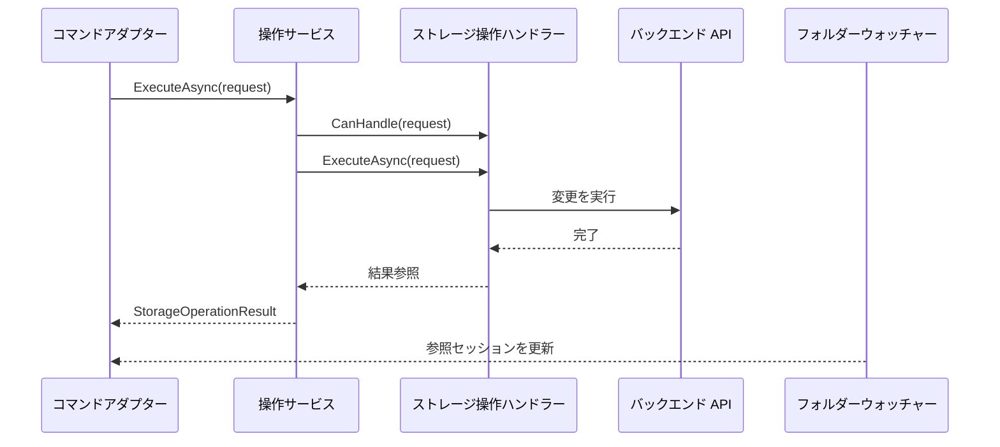
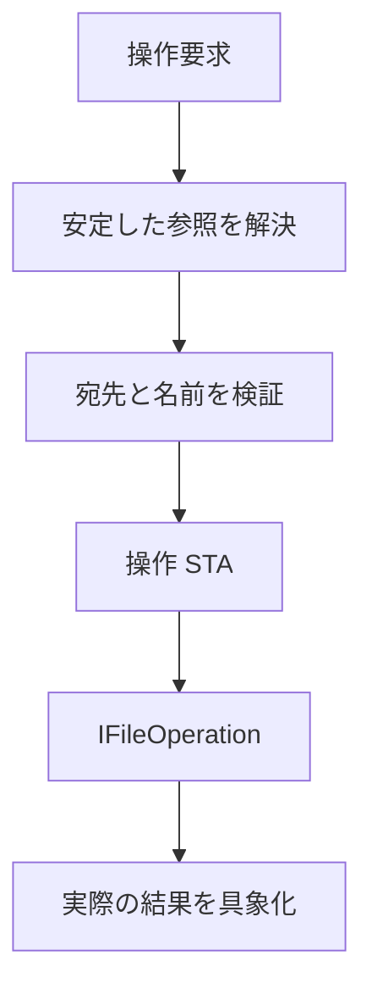

# ストレージ操作

ストレージ変更は request ベースで、ハンドラーへルーティングします。Files は安定した参照から UI 非依存の要求を作り、
`StorageOperationService` が処理できる最初のハンドラーを選択します。

## 契約

Core の操作セットは次のとおりです。

| 要求 | 結果 |
| --- | --- |
| `CreateItemOperationRequest` | 新しいファイルまたはフォルダーへの参照 |
| `RenameOperationRequest` | 同じ論理項目の新しいスナップショット参照 |
| `CopyOperationRequest` | コピー先への参照 |
| `MoveOperationRequest` | 宛先にある項目への参照 |
| `DeleteOperationRequest` | 結果参照なし |

作成、コピー、移動は `StorageConflictBehavior.Fail` または `GenerateUniqueName` を受け付けます。
削除の既定値はごみ箱であり、完全削除は明示的に指定しなければなりません。

`StorageOperationResult` は矛盾した状態を表現できません。成功にはエラーがなく、失敗にはエラーがあり結果項目がありません。
進行状況の値は負数にならず、`CompletedItems` は既知の `TotalItems` を超えられません。

`IStorageOperationService.CanHandle` は、完全に構成された要求に対する安価なコマンド有効化チェックです。
実行時までに権限、接続、競合、識別情報が変わる可能性があるため、後続の成功を保証するものではありません。

## フロー

`Succeeded == false` の場合、エラーはデータとして保持します。呼び出し元が要求したキャンセルは例外です。
`OperationCanceledException` を伝播させることで、コマンドはキャンセルと失敗した操作を区別できます。

## Windows 実装

`WindowsStorageOperationHandler` は専用の操作 STA 上で `IFileOperation` を使います。対応する操作は次のとおりです。

- ファイルシステムの作成。
- ファイルシステムの名前変更。
- ファイルシステムのコピーと移動。
- ファイルシステムまたは仮想項目の Shell 削除。

名前の検証では、パストラバーサル、区切り文字、末尾の空白またはドット、不正な文字、予約済み DOS デバイス名を拒否します。
競合チェックは Shell 操作をキューに入れる前に行います。`GenerateUniqueName` は一般的な `name (2).ext` 形式を使います。

Windows のパス比較には、意図的に 2 つの意味があります。

- 識別情報/競合の比較は大文字小文字を区別しない。
- パス表記の完全一致比較は ordinal かつ大文字小文字を区別する。

したがって `report.txt` を `REPORT.TXT` へ名前変更しても no-op とは扱いません。大文字小文字を区別しない宛先がすでにある場合、
ハンドラーはそれを解決し、安定した `ItemId` がソース項目と一致する場合だけ名前変更を許可します。コピーと移動の既定名は Shell 表示名ではなく `FileSystemPath` から求めます。
表示名ではファイル拡張子が隠れる場合があるためです。

名前変更は変更直前に項目 ID を再確認し、結果のパスが期待した項目を指すことを検証します。作成、コピー、移動は推測したパスを返さず、
ソースを通して実際の宛先を具象化します。

完全削除でない場合は、`IFileOperation` に `FOF_ALLOWUNDO` と `FOFX_RECYCLEONDELETE`（`0x00080000`）の両方を設定します。
`FOF_ALLOWUNDO` だけでは、可能な場合に元に戻せる保存を要求するだけですが、拡張フラグはごみ箱を明示的に要求します。
完全削除ではどちらのフラグも設定しません。どちらのモードでも `PerformOperations` による完了を具象化し、`GetAnyOperationsAborted` を確認します。

キャンセルでは、まだ開始していない処理を止められますが、実行中の同期 Shell 拡張を中断することはできません。副作用が確定した後は、呼び出し元のトークンなしで結果の具象化を完了します。
成功した変更をキャンセルと報告して危険な再試行を誘発しないためです。

## 変更後の識別情報

操作は既存の `IStorableModel` を直接変更しません。フォルダー通知または更新が古いスナップショットを新しいモデルへ置き換えます。

- 同じボリューム内の名前変更は通常 `ItemId` を保持します。
- 移動はソースの仕様により `ItemId` を保持または変更します。
- コピーは常に新しい項目を表します。
- `LastKnownAddress` は返却参照で更新しますが、参照の等値性からは除外します。

Files は完了後に取得したモデルインスタンスを破棄し、返却参照はフォーカス/表示の意図にだけ使います。表示項目コレクションの正しい情報源は参照セッションです。

## 複数項目のコマンド

ハンドラー契約は意図的に 1 つの要求を処理します。複数選択は、呼び出し側が上限付きの順序処理へ展開します。
本番の Files では `Files.Operations` の `FileOperationHost`、プロセス内テストでは同じ意味を持つローカル実装がこれを担当します。
バックエンドが後から専用の一括ハンドラーを追加することもできます。単一項目の意味を保つことで、すべてのストレージシステムが 1 つの原子的な一括トランザクションを提供するかのような誤解を避けます。

バッチ実行器では次の手順にします。

1. 選択されたすべての `StorableReference` を取得する。
2. ソースに適した上限付きの同時実行数で実行する。
3. キャンセルされたら新しい項目のスケジュールを止める。
4. 部分成功を失わないよう、項目ごとの失敗を保持する。
5. フォルダー通知に表示セッションの調整を任せる。
6. 結果参照は最後のフォーカス/表示にだけ使う。

フォアグラウンドプロセスのクラッシュを越える実装、wire contract、操作一覧モデルは
[`Files.Operations` によるクラッシュ耐性のある操作](server-operations.md) で定義します。
