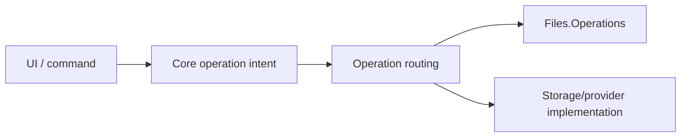

# Operations architecture

Operations represent mutations or other long-running actions that may outlive a single UI interaction. ReFiles separates operation intent/state from presentation and, where appropriate, executes work in `Files.Operations` outside the UI process.

## Goals

- keep the UI responsive during expensive file work;
- isolate operation execution from WinUI lifetime where appropriate;
- express intent through explicit contracts;
- make progress, cancellation, failure, and ownership observable;
- keep provider-specific execution behind provider/operation boundaries.

## Boundary

The exact route depends on the operation/provider, but UI objects must not be shared into the operation host.

## Lifetime

Starting an operation transfers responsibility to an explicit operation/session owner. Closing a view must not accidentally corrupt an operation that is designed to continue. Conversely, operations tied to a browse/session lifetime should cancel and clean up when that owner is disposed.

## Progress and cancellation

Progress reporting must be asynchronous and bounded; avoid flooding the UI dispatcher with per-file updates. Cancellation is cooperative and must leave storage state and owned resources in a defined condition.

## Failure

Operation results should distinguish success, cancellation, unsupported behavior, and failure without requiring presentation to decode low-level implementation details. Preserve enough diagnostic information for logs/troubleshooting without exposing secrets.

## Provider boundary

Generic operation intent should not contain Windows Shell, FTP, archive, or other backend-specific implementation logic. Providers/operation executors decide how an intent is fulfilled.

## Tests

Protect operation routing, enum/input validation, progress/result invariants, cancellation, cleanup, provider fallback behavior, and process-boundary contracts where practical.
