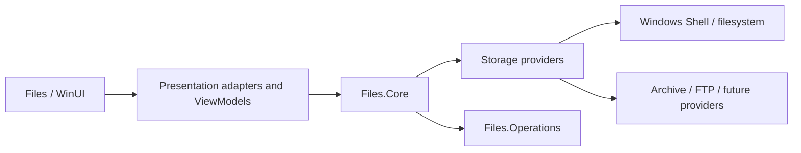
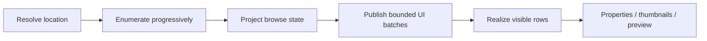

# Architecture overview

ReFiles is built around a UI-independent Core with platform/provider implementations and a WinUI presentation layer around it. The architecture is designed for multiple storage backends, progressive browsing, capability-based item behavior, responsive presentation, and isolated execution of long-running operations.

## High-level architecture

Dependency direction is intentional: lower layers must not acquire presentation responsibilities.

## `Files.Core`

`Files.Core` owns behavior that is meaningful without WinUI, including:

- storage references, identities, models, and provider contracts;
- browsing, projection, selection, navigation state, and view settings;
- optional item features/capabilities;
- properties, thumbnails, preview, streams, search, and change-observation contracts;
- provider composition and resolution;
- UI-independent application/window/tab/pane state;
- operation intent/routing contracts;
- Windows/provider implementations that can remain UI independent.

Loading `Files.Core` must not require a WinUI visual tree.

## `Files`

`Files` is the application and WinUI presentation layer. It owns:

- XAML and visual composition;
- ViewModels and presentation adapters;
- UI dispatching and bounded collection publication;
- localized labels and display formatting;
- viewport, focus, and visual selection integration;
- conversion of Core data into WinUI-specific visual resources;
- translation of user gestures into navigation/commands.

Presentation may adapt Core state, but it does not define storage semantics.

## `Files.Controls`

`Files.Controls` contains reusable WinUI controls. A control may define UI contracts needed to render or interact with data, but it should not depend on application-specific ViewModels, providers, navigation state, or storage ownership unless that dependency is explicitly part of the control's purpose.

## `Files.Operations`

`Files.Operations` is an out-of-process execution boundary. Long-running or isolated operations should communicate through explicit contracts rather than sharing UI state or object ownership with the application process.

## Storage providers and item features

Providers adapt different storage systems to common Core contracts. Provider differences are expressed through identities, hierarchy, enumeration, and optional item features instead of provider-type branches spread throughout generic code.

An item may expose only the capabilities it can implement correctly, such as properties, thumbnail retrieval, preview, streams, operations, search, or change observation.

## Browse and enrichment

Properties and thumbnails are enrichment. They should not unnecessarily delay identity/basic-row publication.

## Cross-cutting rules

All subsystems should preserve:

- explicit dependency direction;
- stable identity;
- explicit ownership and async cleanup;
- cancellation plus stale-result rejection;
- bounded UI-thread work;
- provider isolation;
- deterministic tests for generic contracts;
- separate scenario testing for environment-dependent Windows behavior.

## Related documentation

- [`principles.md`](principles.md)
- [`layering.md`](layering.md)
- [`ownership-and-lifetime.md`](ownership-and-lifetime.md)
- [`browsing.md`](browsing.md)
- [`presentation.md`](presentation.md)
- [`../subsystems/storage-providers.md`](../subsystems/storage-providers.md)
- [`../subsystems/windows-shell.md`](../subsystems/windows-shell.md)
