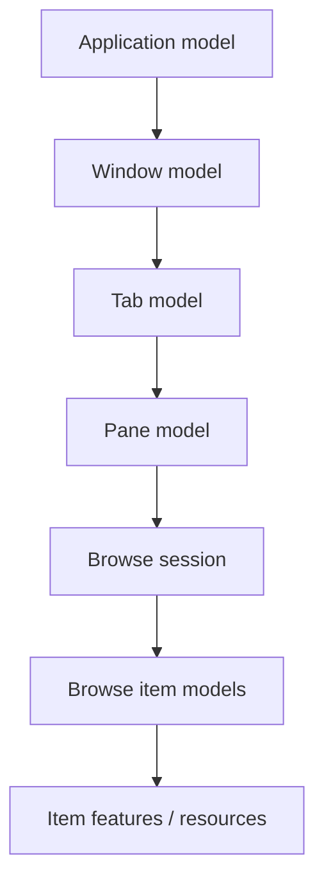

# Ownership and lifetime

ReFiles contains asynchronous and disposable resources such as storage models, provider sessions, streams, thumbnail/preview resources, browse generations, Shell COM objects, STA workers, and operation-host connections.

> Ownership means responsibility for lifetime, cancellation, cleanup, and disposal.

## Ownership hierarchy

At a conceptual level, longer-lived application state owns shorter-lived state:



Concrete types can change; the important part is that ownership remains explicit.

## Browse ownership

A browse session owns the work/resources associated with its active browse state unless a contract explicitly transfers ownership.

When navigation is superseded:

1. previous work becomes stale;
2. cancellation is requested;
3. stale results are rejected even if cancellation arrived late;
4. resources exclusive to the old generation are released when safe.

Cancellation asks work to stop. Disposal releases ownership. They are related, not interchangeable.

## Presentation ownership

ViewModels and presentation adapters generally **borrow** Core state. Displaying a model does not imply permission to dispose it. Conversely, Core must not own WinUI controls or UI-specific resources.

## Streams and owned results

Every stream/resource-returning contract should make clear:

- who created it;
- whether the caller owns it;
- whether it may outlive the provider/item/session;
- what cancellation invalidates;
- whether disposing a parent also disposes the child.

Useful vocabulary:

- **borrowed reference** — usable by the caller, not disposed by the caller;
- **owned result** — disposal responsibility transfers to the caller;
- **shared lifetime** — validity is tied to another owner/session.

## Thumbnail and preview resources

The pipeline may use immutable buffers, streams, temporary files, COM handlers, and decoded UI images. The Core/presentation boundary must keep these ownership rules clear; Core should not retain UI image objects merely because presentation created them.

## COM resources

Shell objects may be apartment-bound. Do not cache COM objects across arbitrary async/thread boundaries unless they are known to be agile or are explicitly marshalled. Prefer stable identities/data that allow the object to be reacquired on an appropriate apartment.

## Async disposal

Keep cleanup asynchronous through the ownership chain when cleanup itself is asynchronous. Avoid sync-over-async on UI-sensitive paths, especially patterns such as:

```csharp
DisposeAsync().AsTask().GetAwaiter().GetResult();
```

unless the implementation proves cleanup cannot depend on the blocked context.

## Failure during construction

Factories/builders that acquire multiple resources must release already-acquired resources if a later step fails. Partial construction does not remove ownership obligations.

## Common mistakes

- disposing a borrowed Core model from presentation;
- assuming cancellation automatically disposes resources;
- publishing after a generation was superseded;
- caching apartment-bound COM objects in long-lived generic models;
- returning streams without ownership documentation;
- blocking the UI thread on async cleanup;
- letting event subscriptions keep panes/sessions alive.

## Tests

Protect disposal hierarchies, canceled-navigation cleanup, stale-publication rejection, stream ownership, partial-construction cleanup, async disposal completion, and retained-object behavior after navigation.
