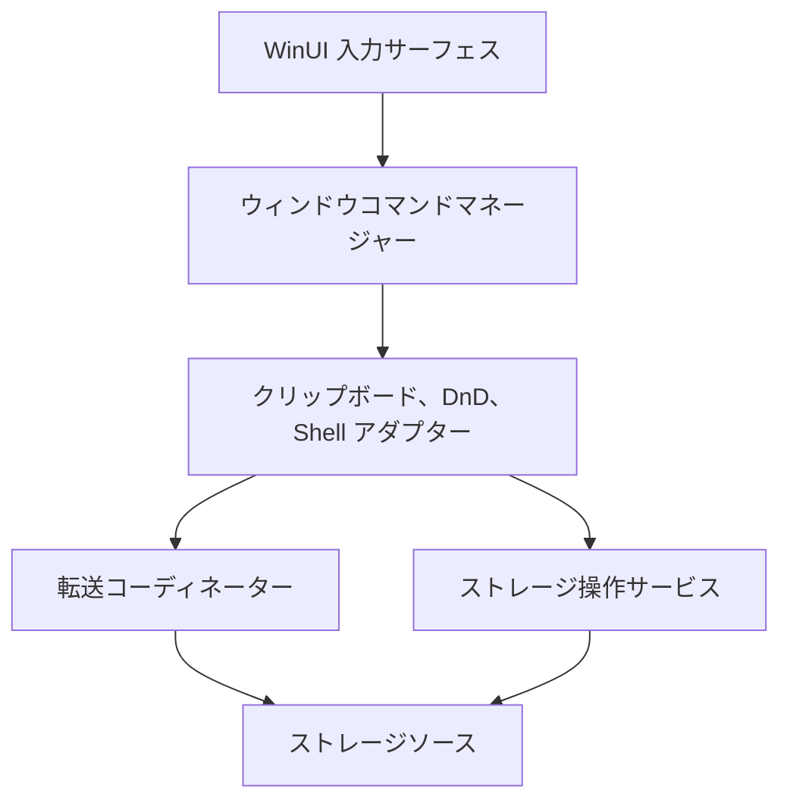
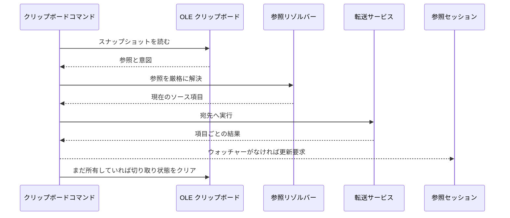
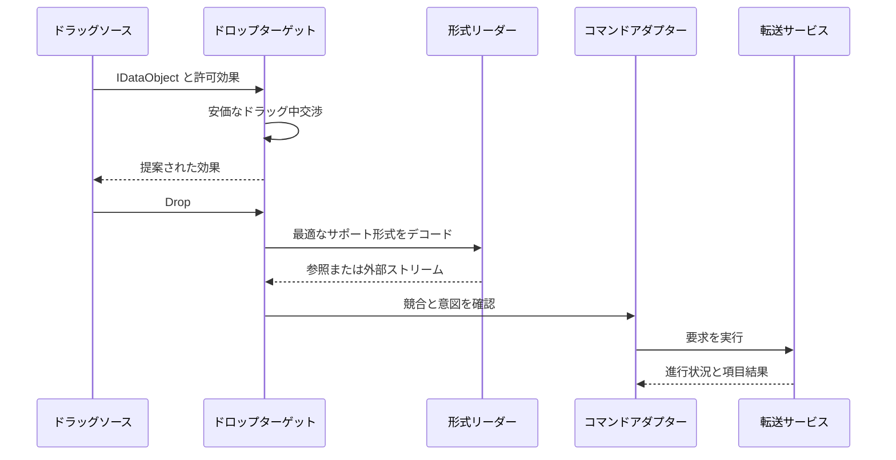
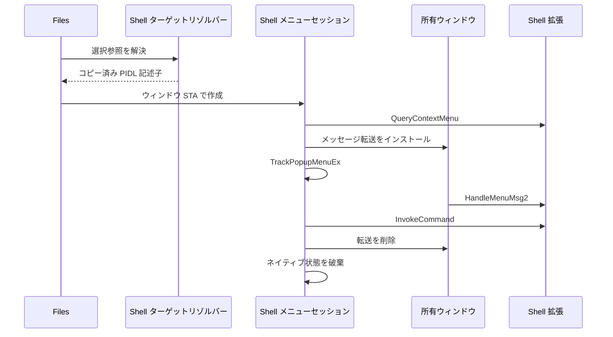
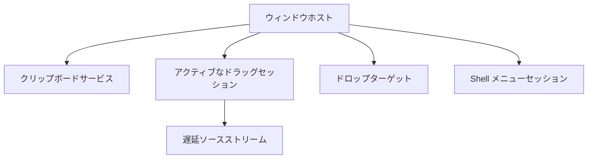

# クリップボード、ドラッグ/ドロップ、Shell 連携

クリップボード、ドラッグ/ドロップ、Windows Shell のコンテキストメニューは、新しい Files のモデルグラフを他のアプリケーションやネイティブ拡張へ接続します。
これらは、信頼できない外部データ、HWND と OLE STA の親和性、遅延ストリーム、可変な選択、破壊的なストレージ操作を組み合わせる高リスクなプラットフォームアダプターです。

これらのアダプターを所有するのは Files です。Files.Core は安定した項目参照、ソース解決、同一ソース操作、将来のソース間転送コーディネーターを提供します。
WinUI や OLE のデータオブジェクトを CoreModel や AppModel に入れてはいけません。

## 境界



アダプターはネイティブ形式とアプリケーションの意図を相互変換します。ファイルコピーを自分で実装したり、参照コレクションを編集したりはしません。

## 提案するソース配置

```text
src/Files/
  Commands/Adapters/
    ClipboardCommandAdapter.cs
    DragDropCommandAdapter.cs
    ShellVerbCommandAdapter.cs
  Platform/Clipboard/
    IClipboardService.cs
    OleClipboardService.cs
    ClipboardSnapshot.cs
    FilesClipboardPayload.cs
    FilesClipboardDataObject.cs
    ClipboardFormatReader.cs
  Platform/DragDrop/
    DragSession.cs
    DragDropService.cs
    DropNegotiator.cs
    FilesDropTarget.cs
    VirtualFileDataObject.cs
  Platform/Shell/
    IShellContextMenuService.cs
    ShellContextMenuService.cs
    ShellContextMenuSession.cs
    ShellSelectionTarget.cs
    ShellMenuMessageRouter.cs
  Platform/Interop/
    NativeDataObjectAdapter.cs
    StgMediumLease.cs
```

ネイティブ宣言、生成されたインターフェース、`NativeMethods.txt` は `Files.Core` に置きます。不足する API はジェネレーター入力または既存のラッパーへ追加し、
重複するアドホック P/Invoke を追加したり、生成出力を編集したりしてはいけません。

## 共有転送の意図

クリップボード貼り付けとドロップは、同じ UI 非依存の転送要求へ集約します。

```csharp
public enum TransferIntent
{
	Copy,
	Move,
	Link,
}

public sealed record StorageTransferRequest(
	ImmutableArray<StorableReference> Sources,
	StorableReference DestinationFolder,
	TransferIntent Intent,
	StorageConflictBehavior ConflictBehavior);

public interface IStorageTransferService
{
	bool CanHandle(StorageTransferRequest request);

	ValueTask<StorageTransferResult> ExecuteAsync(
		StorageTransferRequest request,
		IProgress<StorageTransferProgress>? progress = null,
		CancellationToken cancellationToken = default);
}
```

`IStorageTransferService` は Files.Core に属します。貼り付け、ドロップ、別の UI のどこから要求されたかを知らずに、任意のストレージソース間でストリームを移動するためです。
ルーティング規則は次のとおりです。

1. サポートされる同一ソースのコピーまたは移動には、ソース固有のネイティブ `IStorageOperationHandler` を使う。
2. それ以外は、読み取り可能な OwlCore ストレージストリームと書き込み可能なストリームを介してコピーする。
3. 可能ならソース所有の一時兄弟項目へ書き込む。
4. 成功を報告する前に、一時項目を flush、close し、公開する。
5. ソース間移動では、コピーが確定した後にだけソースを削除する。
6. コピー成功と削除失敗を部分成功として報告する。
7. 2 つのソースをまたぐトランザクション性を決して主張しない。

リンクは、宛先ソースがリンク操作を明示的にサポートする場合だけ扱います。コピーへ暗黙的に劣化させてはいけません。

競合のプロンプトは Files に残します。Core には解決済みのポリシーまたはソース非依存のコールバック契約を渡し、UI は表示させません。

## クリップボードアーキテクチャ

### 内部形式

Files は、適用可能な Windows 形式に加えて、バージョン付きのプライベート形式を 1 つ書き込みます。

```text
application/vnd.files.storable-references+json
```

ペイロードは次のようになります。

```json
{
  "schemaVersion": 1,
  "operationId": "b8996716-74f2-4436-9690-a0a858745ddb",
  "intent": "copy",
  "items": [
    {
      "sourceId": "windows",
      "itemId": "source-defined-stable-id",
      "lastKnownAddress": "C:\\Example\\item.txt"
    }
  ]
}
```

`sourceId` と `itemId` が識別情報です。`lastKnownAddress` は任意の復旧メタデータで、同じ項目がまだ存在する証明として信頼してはいけません。
ペイロードには FTP パスワード、アクセストークン、認証キー、サムネイルバイト列、保持されたモデル、PIDL ポインター、プロセス内オブジェクトハンドルを決して含めません。

パーサーは次を強制します。

- 明示的にサポートされたスキーマバージョン。
- 項目数とペイロードサイズの最大値。
- ソース ID と項目 ID の有効な長さ。
- 既知の意図値。
- 重複する操作または項目エントリがないこと。
- 実行前の厳格な参照解決。

外部アプリケーションはプライベート形式を偽造できます。Files の操作 ID が含まれていても、信頼できない入力として扱います。

### Windows 形式

選択された項目がサポートする、最も豊富な形式を公開します。

| 形式 | 用途 |
| --- | --- |
| Files プライベート形式 | アプリ内およびウィンドウ間の損失のない参照 |
| `CFSTR_PREFERREDDROPEFFECT` | コピーまたは移動の意図 |
| `CFSTR_SHELLIDLIST` | 仮想名前空間項目を含むネイティブ Shell 項目 |
| `CF_HDROP` | 幅広い旧来互換性のためのファイルシステムパス |
| `CFSTR_FILEDESCRIPTORW` | リモートまたは仮想ファイルのメタデータ |
| `CFSTR_FILECONTENTS` | 各仮想ファイルの遅延ストリーム |

実際のファイルシステムパスを持たない FTP やアーカイブ項目に `CF_HDROP` を告知してはいけません。偽のパスは、誤った識別情報とライフタイムの意味を作ります。

Windows だけの選択では、Windows ストレージブリッジを通じて Shell 識別情報を取得し、Shell ネイティブ形式を公開します。
混在またはリモートの選択では、常にプライベート形式を公開します。仮想ファイル形式を公開するのは、外部コンシューマーが範囲を限定したストリームを受信できる場合だけです。

### OLE アダプター

`OleClipboardService` は、OLE `IDataObject` を標準の Windows 境界として使います。WinUI `DataPackage` はビュー境界で単純な形式を適応できますが、
インデックス付きのすべての `CFSTR_FILECONTENTS` ストリームと Shell データオブジェクトを忠実にモデル化できないため、権威ある表現ではありません。

`OleGetClipboard`、`OleSetClipboard`、`OleFlushClipboard` のすべての呼び出しは、初期化済み STA 上で実行します。クリップボード読み取りでは、所有権規則に従って各 `STGMEDIUM` をコピーまたはリースし、
必ず `ReleaseStgMedium` を呼び出します。

`ClipboardSnapshot` が取得するもの:

- クリップボードのシーケンス番号。
- 認識した形式。
- デコードされた参照または外部項目記述子。
- 優先する効果。
- 存在する場合の Files 操作 ID。

スナップショットは、データオブジェクトのリースが終了した後に借用したネイティブポインターを保持しません。

### コピー、切り取り、貼り付け

コピーと切り取りはデータを公開するだけです。切り取りによって項目の名前変更、削除、淡色表示、その他の変更を行ってはいけません。
UI はアクティブなクリップボード操作 ID と参照を照合して切り取り状態を描画できます。



貼り付けでは、競合プロンプトを表示する前に宛先参照とクリップボードシーケンスを取得します。実行前にクリップボードのシーケンスと宛先ペインがまだ有効か確認します。
遅延貼り付けが完了した後、置き換わったクリップボードをクリアしてはいけません。

切り取り貼り付けに成功した後で切り取り状態をクリアまたは置き換えるのは、次のすべてを満たすときだけです。

- クリップボードにまだ同じ操作 ID が含まれている。
- シーケンス番号が変わっていない。
- 要求された移動がすべて成功している。

部分的な移動では失敗した参照を利用可能なままにし、成功したサブセットを報告します。

### クリップボードのライフタイム

Files プロセスは、小さく完全に具象化された形式について `OleFlushClipboard` を呼び出し、コピーされたローカルファイルを Files 終了後も利用可能にできます。
遅延された FTP やアーカイブのストリームがソースとランタイムより長く生存できるように見せかけてはいけません。仮想ファイルでは、明示的なクリーンアップライフタイムを持つ所有された一時エクスポートへ具象化するか、
データオブジェクトをプロセスで提供し続けます。

一時エクスポートを解決されていない広範なパスへ置いてはいけません。Files が所有権を証明できる場合だけ削除します。

## ドラッグとドロップ

### ドラッグセッション

`DragSession` はウィンドウが所有する短命のオブジェクトです。次を取得します。

- ソースのウィンドウ ID とペイン ID。
- 参照世代と項目バージョン。
- 不変の選択参照。
- 許可された効果。
- 一意な操作 ID。
- キャンセルとデータオブジェクトのライフタイム。

`BrowseItemViewModel`、`IStorableModel`、XAML コントロール、借用 PIDL を保持してはいけません。

クリップボードで使うものと同じネイティブデータオブジェクトビルダーが、ドラッグ形式を提供します。`DoDragDrop` と OLE モーダルループは所有 UI STA に残します。
遅延レンダリング中のソースストリーム読み取りは非同期に実行して構いませんが、COM コールバックはデータオブジェクトを所有するアパートメントを通じてマーシャリングします。

### ドロップ交渉

`DropNegotiator` はキャッシュ済みメタデータだけからドラッグ中の判断を行います。

- ターゲットがフォルダー形状の宛先かどうか。
- ソースと宛先のソース ID。
- ソースが宣言した操作サポート。
- 許可されたソース効果。
- キーボード修飾キー。
- アプリケーションポリシー。

ドラッグ中にネットワーク接続を開いたり、フォルダーを列挙したり、プロンプトを表示したり、厳格な識別情報復旧を行ったりしてはいけません。ドロップ時には完全な検証をもう一度行います。

既定の意図は Windows の規約に従います。

| 条件 | 既定値 |
| --- | --- |
| 同一ソースでネイティブ移動がサポートされる | 移動 |
| 異なるソース | コピー |
| Ctrl を押している | コピー |
| Shift を押していて移動が安全 | 移動 |
| Alt を押していてリンクがサポートされる | リンク |

カーソル効果は助言にすぎません。厳格な解決やソース項目機能の変更により、ドロップハンドラーが実行を拒否することがあります。

### ドロップの流れ



受信ドロップの形式の優先順位は次のとおりです。

1. 検証済み Files プライベート参照。
2. Shell ID リスト。
3. `CF_HDROP`。
4. 仮想ファイルの記述子と内容。
5. 互換アダプターとしての WinUI ストレージ項目。

リーダーは同じ項目を表す重複表現を結合しません。

### 外部仮想ファイル

受信した `CFSTR_FILEDESCRIPTORW` エントリは信頼できません。記述子数、名前の長さ、属性、ストリームインデックスを検証します。
表示名からパス成分を取り除き、`.` と `..` を拒否します。各 `CFSTR_FILECONTENTS` メディアは 1 回だけ消費するか、`TYMED` に従って所有ストリームへコピーします。

送信する仮想ファイルは、記述子ごとにインデックス付きのコンテンツストリームを 1 つ公開します。フォルダーには明示的な再帰パッケージポリシーが必要です。
最初の実装では、範囲を限定できないツリーを暗黙的に具象化するより、リモートフォルダーの他アプリへのドラッグを無効にして構いません。

キャンセルではソースストリームを閉じ、COM 非同期操作契約を完了します。転送サービスが作成していない宛先項目を削除してはいけません。

## Windows Shell コンテキストメニュー

### メニューをネイティブのままにする理由

Shell 拡張はオーナー描画、遅延したサブメニューの作成、`IContextMenu2` または `IContextMenu3` のメッセージ転送を行い、
コマンド ID が 1 つのメニューセッション中だけ有効であることを前提にする場合があります。ラベルを列挙して XAML の `MenuFlyout` にコピーすると、それらの動作を失います。

新しい実装では、Windows Shell の選択に対してネイティブ `HMENU` を表示します。Files 標準コマンドは引き続き `WindowCommandManager` を通り、
Windows 以外のソースには Files 標準メニューだけを表示します。

### Shell ターゲットブリッジ

Files はパスから Windows の識別情報を再構築してはいけません。現在の `StorableReference` 値を不変の Shell ターゲット記述子へ変換する、狭い Windows 固有ブリッジを追加します。

```csharp
public sealed record ShellSelectionTarget(
	ReadOnlyMemory<byte> ParentAbsolutePidl,
	ImmutableArray<ReadOnlyMemory<byte>> ChildRelativePidls);

public interface IWindowsShellSelectionTargetResolver
{
	ValueTask<ShellSelectionTarget?> ResolveAsync(
		IReadOnlyList<StorableReference> items,
		CancellationToken cancellationToken = default);
}
```

記述子に含めるのはコピーされた PIDL バイト列であり、借用ポインターや生存中の COM オブジェクトではありません。Files は所有する PIDL を再構築し、メニューの STA で親フォルダーを束縛します。
リゾルバーはすべての参照を検証し、選択を表現できないときは `null` を返します。

最初の実装では、共通の Shell 親を 1 つ持つ項目をサポートします。親が混在する場合は Files 標準コマンドにフォールバックします。選択の一部だけのコンテキストメニューを黙って構築してはいけません。

### メニューセッション

`ShellContextMenuSession` が所有するもの:

- 再構築された絶対 PIDL と子 PIDL。
- 親 `IShellFolder`。
- `IContextMenu` と任意の `IContextMenu2`/`IContextMenu3`。
- ポップアップ `HMENU`。
- 予約済みコマンド ID 範囲。
- 所有者 HWND と呼び出し位置。
- 一時的なウィンドウメッセージ転送。



セッションの作成、表示、呼び出し、解放は所有ウィンドウの STA で行います。アクティブ中は `WM_INITMENUPOPUP`、`WM_DRAWITEM`、`WM_MEASUREITEM`、`WM_MENUCHAR` を転送します。
`IContextMenu3.HandleMenuMsg2` を優先し、`IContextMenu2.HandleMenuMsg` をフォールバックにします。

`QueryContextMenu` には Files コマンドと衝突しない予約済み ID 範囲を渡します。Shift では Shell ポリシーに従って拡張動詞を追加します。
`InvokeCommand` には所有者 HWND、Unicode フラグ、呼び出し位置、意味がある場合の作業ディレクトリ、選択された数値コマンドオフセットを渡します。

`IContextMenu`、`HMENU`、数値コマンド ID を storable にキャッシュしてはいけません。それらの有効性は 1 つの選択と 1 つのポップアップセッションに限定されます。

### Files と Shell コマンドを同時に扱う

意図的に次のどちらかのサーフェスを使います。

- 組み込みコマンドとソース提供コマンド用の Files XAML メニュー。ネイティブ Shell メニューを開く「その他のオプションを表示」項目を含める。
- Files が重複しない独自のコマンド ID を予約し、`IContextMenu` に Shell 範囲を設定させるネイティブメニュー。

最初の選択肢の方が単純で、現代の Windows 動作にも合います。どちらも `WindowCommandManager` を通じて Files コマンドを呼び出し、メニューコントロールにコマンドロジックを重複させません。

`properties` や `openas` のような標準動詞は、組み込みコマンドが明示的に必要とする場合に、短命のセッションを通じて直接呼び出して構いません。
未知の動詞はメニューのスコープに残し、コマンド ID として永続化しません。

## スレッド処理

| 操作 | 必須コンテキスト |
| --- | --- |
| コマンドコンテキストの取得 | 所有ウィンドウの dispatcher |
| OLE クリップボード呼び出し | 初期化済み STA |
| `DoDragDrop` とドロップコールバック | 所有 UI STA |
| `IDataObject` 形式コールバック | データオブジェクト所有のアパートメント |
| Shell メニューの作成と追跡 | 所有ウィンドウ STA |
| Shell メニューのメッセージ転送 | 所有ウィンドウプロシージャ |
| ソースストリーム I/O | バックエンドスケジューラーまたは非同期ワーカー |
| Core 転送の実行 | UI 非依存の非同期経路 |

一般的な Windows Shell メタデータスケジューラーを `HMENU` の表示に使ってはいけません。ウィンドウやメッセージ経路を所有しないためです。
FTP やアーカイブのストリームを同期的に待って UI STA をブロックしてはいけません。

## セキュリティと検証

- すべての外部形式を悪意あるものとして扱い、サイズと数の制限を強制する。
- Files の参照を厳格に解決し、`LastKnownAddress` だけを信頼しない。
- 宛先の子名を作るとき、トラバーサルを含むパスを拒否する。
- 認証情報、トークン、生ポインター、ソースセッション ID をシリアライズしない。
- ドラッグ中に hydration、ダウンロード、実行、Shell 動詞の呼び出しを行わない。
- 破壊的操作と昇格のプロンプトは所有ウィンドウを通して表示する。
- 成功、キャンセル、失敗のすべての経路で、各 `STGMEDIUM`、COM インターフェース、PIDL、`HMENU`、一時サブクラスを解放する。
- メニューセッションが閉じた後でコマンド ID を呼び出さない。
- テレメトリには形式とソースのカテゴリだけを記録し、パスやクリップボード内容は記録しない。

## 所有権と終了



プロセスがクリップボードサービスを所有します。各ウィンドウがドロップターゲットとアクティブなドラッグ/メニューセッションを所有します。
データオブジェクトは、OLE が完了を通知するまで遅延ストリームとソースリースを所有します。

ウィンドウ終了:

1. 新しい貼り付け、ドラッグ、ドロップ、メニュー要求を拒否する。
2. ドロップターゲットを無効化する。
3. アクティブな転送と遅延レンダリングをキャンセルする。
4. ネイティブメニューを閉じ、メッセージ転送を削除する。
5. データオブジェクトとネイティブメディアを解放する。
6. ウィンドウのコマンドマネージャーを破棄する。
7. ViewModel と Core のウィンドウモデルを破棄する。

プロセス終了では、具象化済みのクリップボードデータだけを flush し、クリップボードサービスを破棄してから `FilesCoreRuntime` を破棄します。

## テスト

プラットフォーム非依存のユニットテストでは次をカバーします。

- プライベートペイロードの往復とスキーマ拒否。
- ペイロード数、サイズ、重複、トラバーサルの制限。
- 形式の優先順位と重複抑制。
- コピー、切り取り、貼り付けの効果対応付け。
- クリップボードシーケンスと操作 ID の所有権。
- ドロップ意図の交渉。
- 同一ソースとソース間のルーティング。
- ソース間移動の部分結果。
- 古い参照世代と宛先の拒否。
- Shell 選択の共通親検証。
- 偽オブジェクトを使ったネイティブリソース破棄の決定性。

Windows 統合テストは、メッセージポンプ付き STA で実行し、次をカバーします。

- `CF_HDROP` と優先効果の相互運用性。
- インデックス付き仮想ファイルコンテンツ。
- 貼り付け中の OLE クリップボード置換。
- ドラッグキャンセルと遅延ストリームのクリーンアップ。
- 一時ファイルに対する `IContextMenu3` セッション。
- オーナー描画メッセージの転送。
- 呼び出しなしのメニューキャンセル。
- 各アクティブセッション中のウィンドウ終了。

決定論的な CI のために、インストール済みの第三者 Shell 拡張に依存してはいけません。ファーストパーティの一時項目と、失敗注入用の偽メニュー/データオブジェクトラッパーを使います。

## 既存実装からの移行

現在のコードには有用な Shell と仮想ファイルの相互運用処理がありますが、パス識別情報、キャッシュされた `IContextMenu` オブジェクト、グローバルなクリップボード状態、
WinUI パッケージ、ストレージ実行が混在しています。

動作単位で移行します。

1. プライベート参照形式とパーサーを導入する。
2. `IClipboardService` の背後にクリップボード所有権を移す。
3. 新しいコマンドサービスと転送サービスを通じて貼り付けをルーティングする。
4. データオブジェクトビルダーをドラッグソースと共有する。
5. 受信形式の厳格なリーダーとドロップ交渉を追加する。
6. 現在の Windows 参照を使う Shell ターゲットリゾルバーを追加する。
7. キャッシュされたコンテキストメニューを短命のネイティブセッションに置き換える。
8. UI サーフェスを 1 つずつ移行する。
9. 最後の呼び出し元を移行した後、従来のパス限定ヘルパーとグローバルクリップボードヘルパーを削除する。

既存の CsWin32 宣言と実績のあるラッパーは、所有権とアパートメントの前提を明示した上で再利用して構いません。生成された相互運用コードを Files.Core へコピーしてはいけません。

## 実装順序

1. Core のソース間転送契約とテストを実装する。
2. プライベートクリップボードペイロードと厳格なパーサーを実装する。
3. OLE クリップボードのコピー、切り取り、貼り付けを実装する。
4. 同じペイロードを使う内部ドラッグ/ドロップを実装する。
5. `CF_HDROP` と Shell ID リストの相互運用性を追加する。
6. 範囲を限定した仮想ファイルストリーミングを追加する。
7. Shell 選択ターゲットブリッジを実装する。
8. 短命のネイティブ Shell メニューセッションと転送を実装する。
9. コマンド、進行状況、エラーポリシー、終了を統合する。
10. 対応するレガシーヘルパーを削除する。

## アンチパターン

次のことをしてはいけません。

- `IDataObject`、PIDL ポインター、`IContextMenu`、`HMENU` を項目モデルに保存する。
- パスまたは `CF_HDROP` エントリを安定した項目識別情報として扱う。
- FTP 認証情報やソースハンドルをクリップボード形式に入れる。
- ドラッグ中にネットワークまたは Shell の処理を行う。
- 動的な Shell メニューラベルを XAML にコピーしてネイティブ動作を失わせる。
- 宛先が確定する前に削除してソース間移動を実装する。
- 貼り付けプロンプト中に変更されたクリップボードをクリアする。
- 貼り付けやドロップの後に参照コレクションを直接変更する。
- 遅延された仮想ファイルストリームがプロセス終了後も存続すると仮定する。
- COM、`STGMEDIUM`、メニューリソースを別のアパートメントから解放する。
