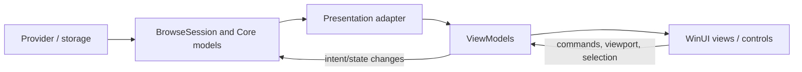

# Presentation architecture

Presentation adapts UI-independent Core state to WinUI without moving storage/application semantics into the visual layer.

## Responsibilities

Presentation owns:

- ViewModels and UI-facing adapters;
- dispatcher-bound collection mutation;
- localized labels and display formatting;
- viewport/focus/visual-selection integration;
- conversion of Core thumbnail/preview data into WinUI objects;
- mapping user gestures to Core navigation and commands;
- bounded/coalesced UI notifications.

Presentation does **not** own:

- provider identity rules;
- storage hierarchy semantics;
- filesystem/Shell implementation details;
- lifetime of Core models merely being displayed;
- generic operation semantics.

## Boundary

## Incremental publication

Large browse updates must be converted into bounded UI-thread work. Avoid one dispatcher callback per item, but also avoid enormous batches that monopolize the UI thread. Coalesce compatible changes and preserve stable row/ViewModel identity where possible.

## Selection

Core identity/selection state and visual control selection are different concerns. Synchronization must avoid feedback loops, unnecessary full scans, and presentation-container ownership leaking into Core.

## Viewport-driven enrichment

The UI knows which rows are visible; Core/provider layers know how to retrieve item capabilities. Presentation bridges these facts by reporting priority/viewport information without taking over capability retrieval semantics.

## UI-specific resources

Core results should remain UI independent. Decode/construct `BitmapImage` or other WinUI-specific objects on the presentation side, and keep expensive decode/copy work off the UI thread where contracts allow.

## Commands

Presentation exposes command state and invokes intent, while Core/application command models define the semantics. Command invalidation should be dependency-driven; global refresh after every unrelated item update is a scalability warning.

See [`commands.md`](commands.md).

## Lifetime

Adapters/ViewModels must unsubscribe and cancel presentation-specific work during disposal. They generally borrow Core models and must not dispose them unless ownership was explicitly transferred.

## Performance review checklist

- Is collection mutation bounded/coalesced?
- Is work accidentally repeated for every visible row?
- Are ViewModels recreated during metadata enrichment or sorting when identity could be retained?
- Does a command refresh scan all items?
- Does grouping rebuild the entire structure for small updates?
- Is image decode/copy happening on the UI thread?
- Does navigation-away clean up callbacks/tasks promptly?

## Tests

Presentation tests should protect incremental publication, stable row identity, cancellation, command invalidation, grouping behavior, control layout contracts, and the end-to-end realization/performance boundary described by issue #5.
