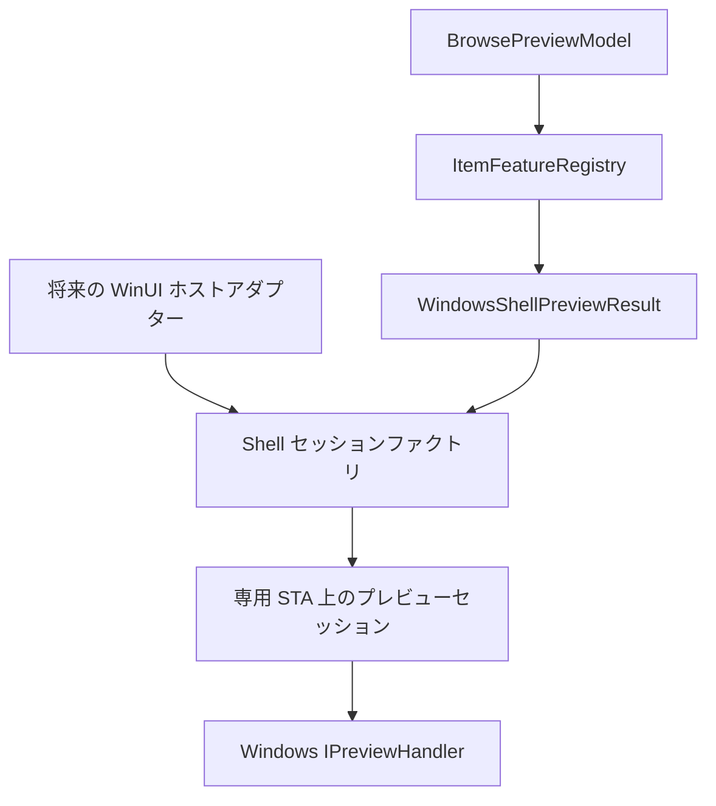
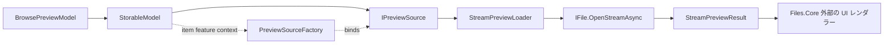
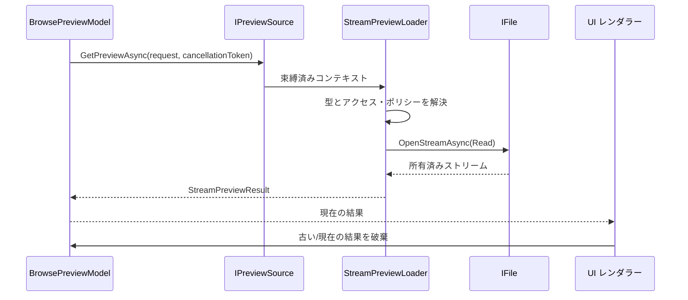

# プレビューの読み込み

プレビューは UI に依存しない項目機能です。`BrowsePreviewModel` が現在の項目を選択し、
`IPreviewSource` がその項目を破棄可能な `PreviewResult` に変換します。WinUI の画像、メディア、
ドキュメントレンダラーは、`Files.Core` の外側でその結果を消費します。

Core のプレビューアーキテクチャには、独立した 2 つの結果経路があります。ストリームプレビューは
`StreamPreviewResult` が所有するデータを返します。Windows Shell プレビューは記述子を返し、
UI ホストがセッションを開いたときにだけ COM ハンドラーを作成します。

## 共有ローダーと項目に束縛されたソース

ローダーには再利用可能なバックエンド処理を含めます。`PreviewSourceFactory` がローダーを
1 つの `ItemContext` に束縛し、モデルが公開する項目束縛済みの `IPreviewSource` を生成します。

現在 `StreamPreviewLoader` は、明示的に登録された拡張子を名前に持つ `IFile` CoreModel をサポートします。
その対応付けは `ExtensionPreviewContentTypeResolver` が所有し、大文字小文字を区別しません。
暗黙的な `application/octet-stream` フォールバックはありません。未知の拡張子は利用不可となり、
別のローダーが試行できるようにします。

## 合成とブロック

`PreviewSourceCombiner` は優先度の降順に選択肢を並べ、null でない結果を返すまで各ソースに問い合わせます。
`null` は「このソースは項目を処理しない」という意味です。一方 `BlockedPreviewResult` は意図的な終端応答であり、
優先度の低いフォールバックを防ぎます。

アクセスの判定は `IPreviewStreamAccessPolicy` によってストリームのオープンから分離します。
ポリシーはストリームを開く前に、`RequiresHydration`、`AccessDenied`、`DisabledByPolicy`、その他の
`PreviewBlockReason` を返せます。要求の `PreviewHydrationPolicy` はポリシーへそのまま渡されます。
`FilesCoreBuilder` は寛容なフォールバックを提供します。本番の Files は hydration と信頼のポリシーを
注入してください。

## ストリームの所有権とサイズ制限

`IFile.OpenStreamAsync` が成功した後、結果を返すまで `StreamPreviewLoader` がストリームを所有します。
成功時には所有権が `StreamPreviewResult` へ移り、その `DisposeAsync` は冪等です。キャンセル、オープンまたは
読み取りの失敗、サイズ超過の結果では、ローダーが開いたストリームを破棄します。

`MaximumBytes` がない場合、元のストリームをバッファーせずに返します。シーク可能なストリームなら、返す前に
長さを確認します。シークできないストリームは制限が必要な場合だけコピーし、最大でも `MaximumBytes + 1` バイトを
読み取ります。制限超過のコピーは `PreviewBlockReason.TooLarge` として破棄し、許可されたコピーは位置 0 から返して
実際の長さを報告します。

## 参照選択と競合

`BrowsePreviewModel` は現在の結果を所有し、選択、項目 ID、参照世代が変わると古い要求をキャンセルします。
古い要求が完了しても、その結果は公開せず破棄します。これにより項目機能の契約を WinUI のスレッド親和性から
独立させ、`BitmapImage.SetSourceAsync` のような画像生成を UI レイヤーに残します。

WinUI レンダラー、dispatcher に依存する画像・メディアオブジェクト、子 HWND ホストは Files.Core の外側です。
ストリーム所有権、Shell との関連付け、ハンドラーのアクティブ化、STA スケジュール、セッション制御、決定論的な
COM クリーンアップは Core で実装します。

## Windows Shell プレビューバックエンド

`WindowsShellPreviewResult` は UI に依存しない記述子です。安定した `StorableReference` と関連するハンドラー CLSID
を保持しますが、COM オブジェクト、`IShellItem`、PIDL、HWND、WinUI オブジェクト、識別に使うパスを所有しません。
`WindowsShellPreviewSessionFactory` はセッション開始時に参照を再解決し、項目を使用する前に返されたソースと項目の
識別情報を検証します。

`WindowsPreviewHandlerResolver` は Shell 関連付け API（`AssocQueryStringW`）を使い、プレビュー・ハンドラー Shell 拡張
カテゴリからプレビュー・ハンドラーを検出します。拡張子を正規化し、ネイティブ結果バッファーを確保する前に必要サイズを
問い合わせ、成功した関連付けと見つからなかった関連付けの両方をキャッシュします。不正な CLSID は利用不可として扱います。
そのためローダーは COM のアクティブ化、ファイルのオープン、HWND の処理を行いません。

セッションファクトリは専用の `WindowsShellScheduler` インスタンスを使用します。アクティブ化、ハンドラーの各メソッド呼び出し、
`IShellItem`/ストリームの作成、COM 解放はすべて、そのプレビュー STA にキューイングされます。既定のアクティブ化ポリシーでは
`CLSCTX_LOCAL_SERVER` でハンドラーをアクティブ化します。インプロセス・アクティブ化など別のコンテキストを使う場合は、
注入したアクティブ化ポリシーで明示的に指定する必要があります。暗黙的なインプロセス・フォールバックはありません。
初期化は次の順序で試行します。

1. `IInitializeWithStream`
2. `IInitializeWithItem`
3. `IInitializeWithFile`

最初に成功した契約が採用されます。ストリームと Shell 項目は `Unload()` と決定論的な破棄まで保持します。
コントローラーは最小限の `IPreviewHandlerFrame` サイトも提供し、任意の `IPreviewHandlerVisuals` を適用します。
さらに WinUI 依存なしで境界、フォーカス、アクセラレーター操作を公開します。クリーンアップでは、いずれかの操作が失敗しても
`Unload()`、`SetSite(null)`、すべての COM 解放を試行します。破棄は冪等です。

キャンセルはキューに入った操作の開始を防ぎますが、実行中の同期的なサードパーティー COM メソッドを中断することはできません。
Files アダプターは専用ホスト HWND を作成し、配置サイズを物理ピクセル境界へ変換し、テーマ・フォーカス・キーボードイベントを
転送し、アンロード時にセッションを破棄します。XAML コントロールとホストウィンドウの作成は意図的に Core に含めません。

セッションの終了はスレッド境界をまたいで順序付けます。まずプレビューコントローラーと COM 状態を専用プレビュー STA で破棄し、
そのコールバックの外側で解決済みの `IStorableModel` を非同期に破棄します。両方のクリーンアップを試行し、複数の失敗は集約します。
アクティブ化に失敗した場合も、プレビュー STA 上でコントローラーをクリーンアップし、元のエラーを返す前に対象モデルの破棄を待機します。

`AddWindowsStorage` は `StreamPreviewLoader` に優先度 200、`WindowsShellPreviewLoader` に優先度 100 を与えます。そのため既知の
ストリーム形式が優先されます。ブロックされた結果はフォールバックを停止し、`null` のストリーム結果なら Shell 記述子ソースを実行できます。
残る実装は、[旧 Files.App の互換アーキテクチャ](files-app.md) に記載する旧 Files.App のレンダラーとホストです。
