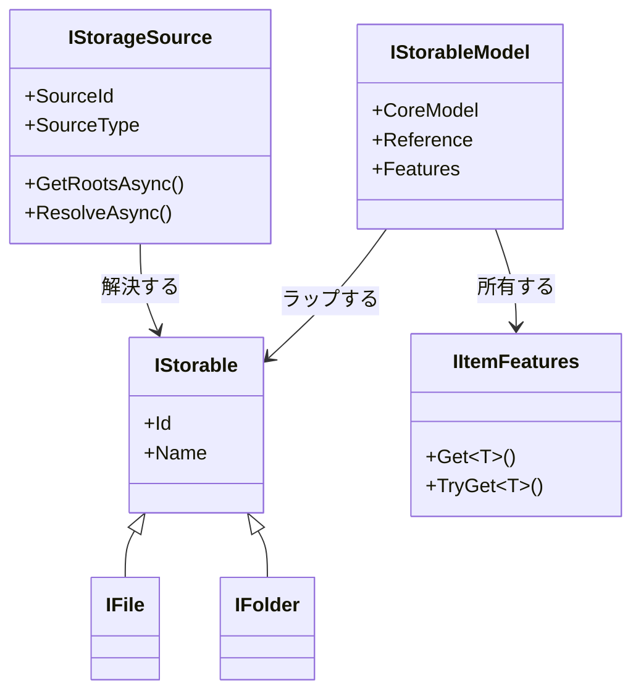
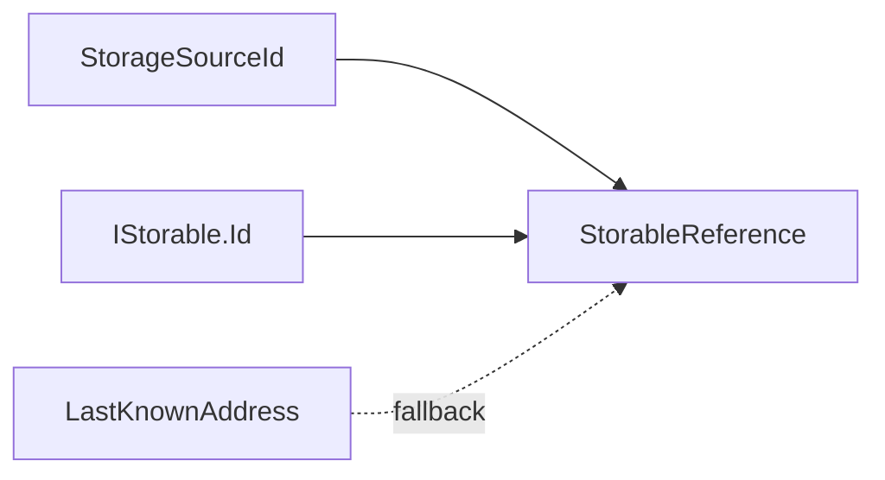
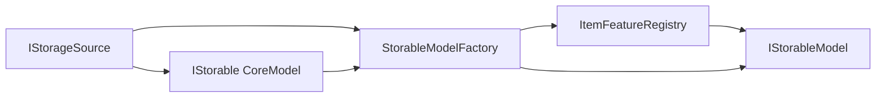

# ストレージモデルの境界

## CoreModel と AppModel

CoreModel はソースをまたいでストレージ項目を標準化します。ストレージにおける最小の CoreModel は、
`IStorable`、`IFile`、`IFolder` などの OwlCore.Storage インターフェースです。

項目 AppModel は CoreModel をラップし、Files 固有の合成を追加します。これは `Files.Core.Models.IStorableModel` として実装され、
WinUI の概念を公開しません。`Files.Core.AppModels` にはウィンドウ、タブ、ペインのアプリケーション状態 AppModel があり、
参照モデルがその状態グラフを完成させます。これは AppModel にある 2 つのスコープであり、競合するアーキテクチャレイヤーではありません。

`Files.Core` プロジェクトには CoreModel アダプターと AppModel の両方を含めます。プロジェクトの配置を、この文書で定める依存境界の代わりに使ってはいけません。

### OwlCore.Storage を使うときの規則

OwlCore.Storage の最小契約は、異なるストレージを同じ形で扱い、実装とテストの負担を抑えるための出発点です。

- `IStorable` の `Id` と `Name` だけを、すべての項目が提供できる値として扱います。
- `IFile.OpenStreamAsync` と `IFolder.GetItemsAsync` は、ファイル/フォルダーの基本能力です。
- パスや親を必要とする処理は `IAddressableStorable`/`IAddressableFolder` などの能力を確認してから実行します。
- 変更通知と変更操作は別の能力です。読み取り専用の項目へ書き込み API を要求したり、例外を能力判定の代わりに使ったりしません。
- Files の `IStorageSource` は、認証・ルート・解決を所有する source 境界です。`IStorable` の代替や、項目 AppModel の親として公開しません。

したがって、Files の `StorableReference` は source ID と項目 ID を結合しますが、`StorageAddress` や `LastKnownAddress` を識別子へ昇格させません。



`IStorageSource` は `IStorable` ではありません。構成された接続または名前空間を表し、ストレージ項目を生成できます。
Windows Shell 名前空間、FTP アカウント、開かれたアーカイブはストレージソースです。その子のファイルとフォルダーが storable です。

## 識別情報とアドレス

3 つの値には異なる役割があります。

| 型 | 意味 |
| --- | --- |
| `StorageSourceId` | 構成されたソースの安定した識別情報 |
| `IStorageSource.SourceType` | `windows-shell` や `ftp` などの短い実装分類。項目の識別情報ではない |
| `IStorable.Id` | そのソース内でソースが定義する識別情報 |
| `StorageAddress` | ソースが解決できる可能性のあるアドレス |

`StorableReference` はソース ID と項目 ID を結合します。等値比較とハッシュコードは意図的にこの 2 つだけを使います。
`LastKnownAddress` は任意の復旧ヒントであり、識別情報には参加しません。

Windows ファイルシステム項目は、利用できる場合、バージョン付きの `winfs:v1:<volume>:<file-index>` 識別情報を使います。
現在の `StorageAddress` は `file:` スキームとファイルシステムパスを使い、Shell 解析名と管理対象の絶対 PIDL は別のロケーターとして扱います。
ファイルシステムパスを持たない項目は `shell:` アドレスを使います。ファイルシステム ID がない仮想またはアクセス不能な項目は、
`winshell-address:v1:<address>` というエンコード済み識別情報へフォールバックします。

FTP 接続はソース ID に `ftp:<ConnectionId>` を使い、大文字小文字の表記を保持した正規化リモートパスを項目 ID にします。
FTP には移植可能で安定したファイル ID がないため、名前変更または移動では新しい参照を生成し、古いパス識別情報を無効にします。
`ftp:`、`ftpes:`、`ftps:` アドレスにはエンドポイントとエスケープ済みパスを含めますが、認証情報を決して含めません。
[FTP ストレージソース](ftp-storage.md)を参照してください。

解決では結果の識別情報を検証し、古いアドレスが別のファイルに置き換わっていた場合は拒否します。Windows ソースは以前の親を走査することで、
同じディレクトリ内の名前変更を冷たい参照から解決できます。ディレクトリをまたぐ冷たい検索には、ボリュームのファイル ID インデックスまたは `OpenFileById` 戦略が必要です。
ライブ操作は更新済みの参照を返し、開いているセッションはウォッチャー経由で移動を受け取ります。



## 項目機能（オプション機能）

項目機能は独立したインターフェースです。具体的な CoreModel が `IStorable` と項目機能の両方を直接実装することはありますが、
項目機能が `IStorable` を継承することはありません。

```csharp
public interface IThumbnailSource
{
	ValueTask<ThumbnailResult?> GetThumbnailAsync(
		ThumbnailRequest request,
		CancellationToken cancellationToken = default);
}

public interface IPropertySource
{
	ValueTask<IReadOnlyDictionary<string, object?>> GetPropertiesAsync(
		PropertyRequest request,
		CancellationToken cancellationToken = default);
}
```

実装はソースアダプター、キャッシュラッパー、拡張機能から提供できます。`ItemFeatureRegistry` はそれらの選択肢を一度だけ合成し、
結果を AppModel の `IItemFeatures` に保存します。



解決、複数ソース、ラッパー、所有権については[項目機能の合成](item-features.md)を参照してください。

## 所有権

`IStorableModelFactory` は、渡された新しい CoreModel の所有権を、返す AppModel へ移します。AppModel は CoreModel を破棄する前に、項目機能セットを非同期で破棄します。
項目機能または CoreModel が `IDisposable` だけを提供する場合、その同期クリーンアップも同じ破棄順序で実行します。

参照セッションの置換、更新、差分の削除/名前変更/更新、ナビゲーション失敗、セッション終了では、すべて `IStorableModel.DisposeAsync` を待機します。
クリーンアップは所有するすべての項目を試行し、残りのモデルを放棄せずに失敗を集約します。同期 `Dispose` メンバーは互換性ブリッジです。
Files は UI スレッド上の破棄を非同期のまま維持しなければなりません。

ストレージソースと共有サービスはより長いライフタイムを持ち、`FilesDataRoot` またはアプリケーションの合成ルートが所有します。
これにより、ネイティブリソースの数をビジュアルツリーではなくモデルグラフに対応させて制限できます。

開かれたアーカイブは、プロセス全体のソースライフタイムに対するスコープ付きの例外です。選択された `IArchiveMount` は、アクティブな `ArchiveBrowseLocationContext` の間だけ項目ソースを公開します。
内部エントリは、バックエンドに依存しない外側の `StorableReference` と正規化されたエントリパスを使ってナビゲートします。[アーカイブ参照](archives.md)を参照してください。
