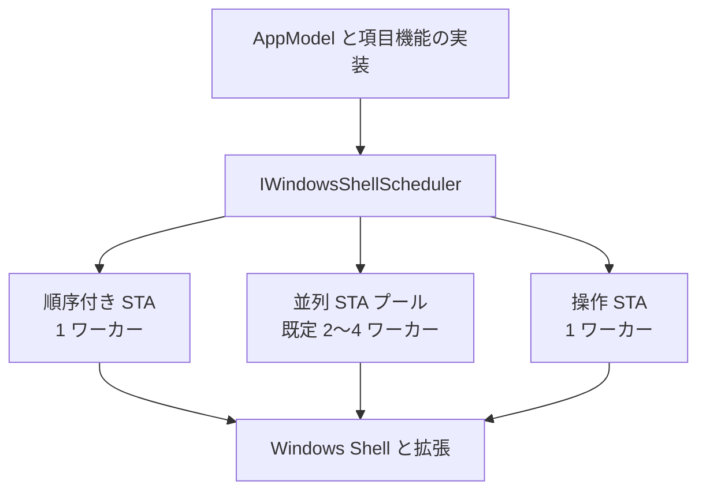
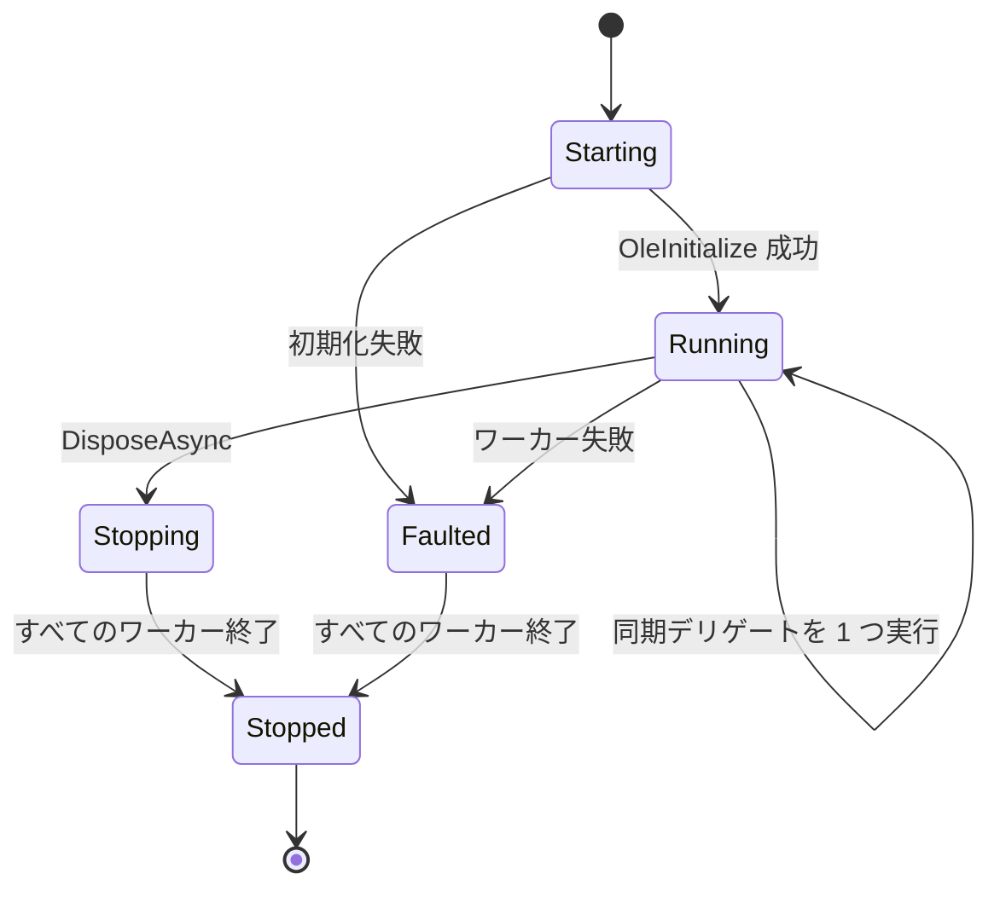
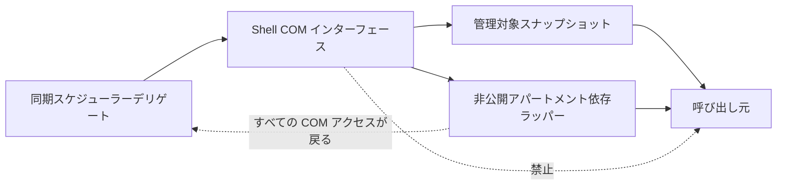
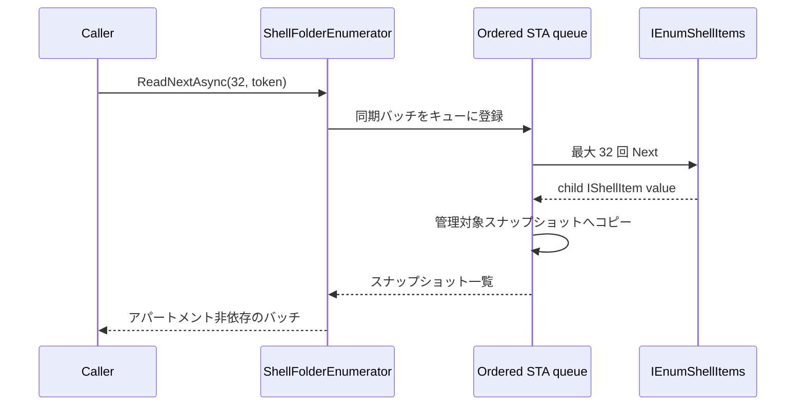

# Windows Shell のスレッド処理

Windows Shell の COM 処理は `IWindowsShellScheduler` の背後に隔離します。このスケジューラーは Files 固有のサービスであり、
注入、共有、テスト用の置換が可能です。

低レベルの STA 機構は、ReFiles 実験から有用な OLE 初期化と Win32 メッセージポンプの部分に従います。
ただし ReFiles のソース、項目機能、ルートモデルのアーキテクチャは採用しません。Files は独自の CoreModel と項目機能フローを維持します。

## レーン

| API | 想定する処理 | 順序と親和性 |
| --- | --- | --- |
| `InvokeAsync` | 項目作成、メタデータ、列挙、アパートメント依存ラッパー | 順序付きワーカー 1 つ。生成元アパートメントに戻る必要があるオブジェクトに使う |
| `InvokeConcurrentAsync` | 保持された COM オブジェクトを持たない独立したサムネイル/アイコン抽出 | 小さなワーカープール。呼び出しは別アパートメントで実行される場合がある |
| `InvokeOperationAsync` | 長時間の `IFileOperation` 型の変更 | 別の順序付きワーカー。コピーのダイアログがメタデータや参照をブロックしない |

操作レーンは名前変更などの長時間の Shell 変更を実行し、順序付きメタデータ処理をブロックしません。

Windows Shell プレビューハンドラーは、`FilesCoreRuntime` が所有する別の `WindowsShellScheduler(concurrentWorkerCount: 1)` を使います。
そのためハンドラーのアクティブ化、初期化、呼び出し、解放はストレージメタデータや操作レーンをブロックせず、1 つのプレビューセッションが 1 つのメッセージポンプ付き STA に残ります。

## ワーカーの動作

各ワーカーは次の処理をします。

1. STA に入り `OleInitialize` を呼び出す。
2. Win32 メッセージキューを作成する。
3. `MsgWaitForMultipleObjectsEx` でキューのセマフォまたはウィンドウメッセージを待つ。
4. キューに入った処理を続行する前にメッセージをポンプする。
5. 初期化成功と対になる `OleUninitialize` を呼び出す。

Shell 拡張とソースは、ワーカーに表示ウィンドウがなくてもメッセージディスパッチと COM の再入に依存する場合があるため、これは重要です。

## 境界の規則

- スケジューラーデリゲートは同期 `Func<T>` です。`async` デリゲートは STA 契約の外で再開するため使いません。
- 生の Shell/COM インターフェースを任意の呼び出し元へ逃がしません。
- データは不変の管理対象スナップショットへコピーすることを優先します。
- オブジェクトを生存させる必要がある場合は、すべてのアクセスを同じ順序付きレーンへスケジュールする非公開ラッパーだけが保持できます。
- 実行中の処理を強制的にキャンセルしません。キャンセルトークンは開始待ちの処理をキャンセルし、デリゲート自身もトークンを確認できます。
- 同じスケジューラーからの入れ子の呼び出しは、後ろにキューイングされてデッドロックするのを避けるためインラインで実行します。

## 列挙のシーケンス

バッチ間のキャンセルは、子ごとにスケジューラー遷移のコストを払わず、すぐに処理できます。

## 終了と所有権

`WindowsShellScheduler` は static global ではなくインスタンスサービスです。破棄では処理の受付をアトミックに停止し、キュー済みの処理を `ObjectDisposedException` で fault させ、
すべてのワーカーを起こし、実行中のデリゲートが終了するのを待ってからキューハンドルを破棄します。

アプリケーションルートはストレージソースとスケジューラーより先に、項目モデルとアパートメント依存ストリームを破棄します。
注入されたスケジューラーは `WindowsStorageSource` から借用され、ソースが作成したスケジューラーはそのソースが所有します。
ソースとランタイムの破棄は冪等で、独立したクリーンアップ失敗があっても処理を継続します。
