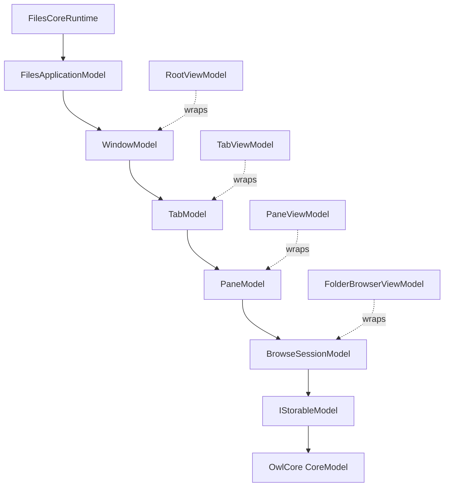

# Trickle-down MVVM と Files の設計規約

この文書は、`docs/architecture` 全体に適用する UI とモデルの規約です。個別の機能文書がこの規約と矛盾する場合は、移行期間の例外を除き、この文書を正本とします。

## 参照した原則

- [Trickle-down MVVM: High maintainability via careful data handling](https://dev.to/arlodotexe/excellent-architecture-trickle-down-mvvm-45jk)
- [Strix Music](https://github.com/Arlodotexe/strix-music) と [Strix Music SDK のドキュメント](https://www.strixmusic.com/docs/)
- [OwlCore.Storage](https://github.com/Arlodotexe/OwlCore.Storage)
- [Files の vNext UI リアーキテクチャ](https://github.com/0x5bfa/Website/blob/5bfa/codebase-docs/src/routes/blog/posts/outlook-on-the-codebase-toward-vnext/%2Bpage.md)
- [Files Brainstorm wiki](https://github.com/0x5bfa/Files/wiki)

これらは実装依存ではなく、モデルの再利用性、所有権、UI の構成を判断するための設計資料です。Strix や OwlCore の型をそのまま Files の契約にコピーするのではなく、Files の Windows Shell、アーカイブ、FTP、out-of-process operation の要件に合わせて適用します。

## 用語と境界

### CoreModel

CoreModel は、ストレージソースが提供できる最小のデータ形状です。Files では OwlCore.Storage の `IStorable`、`IFile`、`IFolder` がその基礎になります。

- `IStorable` は安定した `Id` と `Name` だけを持ちます。
- パス、親、監視、変更、プロパティ、コピー/移動などは、対応する能力インターフェースで表します。
- CoreModel の識別子をパスや表示名から推測しません。
- `IStorageSource` は Files が定義するソース/名前空間の契約であり、OwlCore の項目そのものではありません。

### AppModel

AppModel は CoreModel を Files のアプリケーションコンテキストへ適応する UI 非依存モデルです。

- `IStorableModel` は CoreModel、`StorableReference`、項目機能、所有権を束ねる項目 AppModel です。
- `FilesApplicationModel`、`WindowModel`、`TabModel`、`PaneModel`、`BrowseSessionModel` はアプリケーション状態 AppModel です。
- AppModel は子モデルを所有し、子モデルへ設定済みの依存関係を渡します。View、ViewModel、WinUI 型を公開しません。
- `FilesCoreRuntime` は process-scope の合成と長寿命サービスを所有します。末端の ViewModel が runtime をサービスロケーターとして受け取ることはありません。

### Strix の Core/AppModel パターンを Files へ適用する範囲

Strix では、音楽 source が標準化された CoreModel を実装し、複数 source を組み合わせた Core の上に、機能を追加する AppModel plugin と ViewModel wrapper を重ねます。
Files では同じ方向性を、次の境界へ読み替えます。

- Windows、FTP、アーカイブなどの source は、OwlCore.Storage の最小形状と Files の source 契約を実装します。
- thumbnail、property、preview、watcher などの項目機能は、項目 AppModel の capability/plugin として遅延合成します。
- `PaneModel` や `BrowseSessionModel` は source 項目をアプリケーション状態へ適応し、source の UI 詳細を漏らしません。
- ViewModel は AppModel を必要な View の粒度で包み、View は DP を通じてそれを子 Control へ渡します。

この対応により、同じ CoreModel を一覧、プレビュー、操作、バックグラウンド処理から再利用できます。source ごとに ViewModel や XAML を複製する設計は採用しません。

### ViewModel

ViewModel は直接の AppModel を、特定の View が消費できる通知、コマンド、コレクションへ適応する薄いラッパーです。

- 原則としてコンストラクター依存は直接の AppModel 1 つです。
- UI dispatcher、ローカライズ、`BitmapImage`、`ObservableCollection` は ViewModel/adapter の境界に閉じ込めます。
- 追加の投影が必要な場合は、合成ルートで明示的に作った UI adapter を渡します。ViewModel 内で `IServiceProvider`、`Ioc.Default`、runtime からサービスを探しません。
- ViewModel は別の View の都合の `Visibility`、レイアウト、テンプレート状態を AppModel に戻しません。

## データが流れる方向

親が子を作成・破棄し、ViewModel は対応するモデル階層を同じ粒度で包みます。並列の UI コレクションを別の所有者にしないでください。Core の変更通知は、UI adapter が不変の値と世代をコピーしてから dispatcher に渡します。

## View と Control の規約

Trickle-down MVVM では、Control は View の一部であり、内部実装のための汎用 ViewModel を必ずしも持ちません。WinUI の `DependencyProperty` が ViewModel、項目コレクション、表示設定を親から受け取り、テンプレートと code-behind が Control の振る舞いを所有します。

- `RootView` だけが window の `RootViewModel` を受け取ります。
- `TabView`、`NavigationToolbar`、`ToolbarView` は、それぞれ `TabStripViewModel`、`NavigationToolbarViewModel`、`ToolbarViewModel` を DP で受け取ります。親の `RootViewModel` をそのまま子 Control へ渡しません。
- `PaneView`、`FolderBrowser`、各 folder view は対応する ViewModel を DP で受け取ります。
- `PaneHost` は `ItemsRepeater` の配置と active pane の routing だけを行い、`ScrollViewer` を持ちません。
- `PaneView` が pane ごとの `ScrollViewer` を所有します。`TabModel.SplitOrientation` に応じて各 pane を水平方向または垂直方向に stretch します。
- `PaneContentView` は pane の content kind を `ContentPresenter` で選択するだけで、pane のスクロールや navigation を所有しません。
- `FolderBrowser` は folder view の選択だけを行い、各 view が一覧の入力、選択、viewport を所有します。
- 各 `FolderBrowser` は pane/tab に属する状態を表示します。`ToolbarView` と `InfoPane` のような共有 UI は Sidebar 側に 1 つだけ置き、必要な表示モデルまたは表示値だけを DP で受け取ります。
- Details view はチェックボックスではなく選択状態の視覚表現を使い、各項目の thumbnail を表示します。

新しい Control に専用 ViewModel を追加する前に、DP、`DataTemplate`、既存の親 ViewModel で表現できない理由を確認してください。Control の内部状態が外部のデータ形状と異なる場合だけ、Control 専用の小さな投影を作ります。

## コマンドの境界

コマンドは次の 4 層に分かれます。

1. process-scope の immutable な `CommandRegistry` が安定した `CommandId` と descriptor を持つ。
2. window-scope の manager が active window、tab、pane、選択世代から `CommandContext` を作る。
3. handler が AppModel のメソッドまたは Core の明示的な契約を呼び出す。
4. ViewModel は `ICommand` binding adapter を公開し、Control は DP/`x:Bind` でそれを消費する。

コマンド handler に XAML、表示文字列、`IStorableModel` の長期保持、グローバル IoC 解決を入れません。複数項目や window policy に依存するコマンドは項目機能ではなく、pane/window のコンテキストで評価します。

## 現行実装の移行例外

現在の最初の browsing slice には、安定した境界へ移すための例外があります。これらは新しい実装のテンプレートではありません。

- `RootViewModel` は `WindowCommandManager` と dispatcher を構築します。
- `TabViewModel`、`PaneViewModel`、`FolderBrowserViewModel` は `IFilesDataRoot`、dispatcher、command manager を引き継ぎます。
- `FolderBrowserViewModel` は `CoreBrowseAdapter` を構築し、Core event と WinUI collection の間を接続します。
- `BrowseItemViewModel` は Core の値を `BitmapImage` と表示文字列へ投影するため、UI 専用の型を持ちます。

次の移行単位では、adapter の生成を Files の composition root または明示的な presenter factory へ寄せ、入れ子 ViewModel が直接 runtime/data root/dispatcher を受け取らない形へ縮小します。`App2CommandRegistration` のような旧プロジェクト名を含む型名も、互換性を確認したうえで `Files` の命名へ整理します。

## 受け入れチェックリスト

- CoreModel は UI なしでテストでき、AppModel は子モデルと所有権を明示している。
- ViewModel は直接モデル以外の依存関係を追加する理由と移行期限を文書化している。
- Control は DP から値を受け取り、Control の挙動を ViewModel やサービスへ漏らしていない。
- `IStorable` の `Id` と `StorableReference` を識別情報に使い、パスをキーにしていない。
- Core の通知は世代/バージョンを検証してから UI dispatcher へ投影される。
- 親が子を破棄し、ViewModel/Control が借用した CoreModel を勝手に破棄しない。
- process、window、pane のコマンドコンテキストを混同しない。
