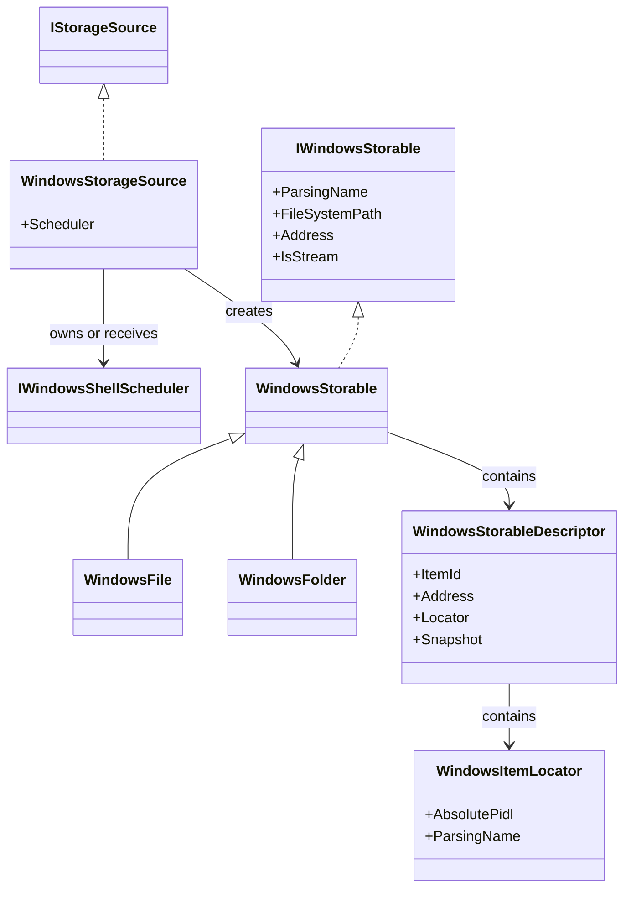
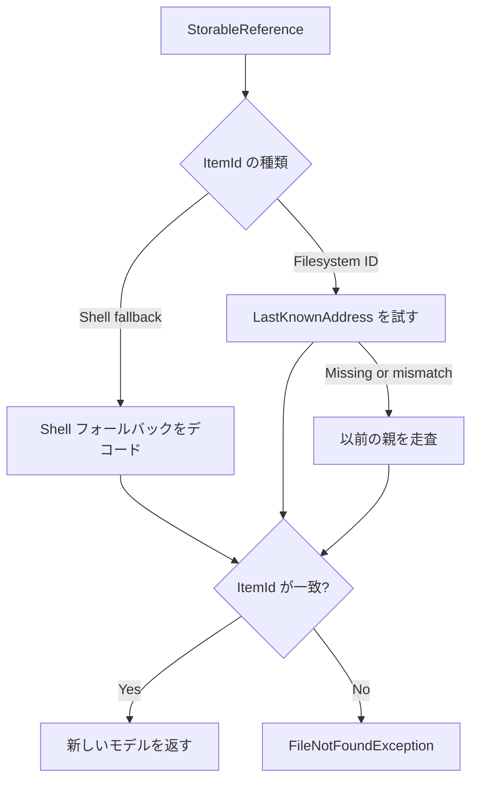
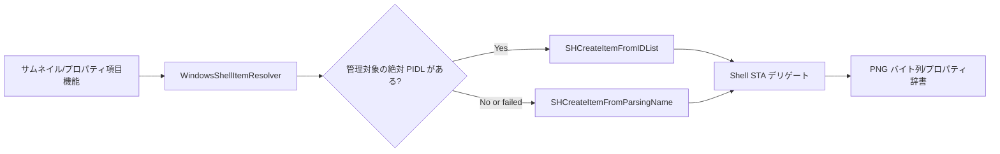
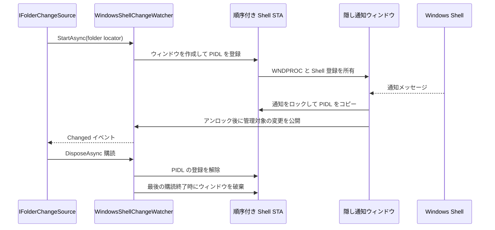
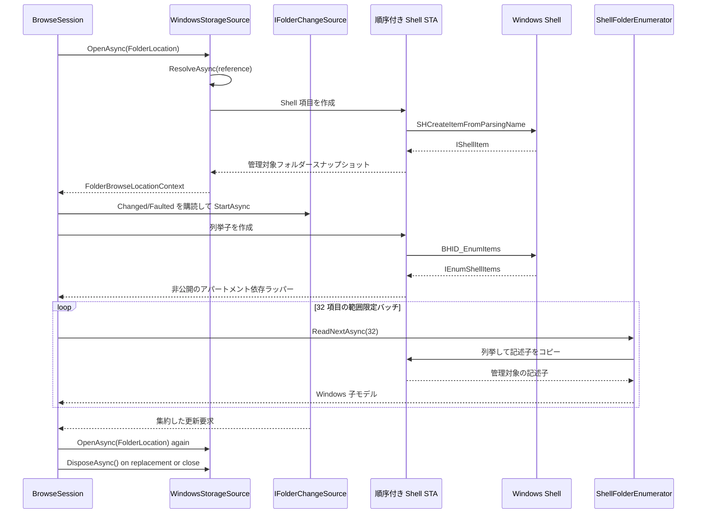
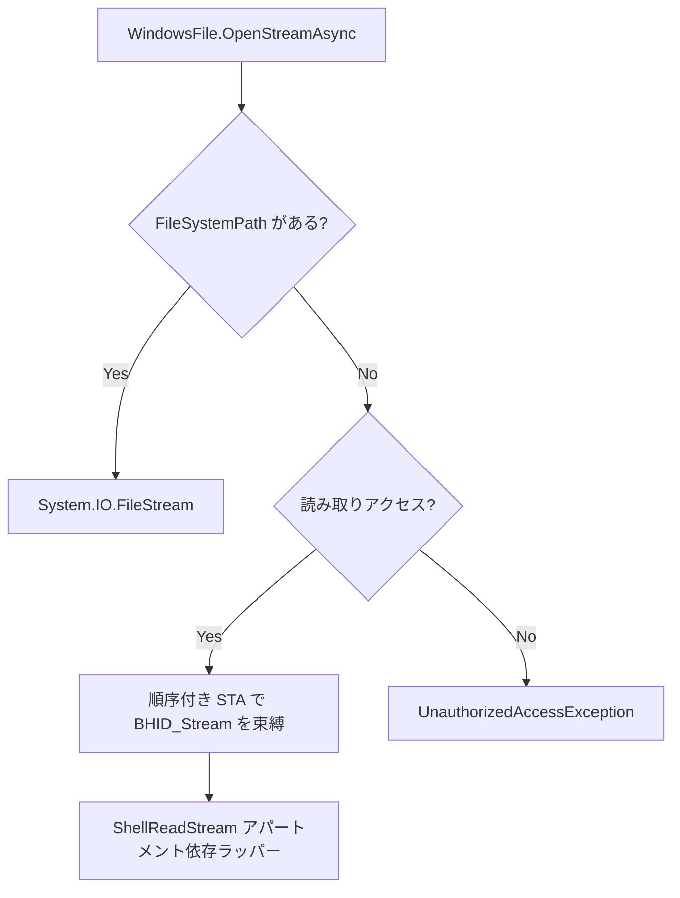
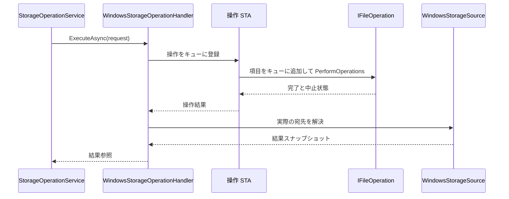

# Windows ストレージソース

Windows ソースは、WinUI 依存関係を導入したり、アパートメントに依存する COM インターフェースを通常のモデルへ漏らしたりせずに、Windows Shell 名前空間を OwlCore.Storage に対応付けます。

## オブジェクトモデル



`WindowsStorageSource` は `shell` と `file` の両方のアドレスを解決します。既定のルートは、Shell の既知のフォルダーである `ComputerFolder` です。

```csharp
await using var dataRoot = new FilesDataRoot(
	[new WindowsStorageSource()],
	new StorableModelFactory(item features));

var windows = dataRoot.Sources.Single();

await foreach (var root in dataRoot.GetRootsAsync(windows.SourceId))
{
	using (root)
	{
		// Pass root.Reference into a FolderLocation or another AppModel.
	}
}
```

`WindowsStorableDescriptor` は、順序付けられた Shell STA 上にいる間に次の値をコピーします。

- `ItemId` は 1 つの `IWindowsItemIdReader` が作成します。ファイルシステム項目にはバージョン付きの `winfs:v1:<volume>:<file-index>` 識別情報を使い、
  仮想またはアクセス不能な項目にはバージョン付きでエンコードされた `winshell-address:v1:<address>` フォールバックを使います。
- `WindowsItemLocator` は絶対 PIDL の管理対象コピーと、`SIGDN_DESKTOPABSOLUTEPARSING` のフォールバックロケーターを含みます。STA の操作が戻る前に PIDL をコピーします。
- `Name` は UI 向けの Shell 表示名を使い、通常表示名へフォールバックします。
- `FileSystemPath` は `SFGAO_FILESYSTEM` が存在する場合だけ `SIGDN_FILESYSPATH` を使います。設計上 null 許容です。
- `IsFolder` は `IShellItem` を保持せずに `WindowsFolder` または `WindowsFile` を選択します。
- `IsStream` は `SFGAO_STREAM` をスナップショットします。`IsFolder` と組み合わせることで、アーカイブのようなファイル形状の Shell コンテナーと通常のファイルシステムディレクトリを、同期的なファイルシステム探索なしで区別できます。

アドレスと識別情報は意図的に独立しています。ファイルシステムモデルは現在のファイルシステムパスを含む `file:` アドレスを公開します。
ファイルシステムパスを持たない項目はデスクトップ絶対解析名を含む `shell:` アドレスを公開します。どちらもソース定義の識別情報を使えます。

Windows のファイル ID は名前変更をまたいで安定します。永続化されたファイルシステム参照は、以前の `file:` アドレスを復旧ヒントとして保持します。
解決ではそのパスを試し、パスがなくなった、または別の項目を指すようになった場合は、以前の親ディレクトリを走査して要求されたファイル ID を探します。
解決された候補が要求された `ItemId` と完全に一致する場合だけ参照を受け入れ、古いアドレスに再作成されたファイルは拒否します。

この走査は同じディレクトリ内の名前変更を対象にした、範囲を限定したフォールバックです。冷たい参照は、古いアドレスだけでは別のディレクトリへの移動を復旧できません。
その場合は `OpenFileById` のようなボリューム相対逆引きや、新しいアドレスを永続化する外部ウォッチャー/インデックスが必要です。ライブ操作では更新された参照を返します。

ファイルシステムパスや解析名を識別情報にすると、This PC、ライブラリ、ごみ箱、ポータブルデバイスのような仮想項目を識別できなくなります。

## 永続化参照の復旧



識別情報のソースはステートレスです。復旧は元の `WindowsStorageSource` を破棄して再作成した後でも機能し、プロセス内の item-ID からパスへの辞書に依存しません。

## スナップショット境界


そのため、ほとんどの CoreModel はアパートメントに依存せず、破棄も不要です。存続させる必要があるリソースの内部ラッパーだけが例外です。

- `ShellFolderEnumerator` は `IEnumShellItems` を所有し、範囲を限定した各バッチを同じ順序付き STA へ送ります。
- `ShellReadStream` は仮想 `IStream` を所有し、`Read`、`Seek`、`Stat`、解放を同じ順序付き STA へ送ります。

どちらのラッパーも COM インターフェースを公開しません。

## 共有 Shell リゾルバー

すべての Shell 項目の具象化は `WindowsShellItemResolver` を通ります。まず管理対象 PIDL で `SHCreateItemFromIDList` を試し、次にロケーターで `SHCreateItemFromParsingName` へフォールバックします。
リゾルバーは選択された STA 内で呼び出し元の操作を実行し、管理対象データまたは非公開のアパートメント依存ラッパーだけを返します。



項目機能のソースが受け取るのはロケーターであり、`IShellItem` や生の PIDL ポインターではありません。これにより COM の親和性をリゾルバー内に閉じ込め、
ファイルシステム、仮想 Shell、サムネイル、プロパティの各経路に 1 つの具象化境界を提供します。

## フォルダー変更項目機能

`WindowsStorageSource` は `WindowsShellChangeWatcher` を 1 つ所有します。モデル向けに作成される各 `WindowsFolderChangeSource` は論理的なソース購読を 1 つ所有し、
`Changed` イベントを公開します。同一フォルダーの登録はソースで共有するため、複数のイベントハンドラーが追加のネイティブ登録を作ることはありません。複数フォルダーの監視でも同じ隠しウィンドウを使います。



ソースは、非再帰フォルダー購読に対して、管理対象 PIDL と Shell 項目のフォールバックを使った Shell 親チェックで絶対 PIDL をフィルターします。
名前変更通知は古い PIDL と新しい PIDL を保持します。`SHCNE_UPDATEDIR` と利用可能な項目 PIDL を持たない通知は `DirectoryUpdated` または `RequiresRefresh` を含む変更になり、
コンシューマーが安全に再列挙できます。各ソース購読は範囲を限定したチャネルを使い、オーバーフロー時には古い詳細を破棄してディレクトリ更新を 1 回発行します。
通知をファイルシステムパスへ変換することはないため、仮想 Shell 項目と `MAX_PATH` より長いパスもサポートされます。

## 参照の流れ



セッションは列挙の前に任意のウォッチャーを開始します。列挙中に受信した通知は、新しいコンテキストが確定した後に 1 つの更新要求になります。
列挙でフォルダー全体をバッファーすることはありません。範囲を限定したバッチでスケジューラー遷移のコストを償却しつつ、バッチ間のストリーミングとキャンセルを維持します。

## ファイルストリーム



ファイルシステム項目は、読み取り/書き込み/削除共有を設定した `FileStream` を使います。仮想項目は `BHID_Stream` を通じて `IStream` を要求し、
Core はその非公開でアパートメント安全なラッパーを読み取り専用として公開します。

## Windows Shell 操作

`StorageOperationService` は、1 つの Windows ソースが所有する参照に対して `WindowsStorageOperationHandler` を選択します。
ハンドラーは、ファイルシステムの作成、名前変更、コピー、移動と、ファイルシステムまたは仮想項目の Shell 削除をサポートします。
要求を検証し、不変の入力スナップショットを解決し、操作 STA レーンで `IFileOperation` をスケジュールします。



名前変更では、変更をキューに入れる直前に Shell 項目のファイルシステム識別情報を再確認します。そのため古い解析名が置き換え項目を静かに対象にすることはありません。
作成/コピー/移動では完了後に実際の宛先を解決します。キューに入った HRESULT だけを個別項目の完了の証拠として扱わず、`PerformOperations` と中止状態の両方を確認します。

名前は検証済みの Windows の 1 セグメントです。ハンドラーはトラバーサル、予約済み DOS デバイス、不正な文字、末尾の空白/ドットを拒否します。
衝突時は失敗するか `name (2).ext` を生成します。削除は、要求が明示的に完全削除を指定しない限り、ごみ箱を使用します。

解決中や STA にキューイングされた作業をまだ防止できる間はキャンセルを尊重します。Shell 操作が確定した後は、結果の具象化に `CancellationToken.None` を使います。
成功した副作用の後でキャンセルを報告すると、安全でない再試行を促してしまうためです。

## ライフタイム

- `FilesDataRoot` が各 `WindowsStorageSource` を所有します。
- 注入されたスケジューラーなしで作成されたソースは、`WindowsShellScheduler` を所有して破棄します。
- `IWindowsShellScheduler` を渡されたソースはそれを借用し、合成ルートが共有スケジューラーを所有します。
- `WindowsStorable` は管理対象スナップショットだけを含み、破棄可能ではありません。
- ソースまたは共有スケジューラーを破棄する前に、アパートメント依存の列挙子とストリームラッパーを完了させなければなりません。
- ソース生成された COM 投影は `Files.Core` 内で直接生成され、互換性のない `Marshal.ReleaseComObject` API は使用しません。

レーン選択、キャンセル、再入、終了については [Windows Shell のスレッド処理](threading.md) を参照してください。

## 実装済みの範囲

実装済み:

- ファイルシステムおよび仮想 Shell 項目の解析。
- 既知のフォルダー、アドレス、永続化参照の解決。
- ボリュームシリアルとファイルインデックスからのバージョン付きソース定義識別情報、および安定したファイルシステム ID を公開できない項目向けのエンコード済みアドレスフォールバック。
- 古いアドレスに別の項目が存在する場合に返却を拒否する厳格な参照解決。
- ファイルシステム参照からの、同じディレクトリ内の冷たい名前変更復旧。
- 管理対象 PIDL 記述子と、ストレージおよび項目機能で共有する 1 つの Shell 項目リゾルバー。
- 親の検索。
- 範囲を限定したバッチによる子項目のストリーミング列挙。
- ファイルシステムストリームと、アパートメント安全な仮想読み取りストリーム。
- 注入可能なメッセージポンプ付き STA スケジューリング。
- `IShellItemImageFactory` による Windows Shell サムネイル抽出。PNG の具象化は並行 Shell STA レーン内で行います。
- ソースが所有する通知ウォッチャーと管理対象 PIDL の配送による Windows Shell フォルダー変更購読。
- 項目種別、サイズ、作成時刻、変更時刻の型付き Shell プロパティ。
- ストリームプレビュー記述子と Windows Shell プレビューハンドラーの関連付け、ローカルサーバーアクティブ化、ホスティングセッション、決定論的クリーンアップ。
- `IFileOperation` によるファイルシステムの作成、名前変更、コピー、移動と Shell 削除。

古い参照だけからのディレクトリ間の冷たい復旧、追加の正規プロパティ型、検索インデックス、コンテキストメニュー、ドラッグ/ドロップデータパッケージ、任意の Shell 動詞は、
引き続き明示的なソースまたは Files 拡張です。これらはストレージ/モデル境界を変更しません。
