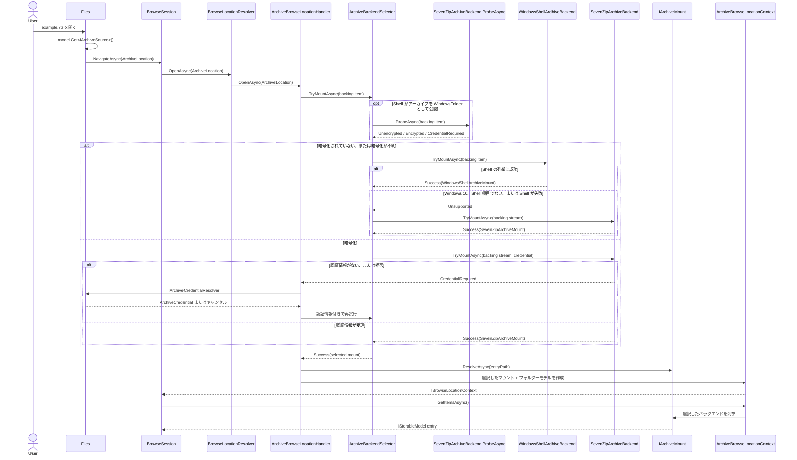
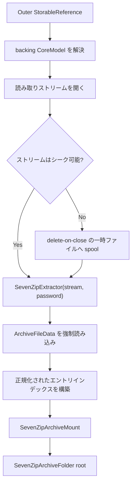
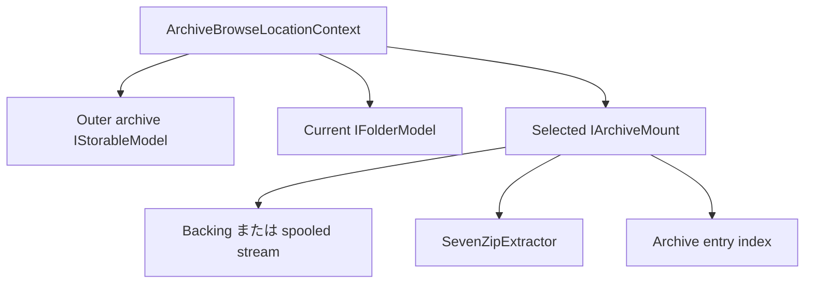

# アーカイブ参照

アーカイブ参照は UI に依存しない Files.Core の垂直スライスです。元ファイルの
`StorableReference` を保持したまま、アーカイブをマウント可能な参照場所として扱います。
Windows Shell がアーカイブをフォルダーとして公開する場合は Shell を優先します。Windows 10、
暗号化アーカイブ、リモートストリーム、Shell が未対応の場合は SevenZipSharp へフォールバックします。

## 用語

この設計で `OpenAsync` は SevenZipSharp の API ではありません。3 つの操作を分離します。

| 操作 | 責務 |
| --- | --- |
| `ArchiveBrowseLocationHandler.OpenAsync` | 参照セッションのために `ArchiveLocation` を開く |
| `IArchiveBackend.TryMountAsync` | 1 つのバックエンドを選択してマウントを試みる |
| `IArchiveMount.ResolveAsync` | 選択されたマウント内のルートまたはエントリを解決する |

SevenZipSharp では、シーク可能なストリームに対して `SevenZipExtractor` を構築し、`ArchiveFileData` を
読み込むことで開きます。

## エンドツーエンドのオープンフロー



アーカイブエントリが参照セッションへ確定される前に選択を完了させます。Shell の子と SevenZip の子を混在させません。
識別情報、パスの正規化、メタデータ、変更動作が同じだとは仮定しません。

## Files のエントリーポイント

Shell のアーカイブフォルダーと通常のファイルは、どちらも `IArchiveSource` を公開できます。
Files は `IFolderModel` を通常のフォルダーとして扱う前に、この項目機能を確認しなければなりません。

```csharp
BrowseLocation CreateOpenLocation(IStorableModel item)
{
	if (item.Get<IArchiveSource>() is { } archive)
	{
		return new ArchiveLocation(archive.Archive);
	}

	if (item is IFolderModel folder)
	{
		return new FolderLocation(folder.Reference);
	}

	throw new InvalidOperationException(
		$"'{item.Name}' is not browsable.");
}
```

SevenZip バックエンドから返されるフォルダーは `IArchiveEntry` を実装します。これを開くと、同じ外側アーカイブと
正規化されたエントリパスを持つ別の `ArchiveLocation` が作成されます。

```csharp
if (item is IFolderModel
	&& item.Get<IArchiveEntry>() is { } entry)
{
	return new ArchiveLocation(entry);
}
```

`ArchiveLocation` にパスワードを含めてはいけません。

```text
ArchiveLocation
├── Archive: example.7z への StorableReference
└── EntryPath: "" または "Documents/Reports"
```

## バックエンドの選択

既定の登録順序は次のとおりです。

| 優先度 | バックエンド | 適用条件 |
| ---: | --- | --- |
| 200 | `WindowsShellArchiveBackend` | backing source が `WindowsStorageSource`、項目が `SFGAO_STREAM` を持つ `IFolder`、Shell 列挙に成功 |
| 100 | `SevenZipArchiveBackend` | SevenZipSharp でシーク可能なアーカイブストリームを開ける |

暗号化アーカイブがエントリ読み取り時に初めて失敗するのを避けるため、Shell フォルダーを選ぶ前に SevenZip の probe を実行します。
他のストレージ項目では probe は補助的な判断です。Windows 10 の `.7z` ファイルとリモートファイルは直接 SevenZip マウントへ進み、2 回解析しません。

Windows 項目では、アーカイブ拡張子の検出に UI 表示名ではなくファイルシステム名または Shell 解析名を使います。そのため Explorer の「既知のファイル拡張子を隠す」設定で項目機能の合成が変わりません。

OS のバージョンだけで選択してはいけません。Windows のビルド、インストールされた Shell 拡張、形式、関連付け、ポリシーによって、項目がフォルダーとして公開されるかは変わります。
実際のストレージ形状と列挙の試行が項目機能の probe です。

## SevenZip のマウント



`ArchiveFileData` はフラットです。`SevenZipArchiveIndex` は不足している親フォルダーを合成し、直下の子を検索できるようにします。
エントリパスには `/` を使い、大文字小文字を区別します。ルート化されたパス、NUL 文字、`..` トラバーサルは拒否し、安全でないエントリを公開しません。

内部ファイルを開くと、シーク可能で delete-on-close の一時ストリームへ `ExtractFileAsync` します。これにより、任意に大きなエントリを 1 つの `MemoryStream` へ読み込むことを避けます。
ネイティブ extractor をスレッドセーフとは扱わないため、マウントの `SevenZipExtractor` へのアクセスを直列化します。

SevenZipSharp は、実行中のネイティブ抽出に対する協調的キャンセルを提供しません。ネイティブ呼び出しの前後でキャンセルを確認し、失敗時には一時出力を削除します。

SevenZipSharp はネイティブ 7-Zip ライブラリのマネージドラッパーです。アプリケーションパッケージはアーキテクチャに合った `7z.dll`、`7z64.dll`、`7zArm64.dll` を引き続き配置しなければなりません。
既存の `Files.csproj` はこれらのファイルをすでに含んでいます。Files.Core は抽象化とマネージドバックエンドを所有しますが、ネイティブ配置はアプリケーションパッケージの責務です。

## 認証情報

Files.Core は `IArchiveCredentialResolver` を定義し、Files が実装を提供します。Core はダイアログを作りません。

```csharp
public sealed class ArchiveCredentialResolver
	: IArchiveCredentialResolver
{
	public async ValueTask<ArchiveCredential?> ResolveAsync(
		ArchiveCredentialChallenge challenge,
		CancellationToken cancellationToken)
	{
		// Dispatch to the owning Window and show WinUI content.
		return await dialogService.RequestArchivePasswordAsync(
			challenge,
			cancellationToken);
	}
}
```

パスワードがない、または拒否されると、型付きの `ArchiveMountResult.CredentialRequired` になります。ハンドラーはリゾルバーへ問い合わせ、
コンテキストを返す前に再試行します。リゾルバーが設定されていなければ `ArchiveCredentialRequiredException` を表面化します。
認証情報を `StorableReference`、`StorageAddress`、履歴、ビュー設定へ保存してはいけません。`ArchiveCredential.ToString()` は意図的に秘匿化されますが、
アプリケーションのテレメトリでも `Password` プロパティをシリアライズしてはいけません。

一部の ZIP 形式は暗号化されていないディレクトリメタデータを公開し、暗号化エントリを抽出するときだけパスワードを検証します。
SevenZip マウントは同じ認証情報リゾルバー契約を維持し、新しいプロンプトを直列化し、シーク可能な backing stream 上に extractor を作り直し、部分出力をクリアして再試行します。
そのため Files のリゾルバーは、場所のオープンと後続のエントリストリームのオープンの両方から安全に呼び出せなければなりません。

## 所有権



コンテキストは現在のフォルダーモデル、マウント、外側アーカイブモデルの順に破棄します。SevenZip マウントは extractor と backing stream を閉じます。
Shell マウントはプロセス全体の Windows ソースを所有せず、現在の参照コンテキストへ適応するだけです。

## 実装範囲

実装済み:

- Shell 優先の参照選択。
- Windows 10 と Shell 未対応時のフォールバック。
- 暗号化アーカイブの認証情報フロー。
- ローカルおよびシーク不可の backing stream。
- 正規化されたフォルダー列挙。
- 読み取り専用のエントリストリーム。
- 決定論的な非同期クリーンアップ。

圧縮、全件抽出、エントリ作成・削除、名前変更、更新、分割ボリューム、進行状況/競合ポリシーには、別のアーカイブ操作ハンドラーが必要です。
これらの操作はダイアログを Files.Core に置かず、同じ Core の結果と認証情報契約を再利用しなければなりません。

SevenZip ベースのアーカイブ内の入れ子アーカイブは、まだ新しい `IArchiveSource` として公開していません。その backing entry はスコープ付きマウントに属し、
コンテキストが置き換わった後に `StorageWorkspace` から冷たい参照を解決できないためです。対応するには明示的なマウントチェーン参照または参照カウント付きマウントレジストリが必要であり、
古いスコープ付きソース ID で近似してはいけません。
