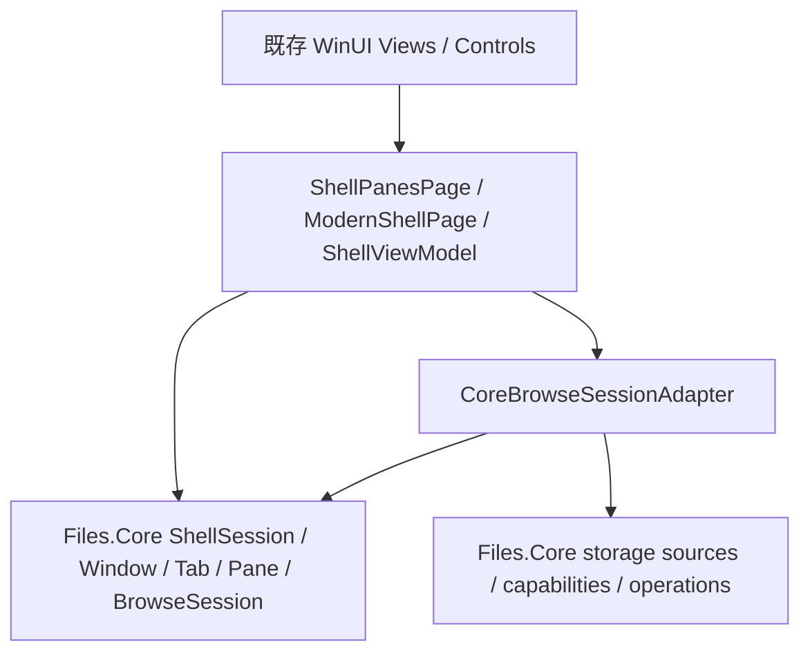
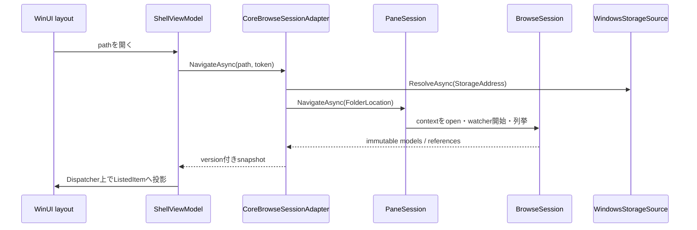
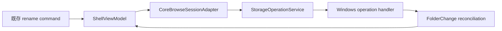

# Files.App の Core 統合アーキテクチャ

この文書は、現在の `new` ブランチで実装されている Files.App と Files.Core の境界を説明します。
移行期間中も既存の WinUI XAML、`Frame` ナビゲーション、`ShellViewModel` を維持し、その内側で
Core のモデルグラフとローカルフォルダーの browse session を使用します。

## 依存方向



Files.Core は Files.App、WinUI、`DispatcherQueue`、`BitmapImage` を参照しません。WinUI 型への変換は
Files.App の adapter 内でのみ行います。既存 UI のうち未移行の機能は、Files.App 内の従来serviceを
通ります。

## 起動と所有権

`AppLifecycleHelper.ConfigureHost` は process scope の `FilesAppCoreHost` を登録します。`App` はDI hostを
保持し、起動時にCore hostを初期化し、最終window終了時にDI hostを非同期破棄します。

```mermaid
flowchart TD
    App["App / DI host"]
    CoreHost["FilesAppCoreHost"]
    Runtime["FilesCoreRuntime"]
    Window["WindowSession"]
    Lease["CoreTabLease"]
    Tab["TabSession"]
    Pane["PaneSession 1..2"]
    Session["BrowseSession"]

    App *-- CoreHost
    CoreHost *-- Runtime
    CoreHost *-- Window
    Window *-- Tab
    Lease --> Tab
    Tab *-- Pane
    Pane *-- Session
```

実装上の対応は次の通りです。

| UI側 | Core側 | 所有と破棄 |
| --- | --- | --- |
| `App` | `FilesCoreRuntime` と主 `WindowSession` | `FilesAppCoreHost` がprocess終了まで所有 |
| `ShellPanesPage` | `TabSession` | `CoreTabLease` を所有し、tab破棄時にrelease |
| `ModernShellPage` | `PaneSession` | 親tabが所有。pageはadapterの購読だけを所有 |
| `ShellViewModel` | `CoreBrowseSessionAdapter` | pane pageと同時に購読解除・破棄 |
| 表示中folder | `IBrowseLocationContext` | `BrowseSession` がnavigation/refresh成功まで所有 |

Core側では新しいcontextの最初のbounded batchを暫定的にactiveとして公開し、以前のcontextと一覧はnavigation確定まで
rollback snapshotとして保持します。失敗またはcancel時は新しいcontextと公開済み項目を破棄し、以前の一覧をresetで復元します。

## ローカルフォルダーのナビゲーション

rooted Windows pathは次の経路を通ります。Home、Search、Library、FTPなど、まだCore adapterが扱わない
場所は既存経路を維持します。非Core画面へ移るとpaneを `HomeLocation` へreplaceして、以前のfolder contextと
watcherを破棄します。したがって、非表示の古いfolderから遅れて来た通知が既存UI一覧を上書きしません。



Core modelを `ListedItem` そのものへ変換して所有権を移すことはしません。`ListedItem` は既存XAML用の
投影で、対応する `StorableReference` と `StorableKey` を保持します。Coreが差分更新でmodelを置換しても、
同じkeyなら既存の `ListedItem` を再利用します。

## 変更通知と表示能力

`BrowseSession` はlocation modelの `IFolderChangeSource` を列挙前に開始します。完全な変更はkey単位で
反映し、不完全な通知、overflow、source faultはcoalesced refreshへfallbackします。Files.AppはCoreの
`ItemsChanged`、`StateChanged`、`SelectionChanged` をsnapshotへ変換します。

propertyとthumbnailはpaneのviewportに従ってCoreのprefetch coordinatorが取得します。
`CoreBrowseSessionAdapter` はdictionaryとencoded image bytesをcopyしてapartment-neutralなsnapshotにし、
`ShellViewModel` は次を保証します。

- collection、`ListedItem`、`BitmapImage` の更新は `DispatcherQueue` 上だけで行う。
- 古いgenerationまたは古いitems versionのsnapshotを無視する。
- 古いgenerationから遅れて到着したproperty/thumbnail結果を無視する。
- thumbnail bytesからの `BitmapImage` 生成をUIスレッド上で行う。
- refresh失敗時は既存一覧を維持し、Coreのerrorをloggingへ渡す。

## 選択とviewport

既存layoutのselection変更は `StorableKey` の集合としてCoreへ渡します。Coreでselectionがreconcileされた
場合は、現在の `ListedItem` へ戻してUI selectionを同期します。空selectionではlistへfocusを強制しません。

layoutは表示範囲を `BrowseViewport` としてpaneへ伝えます。現在は初回に先頭100項目を設定し、その後は
layoutのselection/viewport通知から更新します。これによりproperty/thumbnail取得を全件一括ではなく、
表示範囲とlook-aheadへ限定できます。

## 操作とcommand境界

renameはCore operation pipelineへ接続済みです。



操作対象は一覧に保存した `StorableReference` であり、古いmodelを書き換えません。成功後はShell通知による
reconciliationを待ち、500ms以内にversionが変わらない場合だけfull refreshします。これによりoperation結果と
Shell通知による二重追加を避けます。

delete、copy、move、create、clipboard、drag/drop、context menuはCoreに契約とWindows実装がありますが、
現在のFiles.App command surfaceはまだ既存の操作serviceを使います。UIのcollision dialog、進行状況、
elevation、out-of-process operation hostを保ったまま順次置換する必要があります。

## スレッドとcancel

- Coreのmodel eventは任意のスレッドで発生できる。Files.App adapterは値をcopyし、WinUI更新をdispatcherへ送る。
- Windows Shellの同期COM処理はCore所有のmessage-pumped STA schedulerへ送る。
- browse/navigationのcancelは既存folder-load tokenからpane、session、sourceへ伝播する。
- `ShellPanesPage` はtab scopeのtokenを持ち、pane同期とcloseをcancelする。
- tab/page破棄後に届いたイベントはadapter identityとgeneration検査で無視する。
- process終了時はUI page/tab leaseを先に解放し、最後にDI hostがCore runtimeを破棄する。

## 現在の互換adapter

`src/Files/Adapters` の役割は限定されています。

| Adapter | 残している理由 |
| --- | --- |
| `CoreBrowseSessionAdapter` | Coreのimmutable model/eventを既存 `ShellViewModel` のsnapshotへ変換 |
| `CoreStorageServiceAdapter` | file tagsとStart pinningの旧 `IStorageService` consumerをWindows sourceへ委譲 |
| `CoreHomeFolder` | Home/toolbarの旧shapeをCore Shell enumerationへ委譲 |
| `ThumbnailImageFactory` | encoded bytesからWinUI `BitmapImage` を生成 |
| `STATask` | 未移行の同期Shell処理をCore operation STAへ送り、非同期COM処理には専用message loop付きSTAを維持 |
| `WindowsObjectPicker` | 削除された旧storage assemblyのUI固有object pickerをFiles.Appに保持 |
| `RecycleBinWatcher` | 旧Recycle Bin UIが要求するevent shapeを維持 |
| `TaskbarProgressAdapter` | taskbar progressのWin32 surfaceをFiles.Appに保持 |
| `FtpManager` | 旧WinRT FTP itemの資格情報cacheを一時的に維持 |

これらは新しいstorage modelを作る第2アーキテクチャではありません。新規のbrowse/operation機能はCore契約へ
追加し、adapterはUI値変換または移行中の狭いshape変換だけに留めます。

## まだ既存UIが所有するもの

次は意図的にFiles.App側に残ります。

- XAML layout、focus、dialog、localization、notification、taskbar表示
- Frameのback/forward stackとsession persistence
- command registryとcommand availabilityの大部分
- clipboard、drag/drop、Shell context menu、sharing、activation
- Home/Search/Library/Tag/FTPの既存presentation path
- preview paneのWinUI hostと既存preview selection

Coreの `PaneSession.History` とpreview modelは各paneとともに生成・破棄され、ローカルpath navigationを記録します。
ただしtoolbarのback/forwardとpreview UIはまだ既存surfaceが正です。両者を同時に正としないよう、次の移行では
commandをpaneへroutingした時点でFrame履歴との二重管理を取り除きます。

## ProviderとUIの拡張

新しいstorage providerはFiles.Core builderへsource、capability factory、operation handler、location handlerを
登録します。Files.App側にprovider固有の `ListedItem` subclassを追加する必要はありません。UIは
`StorableReference`、projection、property、thumbnail、preview結果だけを消費します。

新しいUI surfaceも同じ `FilesCoreRuntime` からwindow/tab/paneを所有し、独自のrendererを接続できます。
CoreのモデルイベントがUIスレッドで発生すると仮定してはいけません。
