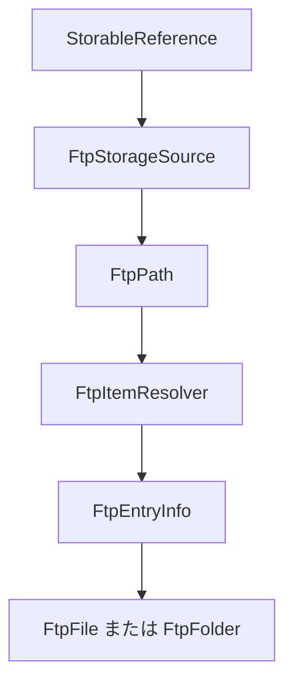
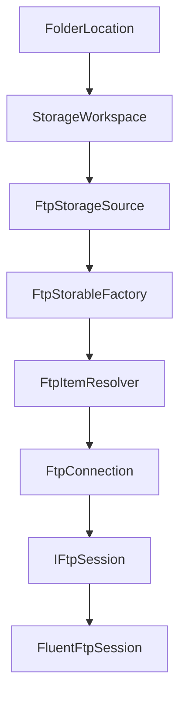
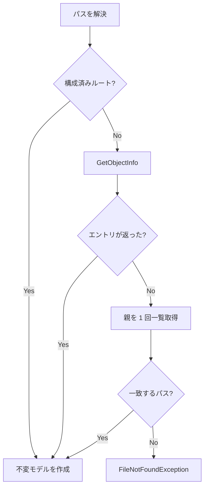
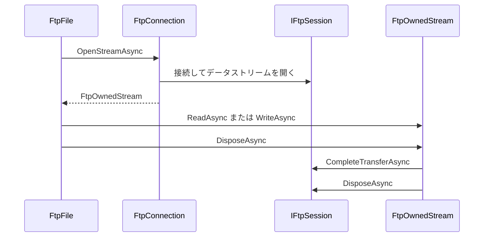

# FTP ストレージソース

Files.Core は、保存された各 FTP 接続を 1 つの
`FtpStorageSource` として表します。FTP 項目は通常の OwlCore.Storage の
`IFile` および `IFolder` CoreModel なので、フォルダーの参照、ストリームプレビュー、
アーカイブ参照、プロパティ、ストレージコマンドに FTP 固有の AppModel は不要です。

SFTP は FTP over TLS ではなく、このソースの対象外です。SFTP には別のソースと
トランスポート実装が必要です。

## ソースと項目の識別

同じホストを使う 2 つのプロファイルであっても、1 プロファイルを 1 ソースとして扱います。
アカウント、ポート、TLS モード、構成済みルートはそれぞれ独立して異なり得ます。

| 値 | FTP での意味 |
| --- | --- |
| `StorageSourceId` | `ftp:<ConnectionId>` |
| `IStorable.Id` | そのソース内の正規化された絶対リモートパス |
| `StorageAddress` | 認証情報を含まない `ftp:`、`ftpes:`、`ftps:` エンドポイントとパス |
| `LastKnownAddress` | 復旧・表示用のヒント。認証情報や識別キーにはしない |

FTP には移植可能で安定したファイル識別子がありません。そのため名前変更や移動では、
旧パスベースの項目 ID が無効になり、新しい `StorableReference` が返されます。
パスが変わると、通常は旧参照を解決できなくなります。後から別のリモート項目がまったく
同じパスを再利用しても、FTP には Core が両者を区別できる移植可能な識別情報がありません。

`FtpPath` は表記を保持し、区切り文字には `/` を使います。接続プロファイルは、
サーバーがパスを大文字小文字区別で比較するかどうかを宣言します。また、構成済みルートの
外側へ解決されないようにします。



アドレスにユーザー名やパスワードを含めてはいけません。内部の `ftpes` スキームは明示的 TLS、
`ftps` は暗黙的 TLS を表します。

| プロファイルモード | アドレススキーム | 既定ポート |
| --- | --- | --- |
| 平文 | `ftp` | 21 |
| 明示的 TLS | `ftpes` | 21 |
| 暗黙的 TLS | `ftps` | 990 |

## コンポーネント境界



責務は意図的に分離します。

| コンポーネント | 責務 |
| --- | --- |
| `FtpConnectionProfile` | 秘密情報を除くエンドポイント、ルート、TLS、比較設定 |
| `IFtpCredentialResolver` | Files のポリシーに従って一時的な認証情報を提供 |
| `FtpConnection` | 認証情報をキャッシュし、拒否された認証情報を 1 回だけ再試行し、分離されたコマンドセッションを作成 |
| `IFtpSession` | テスト可能な FTP コマンドおよびデータストリーム境界 |
| `FluentFtpSession` | FluentFTP 型を変換する唯一のレイヤー |
| `FtpItemResolver` | パスを解決し、構成済みルート外の項目を除外 |
| `FtpStorableFactory` | 不変の CoreModel スナップショットを具象化 |
| `FtpStorageOperationHandler` | 1 つの FTP ソースが所有する参照を変更 |
| `FtpPropertyReader` | 追加のネットワーク呼び出しなしで一覧メタデータを公開 |

各コマンドは短命のセッションを使います。これにより、1 つの制御接続を並行して共有する
ことを避け、コマンドのキャンセルと失敗の封じ込めを明示できます。

## フォルダーと項目の解決

サーバーが `/` のメタデータを返せない場合でも、構成済みルートはフォルダーとして合成します。
その他の項目ではまず `GetObjectInfo` を使います。MLST をサポートしないサーバーでは、
親の一覧を 1 回取得する方式にフォールバックします。



`FtpFolder.GetItemsAsync` は 1 回の一覧取得を行い、リモートメタデータを `FtpEntryInfo` に
コピーし、セッションを閉じてから CoreModel を生成します。CoreModel が FluentFTP クライアントや
生存中の一覧レスポンスを保持することはありません。

## ストリームの所有権

低レベル FTP データストリームでは、制御接続を存続させ、最後の応答を読み取る必要があります。
クライアントを破棄した後でストリームを返すのは無効です。

`FtpOwnedStream` はデータストリームと `IFtpSession` の両方を所有します。



返されたストリームの所有権は呼び出し側にあります。FTP はダウンロードとアップロードで別の
データチャネルを公開するため、`FileAccess.ReadWrite` は拒否します。ストリームの破棄時には
最後の FTP 応答も検証するので、データストリームが閉じただけでサーバー側の転送失敗を成功と
して報告することはありません。

## 操作

`FtpStorageOperationHandler` は、すべての参照が自分のソースに属する場合にだけ操作を処理します。

| 要求 | FTP での動作 |
| --- | --- |
| ファイル作成 | 上書きせず空ファイルをアップロード |
| フォルダー作成 | リモートディレクトリを 1 つ作成 |
| 名前変更 | 現在の親でサーバー移動。大文字小文字を区別しない設定で大文字小文字だけを変更する場合は一時パスを使用 |
| 移動 | 同じ FTP ソース内でサーバー移動 |
| ファイルコピー | 所有する 2 セッションで一時兄弟項目へストリーム転送し、上書きなしのサーバー移動で公開 |
| フォルダーコピー | 一時兄弟項目を再帰的に作成し、上書きなしのサーバー移動で公開 |
| 削除 | 再帰的な完全削除のみ |

コピーと移動では、ソースフォルダー内にあるフォルダーを宛先にすることを拒否します。ファイルと
フォルダーのコピーはランダムな一時兄弟項目へ作成してから、上書きなしのサーバー移動で公開します。
そのため失敗時のクリーンアップで削除されるのは、そのソースが所有する一時項目だけです。並行して
作成されたターゲットをソース所有のクリーンアップ対象として扱うことはありません。
`GenerateUniqueName` は `name (2).ext`、`name (3).ext` のような名前を生成します。

FTP にはごみ箱がありません。`Permanently == false` の `DeleteOperationRequest` は失敗結果を返し、
Files が明示的な確認を求められるようにします。

FTP と別のソース間の転送は、このソースの内部に隠しません。両方のソースを解決し、CoreModel 間で
ストリームを転送する、将来のストレージ非依存クロスソース転送コーディネーターの責務です。

## FTP が再利用する既存の項目機能

FTP 固有の参照場所、プレビューローダー、アーカイブソース、サムネイルソースは登録しません。

- `FolderBrowseLocationHandler` が `FtpFolder` を参照します。
- `StreamPreviewLoader` が対応する `FtpFile` 形式をプレビューします。
- アーカイブの判定と SevenZip フォールバックは FTP の読み取りストリームを消費します。シークできないストリームは、アーカイブ処理ですでに spool されます。
- `FtpPropertyReader` が一覧から取得したサイズとタイムスタンプを公開します。
- サムネイル取得は、将来もポリシーで制御します。参照一覧を装飾するだけのために任意のリモートファイルをダウンロードしてはいけません。
- FTP には一般的な push 通知 API がありません。CoreModel を変更せず、必要になれば任意のフォルダー変更ポーリングソースを後から追加できます。
- シンボリックリンクのメタデータは保持しますが、リンク先がフォルダーであることを将来のリゾルバーが安全に判定するまでは、現在はファイル形状として扱います。

## 合成

1 プロセスで共有するランタイムを構築する前に、保存済みプロファイルを読み込みます。

```csharp
var builder = new FilesCoreBuilder(
	viewSettingsStore,
	thumbnailCache)
	.AddWindowsStorage(
		streamPreviewPolicy: streamPolicy,
		shellPreviewPolicy: shellPolicy);

foreach (var profile in ftpProfiles)
{
	builder.AddFtpStorage(
		profile,
		ftpCredentials,
		streamPreviewPolicy: streamPolicy,
		archiveCredentialResolver: archiveCredentials);
}

await using var runtime = builder.Build();
```

`AddDefaultStreamPreviews` とアーカイブ参照はモジュールガードを使うため、複数の FTP ソースを追加しても
共有ローダーやハンドラーが重複登録されません。FTP プロパティファクトリはソース単位のままです。

現在の `StorageWorkspace` のソース集合は `Build` 後には不変です。保存済み接続を実行時に追加・削除するには、
ソースの有効期間を明示した将来のソースレジストリ契約が必要です。初期の Files はプロセス起動時に
プロファイルを読み込めます。

## Files の責務

Files が所有するもの:

- 秘密情報を含まないプロファイルの永続化。
- Windows Credential Manager または別の保護された秘密ストア。
- ウィンドウを認識する `IFtpCredentialResolver` と認証プロンプト。
- 平文で暗号化されない FTP の前に表示する警告。
- 追加する場合の無効な証明書の信頼 UI と保存された証明書ポリシー。
- 接続の作成・削除 UI、およびソースが動的登録されるまでのランタイム再起動。
- 認証、接続、完全削除エラーのローカライズされた表示。

Files.Core が WinUI を呼び出したり、URI/参照にパスワードを保存したり、無効な FTPS 証明書を
グローバルに受け入れたりすることはありません。
