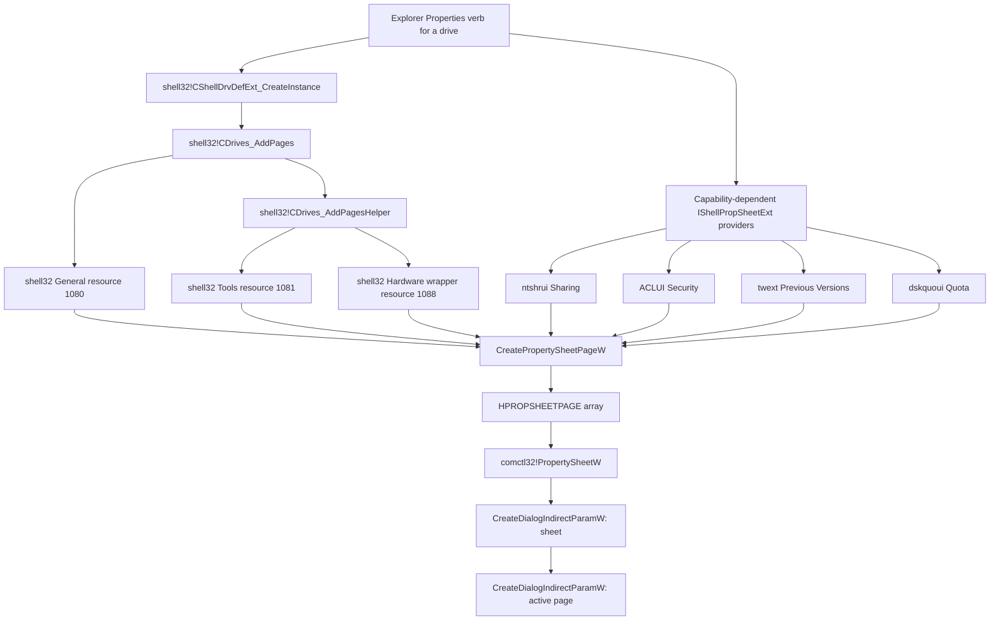

# Drive property-sheet construction

This article describes how Explorer obtains the drive-specific pages, how each provider contributes an `HPROPSHEETPAGE`, and how the result enters the Common Controls property-sheet host.

## End-to-end flow



## Shell drive-page provider

**Verified.** `shell32!CShellDrvDefExt_CreateInstance` at `0x18038ADD0` constructs the default drive extension around `shell32!CDrives_AddPages` at `0x1802E6610`.

`CDrives_AddPages` accepts the Shell data object. It first tries the normal Shell ID-list array and creates one `CDriveProps` abstraction per selected drive. If the selection is instead exposed through the private Mounted Volume clipboard format, it enters `CDrives_AddPagesForMountedVolume` at `0x1802E2454`, extracts the path, and creates an `IShellItem` with `SHCreateItemFromParsingName`.

Both paths build the General page as follows:

```text
PROPSHEETPAGEW
  hInstance   = shell32.dll
  pszTemplate = MAKEINTRESOURCE(1080)
  pfnDlgProc  = shell32!_DrvGeneralDlgProc
  lParam      = drive-page state / CDriveProps
  -> CreatePropertySheetPageW
  -> add-page callback
```

For a single eligible drive, `CDrives_AddPagesHelper` at `0x1802E2664` adds:

| Page | Template | Dialog procedure | Eligibility |
| --- | ---: | --- | --- |
| Tools | `1081` | `shell32!_DiskToolsDlgProc` at `0x1801853C0` | Drive type is neither `DRIVE_NO_ROOT_DIR` nor `DRIVE_REMOTE`, and `CDrives_EnablePropertiesTools` succeeds. |
| Hardware wrapper | `1088` | `shell32!_DriveHWDlgProc` at `0x18017AA90` | Same drive-type rule, `REST_NOHARDWARETAB` is clear, and the host is not WOW64. |

`CDrives_EnablePropertiesTools` at `0x1802E2710` does not equate a successful `GetVolumeInformationW` call with Tools eligibility. For an optical drive, its private `CMountPoint` test is:

```text
(IsBurner && IsMediaPresent && !(GetVolumeInformationFlags & FILE_READ_ONLY_VOLUME)) || IsDVDRAMMedia
```

The `driveType != DRIVE_CDROM` branch makes ordinary mounted local volumes eligible. A read-only UDF ISO fails the optical capability path and therefore has no Tools page.

## Specialized extension pages

Explorer's property-sheet orchestrator also asks applicable Shell page providers to add their pages. The drive capture produced the following visible child-dialog owners:

| Page | Visible dialog module | Provider path |
| --- | --- | --- |
| General | `shell32.dll` | Built-in resource `1080` |
| Tools | `shell32.dll` | Built-in resource `1081` |
| Hardware | `shell32.dll`, containing a `devmgr.dll` child | `_DriveHWDlgProc` → `devmgr!DeviceCreateHardwarePageEx` |
| Sharing | `ntshrui.dll` | `CShare::AddPages` |
| Security | `aclui.dll` | `CreateSecurityPage` over the selected object's `ISecurityInformation` provider |
| Previous Versions | `twext.dll` | `CTimeWarpProp::AddPages` |
| Quota | `dskquoui.dll` | `DiskQuotaPropSheetExt::AddPages` |
| Customize | `shell32.dll` | `CFolderCustomize::AddPages` after `IsItemCustomizable` |

The Previous Versions provider does not add its page for an optical ISO root. The Customize provider can add its page because the mounted ISO root is a filesystem folder and is not the system drive. For the observed ISO mount, the resulting order is `General`, `Hardware`, `Sharing`, and `Customize`.

This table was obtained from each active child dialog's `GWLP_HINSTANCE`. It identifies UI ownership; it does not imply that only that module participates in data retrieval.

## Hardware page nesting

The Hardware tab has two nested dialogs:

```text
comctl32 property sheet
  -> shell32 page dialog, template 1088, _DriveHWDlgProc
      -> devmgr!DeviceCreateHardwarePageEx
          -> devmgr dialog resource 1410, CHWTab::DialogProc
```

`DeviceCreateHardwarePageEx` at `0x1800423D0` allocates `CHWTab`, calls `CHWTab::Initialize`, and creates the inner dialog with `IsolationAwareCreateDialogParamW`. The four class GUIDs passed by `shell32.dll` are:

- `GUID_DEVCLASS_DISKDRIVE`;
- `GUID_DEVCLASS_FLOPPYDISK`;
- `GUID_DEVCLASS_CDROM`;
- `GUID_DEVCLASS_SCMDISK`.

## Common Controls handoff

Every accepted page is an `HPROPSHEETPAGE`, not an `HWND`. The page window remains uncreated until Common Controls activates it. The remaining construction path is shared with filesystem item properties:

```text
CreatePropertySheetPageW
  -> PropertySheetW
  -> comctl32!_RealPropertySheet
  -> user32!CreateDialogIndirectParamW for the sheet
  -> comctl32!_CreatePageDialog
  -> user32!CreateDialogIndirectParamW for the page
```

For the complete Common Controls addresses, ownership, modal loop, and the temporary `CreateWindowExW(L"Static")` positioning fallback, see [Property-sheet window construction](../property-sheets/construction.md).

## Reimplementation boundary

ReFiles does not need native dialogs to reproduce the built-in information. A drive property service can expose typed capacity, volume, device, security, snapshot, sharing, and quota models. Keep undocumented launch helpers—such as `SHChkDskDriveEx`, `DeviceCreateHardwarePageEx`, and the elevated quota helper—behind optional Windows-only commands with supported data fallbacks.
