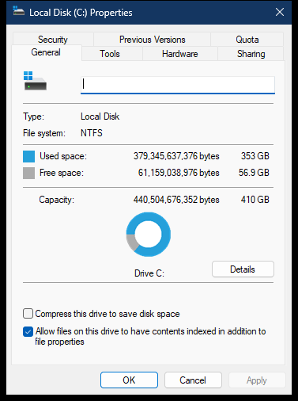

# Drive General property page

The drive General page combines volume identity, filesystem capacity, a usage visualization, and two root-folder attribute controls.

> [!NOTE]
> `shell32.dll` addresses apply to analyzed version `10.0.26100.8521`, image base `0x180000000`.

## Screenshot



## UI region map

| UI region | Verified owner | Data or API path | ReFiles guidance |
| --- | --- | --- | --- |
| Drive icon | `shell32!CFileSystemDriveProps::GetIcon` at `0x1802E3AB0` | Explorer uses the Shell image cache and `ImageList_GetIcon`; supported callers can use `IShellItemImageFactory::GetImage` or `SHGetFileInfoW` | Release an `HBITMAP` from `IShellItemImageFactory` with `DeleteObject`, or an `HICON` requested with `SHGFI_ICON` using `DestroyIcon`. |
| Editable volume label | `shell32!_DrvPrshtSetVolumeLabel` at `0x1802E61C4` | `CFileSystemDriveProps::GetVolumeLabel` (`0x1802E3D70`); supported read path is `GetVolumeInformationW` | Stage edits and enforce the filesystem's maximum label length. |
| Type | `shell32!_DrvPrshtSetDriveType` at `0x1802E5DE8` | `CFileSystemDriveProps::GetType` (`0x1802E3CB0`); public basis is `GetDriveTypeW`, with localized Shell display text | Keep the numeric drive type separate from its localized label. |
| File system | `shell32!_DrvPrshtSetFileSystem` at `0x1802E5E74` | `CFileSystemDriveProps::GetFileSystem` (`0x1802E3940`); public path is `GetVolumeInformationW` | Unknown provider filesystems are valid values. |
| Used space, free space, and capacity | `shell32!CFileSystemDriveProps::GetCapacity` at `0x1802E3620` | `SHGetDiskFreeSpaceExW`; public equivalent is `GetDiskFreeSpaceExW` | Keep byte counts as 64-bit values and format only in presentation. |
| Usage ring | `shell32!_DrvPrshtDrawItem` at `0x1802E5930` | Drawn from the same used/free byte values | The chart is presentation only; do not perform a second capacity query. |
| Details | `shell32!_DrvPrshtSetStorageUsage` at `0x1802E6120` and `_DrvGeneralDlgProc` at `0x1802E52A0` | `CheckDriveSupportsStorageBreakdown` (`0x1802E2AE4`) enumerates Storage Sense devices; `LaunchSettingsStorageUsageForDrive` (`0x1802E461C`) activates the selected-volume Settings page | Hide the button unless the selected root is an eligible Storage Sense device. `ms-settings:storagesense` alone opens the overview instead. |
| Compress this drive | `shell32!_DrvPrshtSetDriveAttributes` at `0x1802E5B30` | `CDriveProps::GetAttributes` tests compression support and root compression state; Apply reuses `CFilePropSheetPage::ApplySingleFileAttributes` | Compression can recurse and partially fail. Route it through the operation layer with progress and confirmation. |
| Allow contents to be indexed | `shell32!_DrvPrshtSetDriveAttributes` at `0x1802E5B30` and `_DrvPrshtApply` at `0x1802E5568` | Root `FILE_ATTRIBUTE_NOT_CONTENT_INDEXED` semantics, applied through the Shell attribute path | Display the inverse meaning correctly and preserve unrelated attributes. |

The editable field contains the raw volume label. It remains empty when the volume has no assigned label. The window title is a separate Shell display name obtained with `IShellItem::GetDisplayName(SIGDN_NORMALDISPLAY)`; for example, an unlabeled system volume can be displayed as `Local Disk (C:) Properties` while its editable label field is empty.

## Page construction

`shell32!CDrives_AddPages` (`0x1802E6610`) or `CDrives_AddPagesForMountedVolume` (`0x1802E2454`) creates dialog resource `1080` with `shell32!_DrvGeneralDlgProc`. Initialization is performed by `_DrvPrshtInit` at `0x1802E59C4`.

## Control eligibility

`_DrvPrshtSetStorageUsage` does not infer Details support from `GetDriveTypeW` or free-space availability. It calls `CheckDriveSupportsStorageBreakdown`, which loops storage categories `0` and `1` with the undocumented API-set exports below. The button is shown only when a returned entry has state `0` and its root matches the selected root.

```text
ext-ms-win-storage-sense-l1-1-0!GetStorageInstanceCount
ext-ms-win-storage-sense-l1-1-0!GetStorageDeviceInfo
```

The analyzed `GetStorageDeviceInfo` record is 1,112 bytes in this build. Its root string starts at offset `4`, and the state tested by Shell is at offset `528`. These are private ABI details and must remain isolated behind a version-tolerant Windows service. Mounted ISO volumes are absent from the Storage Sense inventory, so Explorer removes their Details button.

`_DrvPrshtSetDriveAttributes` obtains a four-bit state from `CDriveProps::GetAttributes`: current compression, compression support, current indexing, and indexing support. If a support bit is absent, Explorer calls `DestroyWindow` for that checkbox. It does not leave an unsupported checkbox visible and disabled. A read-only UDF ISO therefore has neither drive-attribute checkbox.

## Storage-details activation

The Details button activates the Settings application ID below instead of launching the generic `ms-settings:storagesense` URI:

```text
windows.immersivecontrolpanel_cw5n1h2txyewy!microsoft.windows.immersivecontrolpanel
```

Explorer passes these application arguments, appending the selected drive root such as `C:\` to `selectpath`:

```text
page=SettingsPageStorageSenseStorageOverview&target=SystemSettings_StorageSense_VolumeListLink&l3target=SystemSettings_StorageSense_VolumeInfoList&selectpath=C:\
```

The public activation boundary is `shell32.dll`'s COM class `CLSID_ApplicationActivationManager` and `IApplicationActivationManager::ActivateApplication`. The page, target, and `l3target` identifiers are Settings implementation details and must remain isolated behind the Windows-specific service.

## Volume-label write path

`_DrvPrshtApply` checks the edit control with `EM_GETMODIFY`. It reads at most 32 label characters only when the field was modified, resolves the current `CMountPoint`, and invokes its `SetLabel(HWND, PCWSTR)` virtual method. For a local mount point, `shell32!CMtPtLocal::SetLabel` at `0x180595AF0` first calls `SetVolumeLabelW` and reads `GetLastError` immediately on failure.

The property page passes an empty edit value as an empty string, which clears the assigned label in this path. After a successful write, notify the Shell and refresh the localized Shell display name instead of constructing a title from the raw label.

An `ERROR_ACCESS_DENIED` result enters this exact elevation flow:

```text
CMtPtLocal::_ShowElevationDialog
  -> TaskDialogIndirect
     title: Access Denied
     instruction: You will need to provide administrator permission to rename this drive.
     content: Click Continue to complete this operation.
     buttons: Continue (elevation shield), Cancel
  -> CoCreateInstanceAsAdmin(CLSID_MountPointRename, IID_IMountPointRename)
  -> IMountPointRename::SetLabel(rootPath, label)
```

The analyzed private COM identifiers are:

```text
CLSID_MountPointRename = {60173D16-A550-47F0-A14B-C6F9E4DA0831}
IID_IMountPointRename  = {92F8D886-AB61-4113-BD4F-2E894397386F}
```

`IID_IMountPointRename` has the three `IUnknown` entries followed by `HRESULT SetLabel(PCWSTR rootPath, PCWSTR label)`. These identifiers and the interface ABI are undocumented and build-sensitive, so ReFiles isolates them in the Windows volume-label service. Canceling either permission UI leaves the property page open without displaying an additional error.

After a successful non-elevated write, the analyzed implementation emits `SHChangeNotify(SHCNE_RENAMEFOLDER, SHCNF_PATHW, rootPath, rootPath)` when required by the mount-point state. The elevated broker owns notification for the elevated path. Other failures are mapped to the Shell's write-protected, label-too-long, unrecognized-volume, or generic error UI.

## Attribute write path

The compression and indexing choices are not simple UI preferences. Explorer builds a file-property operation over the volume root and can display a recursive-application confirmation dialog. A ReFiles implementation must distinguish:

- the attribute on the root directory itself;
- recursive propagation to existing descendants;
- the default inherited behavior for newly created descendants;
- filesystem support for compression, sparse files, and content indexing.

The controls remain enabled for an editable drive; administrator membership is not a page-construction condition. The compression checkbox exists only when the drive provider reports compression support, whose public filesystem basis is `GetVolumeInformationW` with `FILE_FILE_COMPRESSION`. Its root state comes from `FILE_ATTRIBUTE_COMPRESSED` and is changed with `FSCTL_SET_COMPRESSION`. Indexing exists only when the drive provider reports indexing support; its state is the inverse of `FILE_ATTRIBUTE_NOT_CONTENT_INDEXED` and is written with the normal file-attribute path. ReFiles asks for root-only versus recursive scope after Apply, matching the Shell flow instead of disabling supported controls preemptively.

## Related content

- [Drive property-sheet overview](README.md)
- [Drive property-sheet construction](construction.md)
- [Filesystem General page](../property-sheets/general.md)
