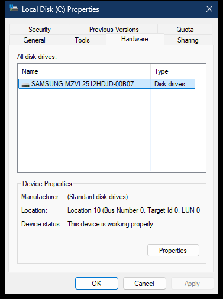

# Drive Hardware property page

The Hardware page embeds the Device Manager hardware-list control. `shell32.dll` contributes the outer property page; `devmgr.dll` creates and owns the inner device UI.

> [!NOTE]
> Addresses for `shell32.dll` apply to `10.0.26100.8521`. Addresses for `devmgr.dll` apply to the analyzed `10.0.26100.8737` image. Both use image base `0x180000000`.

## Screenshot



## UI region map

| UI region | Verified owner | Data or API path | ReFiles guidance |
| --- | --- | --- | --- |
| All disk drives list | `devmgr!CHWTab::RebuildDeviceList` at `0x180041A98` | `SetupDiGetClassDevsW(DIGCF_PRESENT | DIGCF_PROFILE)`, `SetupDiEnumDeviceInfo` | Destroy every `HDEVINFO` with `SetupDiDestroyDeviceInfoList`. |
| Name column | `devmgr!CHWTab::GetDeviceProperty` at `0x1800176B8` | `SetupDiGetDevicePropertyW(DEVPKEY_NAME)` | Preserve the device instance ID as identity; names can be duplicated. |
| Type column | `devmgr!CHWTab::RebuildDeviceList` | `SetupDiGetClassDescriptionW` | Class descriptions are localized display values. |
| Device icon | `devmgr!CHWTab::RebuildDeviceList` at `0x180041A98` | `SetupDiLoadDeviceIcon` | ReFiles converts the 16-pixel icon to independent PNG data and releases the returned `HICON` with `DestroyIcon`. |
| Manufacturer | `devmgr!CHWTab::OnItemChanged` at `0x18000F070` | `SetupDiGetDevicePropertyW(DEVPKEY_Device_Manufacturer)` | A missing property is normal; use an unknown display value without fabricating an identifier. |
| Location | `devmgr!CHWTab::OnItemChanged` at `0x18000F070` | Internal `GetLocationInformation`; supported inputs are `DEVPKEY_Device_UINumber`, `DEVPKEY_Device_UINumberDescFormat`, `DEVPKEY_Device_LocationInfo`, and `DEVPKEY_Device_LocationPaths` | Compose the UI-number label with the bus description. Location paths can be multi-string values. |
| Device status | `devmgr!CHWTab::OnItemChanged` at `0x18000F070` | `CM_Get_DevNode_Status_Ex` plus internal `GetDeviceProblemText` | Keep status flags and problem code typed; localized problem text is presentation. |
| Properties | `devmgr!CHWTab::OnProperties` at `0x180041864` | `SetupDiGetDeviceInstanceIdW`, then undocumented `devmgr!DevicePropertiesExW` at `0x18003DC00` | Exact system property UI may be launched behind a versioned Windows boundary; data retrieval should remain SetupAPI/Configuration Manager based. |

## Page construction

`shell32!CDrives_AddPagesHelper` creates resource `1088` with `_DriveHWDlgProc` (`0x18017AA90`). On `WM_INITDIALOG`, that procedure calls `devmgr!DeviceCreateHardwarePageEx` at `0x1800423D0`.

`DeviceCreateHardwarePageEx` initializes `CHWTab` and creates devmgr dialog resource `1410` with `CHWTab::DialogProc`. The requested device classes are DiskDrive, FloppyDisk, CDROM, and SCM Disk. The resulting devmgr dialog is a child of the shell32 property page.

## Location construction

The location displayed by Device Manager is not only `DEVPKEY_Device_LocationInfo`. For a typical storage device that property contains `Bus Number 0, Target Id 0, LUN 0`, while `DEVPKEY_Device_UINumber` supplies the leading logical location number. The combined result is shaped as:

```text
Location 10 (Bus Number 0, Target Id 0, LUN 0)
```

When `DEVPKEY_Device_UINumberDescFormat` is present, its provider-supplied format is used for the leading value. Otherwise ReFiles uses its localized `Location {0}` format. If `LocationInfo` is absent, the first supported `DEVPKEY_Device_LocationPaths` value remains the fallback. These are SetupAPI device properties; ReFiles does not read the registry directly.

## Device list semantics

The list is not restricted to the physical device that backs only C:. It enumerates present/profile devices in the requested storage classes, which is why the heading says “All disk drives.” ReFiles should label the scope accurately if it reproduces this page.

`CM_Get_DevNode_Status_Ex` supplies `DN_*` status bits and a Configuration Manager problem number. Device Manager converts the problem number to user-facing text with an internal resource helper. ReFiles can show the numeric problem code and use documented Configuration Manager semantics without depending on that private formatter.

## Properties command

Explorer calls the undocumented exported `DevicePropertiesExW` after resolving the selected instance ID. If exact Windows device properties are desired, isolate this call and validate the export at runtime. Do not treat its current parameter layout as a cross-version contract. For a native ReFiles implementation, use SetupAPI and Configuration Manager property keys instead.

## Related content

- [Drive Tools page](tools.md)
- [Drive property-sheet overview](README.md)
- [Drive property-sheet construction](construction.md)
