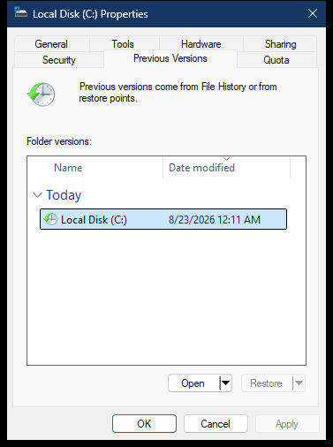

# Drive Previous Versions property page

The drive Previous Versions page queries recovery providers for versions of the volume root. It uses the same Time Warp provider as a folder page, but the selected item and restore scope are the root directory.

> [!NOTE]
> Addresses apply to `twext.dll` `10.0.26100.8117`, image base `0x180000000`.

## Screenshot

## UI region map

| UI region | Verified owner | Data or API path | ReFiles guidance |
| --- | --- | --- | --- |
| Introductory text | `twext!CTimeWarpProp` dialog procedure | Static provider resources | Do not infer provider availability from the text alone. |
| Folder versions list | `twext!CTimeWarpProp::_OnInit` at `0x180010B8C` | Private Explorer Browser navigates to the previous-versions Shell namespace | Preserve provider kind and snapshot identity on each row. |
| Name and Date modified | `twext!CTimeWarpProp` hosted Shell view | Shell properties on the snapshot/File History item | The displayed date is provider metadata, not necessarily the root's original modification time. |
| Open | `twext!CTimeWarpProp` command path | Opens the selected snapshot namespace item | Treat opened snapshots as read-only unless the provider documents otherwise. |
| Restore | `twext!CTimeWarpProp::_OnRevert` at `0x180010EA4` | `_CopySnapShot` (`0x18001044C`) uses `IFileOperation` | Restoring a drive root is high impact; require an explicit scope and confirmation. |

## Page construction

`twext!CTimeWarpProp::AddPages` at `0x18000E9C0` creates the provider page from resource `101` or `102` and supplies it through `CreatePropertySheetPageW`. The active drive child dialog's `GWLP_HINSTANCE` resolves to `twext.dll`.

## Discovery paths

The provider merges filesystem shadow-copy namespace items, File History items, and SafeDocs recovery items. The analyzed local-snapshot path opens the item, issues private filesystem control `0x00144064`, parses `@GMT-yyyy.MM.dd-HH.mm.ss` names, and binds them as Shell items with a time-warp context.

These enumeration and bind-context contracts are undocumented. Keep them in a version-guarded Windows adapter and return an empty provider result when unsupported. Do not turn an empty response into “the drive has no backups” without distinguishing provider failure from a valid empty set.

## Restore boundary

Explorer restores through `IFileOperation`. ReFiles should route restore through its normal operation service so overwrite handling, elevation, progress, cancellation, and partial failures have the same behavior as other copy/replace operations.

## Related content

- [Filesystem Previous Versions page](../property-sheets/previous-versions.md)
- [Drive property-sheet overview](README.md)
- [Drive property-sheet construction](construction.md)
