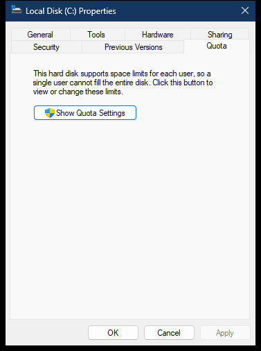

# Drive Quota property page

The Quota page is supplied by `dskquoui.dll`. On the captured non-elevated Explorer process it shows an elevation proxy; the full quota editor is created only after the user chooses **Show Quota Settings**.

> [!NOTE]
> Addresses apply to `dskquoui.dll` `10.0.26100.8115`, image base `0x180000000`.

## Screenshot



## UI region map

| UI region | Verified owner | Data or API path | ReFiles guidance |
| --- | --- | --- | --- |
| Quota support explanation | `dskquoui!VolumeElevatePropPage::DlgProc` at `0x18001A540` | Static resource in elevation-proxy dialog resource `108` | Page presence means the volume supports the quota provider; it does not mean quotas are enabled. |
| Show Quota Settings | `dskquoui!VolumeElevatePropPage::DlgProc` at `0x18001A540` | `CoCreateInstanceAsAdmin` creates the private elevated UI helper; `CElevatedUIHelper::ShowVolumeQuotaUI` (`0x180012730`) builds a separate `PropertySheetW` | Keep the button enabled. The current token need not already be elevated because the click is the user-initiated UAC boundary. |

## Page construction

`dskquoui!DiskQuotaPropSheetExt::Initialize` at `0x180017C70` extracts the selected drive from the data object, resolves its volume name with `GetVolumeNameForVolumeMountPointW`, and reads volume information.

`DiskQuotaPropSheetExt::AddPages` at `0x180017930` first tries to create the full `VolumePropPage`. When quota control initialization returns access denied and elevation is available, it creates `VolumeElevatePropPage` instead. Both paths build a `PROPSHEETPAGEW` with `DiskQuotaPropPage::s_DlgProc` (`0x1800181A0`) and call `CreatePropertySheetPageW`.

| Mode | Dialog resource | Behavior |
| --- | ---: | --- |
| Full quota editor | `107` | Reads and writes volume quota policy and opens per-user details. |
| Elevation proxy | `108` | Displays the explanation and launches the elevated full editor. |

During `WM_INITDIALOG`, `VolumeElevatePropPage::DlgProc` sends `BCM_SETSHIELD` (`0x160C`) to button `1014`. The button is not disabled merely because the current process lacks administrator rights.

On click, the provider activates this private local-server interface:

```text
Elevation:Administrator!new:{1FB2A002-4C6C-4DE7-85C2-CB8DB9A4F728}
  -> IID 9A50588E-FA80-4509-B345-664110225322
  -> ShowVolumeQuotaUI(owner, volumeName, displayName, rootPath)
```

`BIND_OPTS3.hwnd` supplies the owner for the UAC prompt. The three strings originate in `DiskQuotaPropSheetExt::Initialize`: the quota-controller volume name, the formatted Shell display name, and the drive root. `CElevatedUIHelper::ShowVolumeQuotaUI` constructs a one-page `PropertySheetW` only after elevation succeeds.

## Quota data API

Unlike many Shell-page internals, the quota data model has a documented COM API in `DskQuota.h`.

```text
CoCreateInstance(CLSID_DiskQuotaControl, IID_IDiskQuotaControl)
  -> IDiskQuotaControl::Initialize(volumePath, readWrite)
  -> GetQuotaState / SetQuotaState
  -> GetDefaultQuotaLimit / SetDefaultQuotaLimit
  -> GetDefaultQuotaThreshold / SetDefaultQuotaThreshold
  -> GetQuotaLogFlags / SetQuotaLogFlags
  -> CreateEnumUsers
```

`dskquoui!CreateQuotaController` at `0x1800182C0` performs the same `CLSID_DiskQuotaControl` activation and calls `IDiskQuotaControl::Initialize` for the selected volume.

## Full editor behavior

The full page is implemented by `dskquoui!VolumePropPage`:

| Operation | Internal function | Public model |
| --- | --- | --- |
| Populate check boxes and limits | `InitializeControls` at `0x18001AAB4` | `GetQuotaState`, `GetQuotaLogFlags`, default limit and threshold getters |
| Apply changes | `ApplySettings` at `0x18001A18C` and `OnSheetNotifyApply` at `0x18001B220` | Matching `IDiskQuotaControl` setters |
| Open per-user list | `OnButtonDetails` at `0x18001ABEC` | `CreateEnumUsers`, `IEnumDiskQuotaUsers`, `IDiskQuotaUser` |

Quota values use signed 64-bit byte counts. `DISKQUOTA_NO_LIMIT` and `DISKQUOTA_NO_THRESHOLD` are sentinel states, not zero-byte limits.

## ReFiles boundary

Use `IDiskQuotaControl` for typed reads and writes. Keep name resolution, enumeration, and updates off the UI thread; quota user enumeration can be expensive and can trigger SID-to-name resolution. ReFiles reads available state directly, but its explicit **Show Quota Settings** action follows the provider's elevation moniker and opens the full system quota editor.

## Related content

- [Drive property-sheet overview](README.md)
- [Drive Security page](security.md)
- [Drive property-sheet construction](construction.md)
