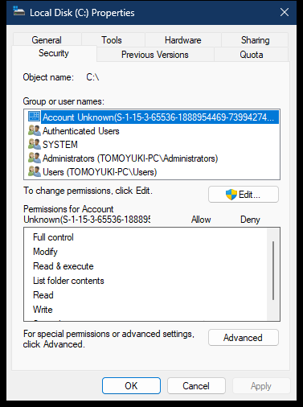

# Drive Security property page

The drive Security page displays the security descriptor for the filesystem root, such as `C:\`. ACLUI owns the visible page; an object-specific `ISecurityInformation` provider supplies the descriptor and write operations.

> [!NOTE]
> The `CreateSecurityPage` address applies to `aclui.dll` `10.0.26100.8115`, image base `0x180000000`.

## Screenshot



## UI region map

| UI region | Verified owner | Data or API path | ReFiles guidance |
| --- | --- | --- | --- |
| Object name | Page created through `aclui!CreateSecurityPage` at `0x18004E680` | Provider `ISecurityInformation::GetObjectInformation` returns the filesystem root parsing path | Retain the canonical root path separately from display text. |
| Group or user names | Page created through `aclui!CreateSecurityPage` at `0x18004E680` | Owner, group, and DACL SIDs; ACLUI loads its SID image strip from the `"Image"` resource in `aclui.dll` | Resolve with `LookupAccountSidW`; preserve the SID and use the unknown-account image when lookup fails. |
| Permissions matrix | Page created through `aclui!CreateSecurityPage` at `0x18004E680` | File/directory access masks supplied by the security provider | A row can combine multiple ACEs; do not rewrite the ACL from checkbox state alone. |
| Edit | Page created through `aclui!CreateSecurityPage` at `0x18004E680` | Provider `ISecurityInformation::GetSecurity` and `SetSecurity` | Prefer ACLUI for a full-fidelity editor. |
| Advanced | Page created through `aclui!CreateSecurityPage` at `0x18004E680` | Owner, inheritance, auditing, effective access, and advanced ACEs | A reduced custom UI must preserve entries it cannot represent. |

## Page construction

**Observed.** The active drive Security child dialog has `aclui.dll` as its `GWLP_HINSTANCE`. The applicable Shell security handler supplies `ISecurityInformation` and calls `CreateSecurityPage`; ACLUI returns an `HPROPSHEETPAGE` to the containing drive sheet.

The general provider chain and analyzed ACLUI entry point are documented in [Filesystem Security property page](../property-sheets/security.md). Drive-root eligibility can differ from a normal folder because the filesystem, remote-volume state, and access token affect security-descriptor support.

The Edit and Advanced buttons use the same `rshx32!CSecurityExtension::OpenEditor` flow documented for folders and files. The Edit action activates the elevation moniker only if the current token cannot obtain both `READ_CONTROL` and `WRITE_DAC`; Advanced initially uses the normal provider so it remains viewable without an administrator token.

## Read and write APIs

The supported filesystem boundary is:

```text
GetNamedSecurityInfoW(rootPath, SE_FILE_OBJECT, requestedParts, ...)
  -> inspect owner/group/DACL/SACL with documented ACL APIs
  -> LookupAccountSidW for optional display names

SetNamedSecurityInfoW(rootPath, SE_FILE_OBJECT, changedParts, ...)
```

Release the security descriptor returned by `GetNamedSecurityInfoW` with `LocalFree`. Request `ACCESS_SYSTEM_SECURITY` and privilege-sensitive SACL information only when the feature explicitly requires it.

Recursive inheritance changes are not atomic and can fail partway across a volume. Route them through a progress-reporting operation with an explicit scope and partial-failure result.

## Related content

- [Filesystem Security page](../property-sheets/security.md)
- [Drive Quota page](quota.md)
- [Drive property-sheet construction](construction.md)
