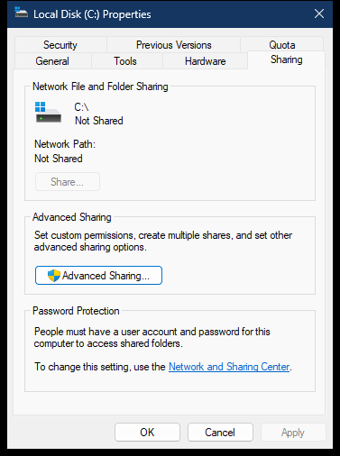

# Drive Sharing property page

The drive Sharing page is the Network Sharing UI page for the drive root. It reports whether the root is exposed through an applicable share and provides entry points to the standard and advanced sharing workflows.

> [!NOTE]
> Addresses apply to `ntshrui.dll` `10.0.26100.8117`, image base `0x180000000`.

## Screenshot

## UI region map

| UI region | Verified owner | Data or API path | ReFiles guidance |
| --- | --- | --- | --- |
| Drive name and shared state | `ntshrui!CSharingPropertyPage::_InitializeControls` at `0x180067350` | Private sharing configuration manager selects a sharing engine and reads the selected Shell item | Use supported SMB share enumeration for the displayed state. |
| Network Path | `ntshrui!CSharingPropertyPage::_GetSharingInfo` at `0x18006714C` | Private sharing engine resolves an applicable UNC path; the capture reports `Not Shared` | Do not synthesize a UNC path when no matching share record exists. |
| Share | `ntshrui!CSharingPropertyPage::_ShowSharingWizard` at `0x18006835C` | Private modal sharing wizard; disabled for the captured drive-root state | Keep the system wizard as an optional launch command, not as the state reader. |
| Advanced Sharing | `ntshrui!CSharingPropertyPage::_OnCommand` at `0x180067AC8` | Private elevation factory launches advanced sharing UI | Elevation must remain explicit and user initiated. |
| Password Protection | `ntshrui!CSharingPropertyPage::DlgProcPage` | Windows network-sharing policy and configuration | Display policy as read-only unless ReFiles owns a supported settings workflow. |
| Network and Sharing Center | `ntshrui!CSharingPropertyPage::_ShowNetCenter` at `0x1800682E0` | `IOpenControlPanel::Open` | This link does not participate in share discovery. |

## Page construction

`ntshrui!CShare::AddPages` at `0x180037300` creates dialog resource `1000`, assigns `CSharingPropertyPage::DlgProcPage`, and submits it with `CreatePropertySheetPageW`. The live child dialog's `GWLP_HINSTANCE` resolves to `ntshrui.dll`.

## Supported data boundary

Use the Network Management APIs for SMB-backed local shares:

- `NetShareEnum` to enumerate shares;
- `NetShareGetInfo` for one share;
- `NetShareAdd`, `NetShareSetInfo`, and `NetShareDel` for explicit management operations;
- `NetApiBufferFree` for every returned network-management buffer.

Match normalized local paths and account for shares rooted below the volume. Administrative shares such as `C$` have different visibility and privilege semantics from ordinary user-created shares and should be identified as such.

## Related content

- [Filesystem Sharing page](../property-sheets/sharing.md)
- [Drive Security page](security.md)
- [Drive property-sheet construction](construction.md)
