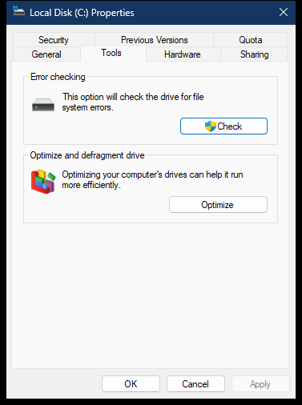

# Drive Tools property page

The Tools page is a command surface. It does not continuously report health or fragmentation data; it validates the selected drive and launches the Windows error-checking and optimization experiences.

> [!NOTE]
> `shell32.dll` addresses apply to analyzed version `10.0.26100.8521`, image base `0x180000000`.

## Screenshot

## UI region map

| UI region | Verified owner | Exact Explorer path | ReFiles guidance |
| --- | --- | --- | --- |
| Error checking description | `shell32!_DiskToolsPrshtInit` at `0x1802E5080` | Static Shell resources selected for the drive | Keep the text independent from current error state. |
| Check | `shell32!_DiskToolsCommand` at `0x1802E4E38` | Command ID `14416` calls `shell32!SHChkDskDriveEx` at `0x180226924` | Keep the command enabled when the Tools page is present. The user action is the elevation boundary; the hosting process need not already be elevated. |
| Optimize and defragment description | `shell32!_DiskToolsPrshtInit` | Static Shell resources and tool-availability checks | “Optimize” can mean retrim or media-appropriate maintenance, not necessarily defragmentation. |
| Optimize | `shell32!_DiskToolsCommand` | Command ID `14420`; private Shell configuration `MyComputer\\defragpath`, falling back to `dfrgui.exe %c:`, then `ShellExecCmdLine` | Launch the system optimization UI rather than implementing storage maintenance in the app process. |

## Page construction

`shell32!CDrives_AddPagesHelper` at `0x1802E2664` selects dialog resource `1081` and `shell32!_DiskToolsDlgProc` at `0x1801853C0`. The page is excluded for `DRIVE_NO_ROOT_DIR` and `DRIVE_REMOTE` and when `CDrives_EnablePropertiesTools` rejects the drive.

## Error-checking path

`SHChkDskDriveEx` validates access, drive type, volume name, and filesystem. The analyzed implementation calls `GetVolumeInformationW`, `GetVolumeNameForVolumeMountPointW`, and a private FMIFS loader, and can use an elevated COM path when repair requires administrator rights.

There is no documented “show Explorer's Check Disk dialog” contract corresponding to `SHChkDskDriveEx`. ReFiles uses the following supported fallback at its version boundary:

1. query basic volume state with documented volume APIs;
2. normalize the volume root to a drive argument such as `C:`;
3. call `ShellExecuteExW` for `%SystemRoot%\System32\chkdsk.exe` with the `runas` verb and the property window in `SHELLEXECUTEINFOW.hwnd`;
4. treat `ERROR_CANCELLED` as a user cancellation and surface other launch failures;
5. avoid holding filesystem handles that prevent the requested check.

The explicit `runas` verb fixes the ineffective non-elevated launch where `chkdsk.exe` reports access denial in a short-lived console and appears to do nothing. Supplying the property window as owner also keeps the UAC prompt in the correct window hierarchy.

## Optimization path

Explorer's fallback command is `dfrgui.exe` with the selected drive letter. ReFiles should treat this as system-UI activation. It must not run `defrag.exe` silently because that changes a launch action into a storage-maintenance operation with different privilege and progress requirements.

ReFiles launches the System32 `dfrgui.exe` path through `ShellExecuteExW`, passes the selected drive, and supplies the property window as owner. It does not request elevation for opening this UI because the system application owns any privilege transition required by a later maintenance action.

## Related content

- [Drive General page](general.md)
- [Drive Hardware page](hardware.md)
- [Drive property-sheet construction](construction.md)
