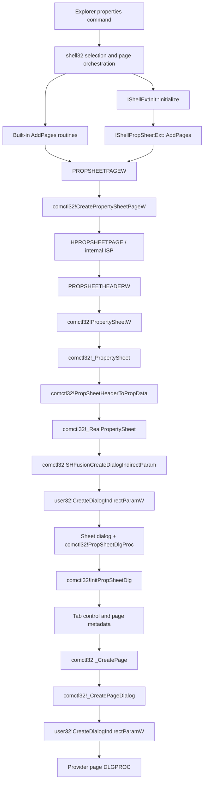

# Property-sheet window construction

This article explains how an Explorer property request becomes a Common Controls property-sheet dialog and how each provider page becomes a child dialog. It also clarifies the role of `CreateWindowExW`: the sheet and pages are created from dialog templates through `CreateDialogIndirectParamW`; the direct `CreateWindowExW` call observed in `InitPropSheetDlg` is only a temporary sizing fallback.

## End-to-end flow



## Stage 1: collect page descriptions

**Verified.** A built-in provider constructs a `PROPSHEETPAGEW` containing a dialog template or resource identifier, the provider `DLGPROC`, flags, and provider state in `lParam`. Specialized providers expose the same result through `IShellPropSheetExt::AddPages` and its `LPFNADDPROPSHEETPAGE` callback.

Representative entry points include:

| Module | Function | Address | Result |
| --- | --- | ---: | --- |
| `shell32.dll` | `FileSystem_AddPages` | `0x180377820` | General page and filesystem defaults |
| `shell32.dll` | `AddLinkPage` | `0x18046A368` | Shortcut page |
| `ntshrui.dll` | `CShare::AddPages` | `0x180037300` | Sharing page |
| `rshx32.dll` | `CSecurityExtension::AddPages` | `0x180009680` | Security provider passed to ACLUI |
| `twext.dll` | `CTimeWarpProp::AddPages` | `0x18000E9C0` | Previous Versions page |
| `shell32.dll` | `CFolderCustomize::AddPages` | `0x1802957A0` | Customize page |
| `cryptext.dll` | `CCryptSig::AddPages` | `0x1800042F0` | Digital Signatures page request |
| `shell32.dll` | `CSummaryPage::AddPages` | `0x1803E28B0` | Details page |

The provider calls `comctl32!CreatePropertySheetPageW`. For Common Controls v6 `10.0.26100.8972`, the export is at `0x1800FC850` and immediately enters `_CreatePropertySheetPage` at `0x180006464`.

### What `CreatePropertySheetPageW` owns

`_CreatePropertySheetPage` validates `dwSize` and flags, allocates the internal page object, copies `PROPSHEETPAGEW`, duplicates page strings, retains an optional reference-counted page resource, and calls the provider callback with `PSPCB_CREATE`. The returned `HPROPSHEETPAGE` is therefore an owned Common Controls object, not an `HWND`.

> [!IMPORTANT]
> `HPROPSHEETPAGE` must not be treated as a window handle. The page window does not exist yet and is normally created lazily when the page is activated.

## Stage 2: normalize the sheet header

`comctl32!PropertySheetW` (`0x180128B30`) is a small wrapper over `_PropertySheet` (`0x1801280F8`). `_PropertySheet` calls `PropSheetHeaderToPropData` (`0x180128B40`) to allocate a `PROPDATA` block and normalize `PROPSHEETHEADERW`.

`PropSheetHeaderToPropData` handles both supported input forms:

- `PSH_PROPSHEETPAGE`: call `_CreatePropertySheetPage` for each inline `PROPSHEETPAGEW`;
- page-handle array: copy each supplied `HPROPSHEETPAGE` into the internal page array.

The implementation rejects `nPages >= 100` in this build. It then dereferences each valid page handle to its internal page object and carries the resulting array into `_RealPropertySheet` (`0x1800C43EC`).

## Stage 3: create the containing dialog

`_RealPropertySheet` loads a dialog resource from Common Controls:

- resource `1006` for the normal tabbed sheet;
- resource `1020` for wizard/header variants selected by the sheet flags.

It copies and adjusts the `DLGTEMPLATE`, applies font and style decisions, and calls `SHFusionCreateDialogIndirectParam` (`0x1801D5EF8`). That function activates the Common Controls activation context and makes the decisive call:

```text
user32!CreateDialogIndirectParamW(
    comctl32 instance,
    prepared sheet DLGTEMPLATE,
    owner HWND,
    comctl32!PropSheetDlgProc,
    PROPDATA pointer)
```

The resulting top-level window is a dialog-class window created by USER32 from the template. `comctl32!PropSheetDlgProc` (`0x1800C0570`) receives the initialization message and calls `InitPropSheetDlg` (`0x1800C4CCC`).

For a modal sheet, `_RealPropertySheet` runs its own `GetMessageW` loop and routes messages through `Prop_IsDialogMessage`. For `PSH_MODELESS`, it returns the sheet `HWND` and leaves message dispatch to the caller.

### Where the CreateWindow family fits

`PropertySheetW` is not a wrapper around one provider-issued `CreateWindowExW` call. It feeds dialog templates to the USER32 dialog manager. USER32 creates the dialog-class window and instantiates the controls declared in each template; Common Controls then owns the tab and activation policy.

| Visible object | Creation mechanism | Window procedure |
| --- | --- | --- |
| Property-sheet frame | `CreateDialogIndirectParamW` with the prepared Common Controls template | `comctl32!PropSheetDlgProc` |
| Tab, buttons, and template controls | Instantiated by the USER32 dialog manager from the sheet `DLGTEMPLATE` | Control-class procedures, with commands routed to `PropSheetDlgProc` |
| Active property page | `CreateDialogIndirectParamW` with the provider's page template | Provider-supplied `DLGPROC` |
| Temporary positioning fallback | Direct `CreateWindowExW` of class `Static` | Standard Static control procedure; destroyed immediately |

Consequently, a `CreateWindowExW` breakpoint alone does not describe property-sheet construction. Trace `PropertySheetW`, `CreatePropertySheetPageW`, and both `CreateDialogIndirectParamW` call sites to recover the ownership and page lifecycle.

## Stage 4: initialize tabs and commands

`InitPropSheetDlg` stores the `PROPDATA` pointer with `SetWindowLongPtrW`, obtains the tab control with control ID `12320` (`0x3020`), and inserts one tab item for each accepted page after calling `GetPageInfoEx`.

The dialog resource supplies the standard child controls, including the tab control and OK/Cancel/Apply buttons. Common Controls then computes the ideal page size, applies DPI scaling, positions the sheet, and activates the initial page.

### The direct `CreateWindowExW` call

At `comctl32!InitPropSheetDlg+0x9BA` (`0x1800C5686`), this build calls:

```text
user32!CreateWindowExW(
    0,
    L"Static",
    nullptr,
    0,
    CW_USEDEFAULT,
    CW_USEDEFAULT,
    0,
    0,
    nullptr,
    nullptr,
    comctl32 instance,
    nullptr)
```

**Verified.** The temporary `Static` window is used only when the owner is not a valid window. Common Controls reads its rectangle, destroys it immediately, and uses the result as a positioning fallback. It is not the property sheet and it does not host a page.

## Stage 5: create the active page

`_CreatePage` (`0x18010B858`) calls the provider callback with `PSPCB_ADDREF`, loads or copies the provider dialog template, and passes it to `_CreatePageDialog` (`0x180120ED0`). `_CreatePageDialog` normalizes the page styles for child hosting and calls:

```text
user32!CreateDialogIndirectParamW(
    provider module,
    provider page DLGTEMPLATE,
    sheet HWND,
    provider DLGPROC,
    pointer to the copied PROPSHEETPAGEW)
```

The returned page `HWND` is a child dialog. The provider receives its own initialization and notification traffic through the declared `DLGPROC`; Common Controls controls visibility and activation as the selected tab changes.

## Destruction and lifetime

When the modal loop ends, `_RealPropertySheet` destroys the sheet window and releases every accepted page in reverse order through `DestroyPropertySheetPage`. Provider callbacks receive the corresponding release notification.

| Object | Created by | Released by |
| --- | --- | --- |
| Page descriptor copy/internal `ISP` | `CreatePropertySheetPageW` / `_CreatePropertySheetPage` | `DestroyPropertySheetPage` |
| Sheet dialog `HWND` | `CreateDialogIndirectParamW` through `SHFusionCreateDialogIndirectParam` | `_RealPropertySheet` or modeless owner |
| Active page dialog `HWND` | `_CreatePageDialog` → `CreateDialogIndirectParamW` | Dialog hierarchy/Common Controls |
| Provider COM extension | Shell page orchestrator | Shell orchestration after page lifetime permits release |

## Reimplementation guidance

ReFiles does not need to construct native page dialogs merely to read the values shown by built-in pages. Prefer page-specific data services and a native ReFiles presentation. Use the native construction path only when exact third-party page hosting is an explicit requirement, because loading arbitrary `IShellPropSheetExt` implementations executes third-party in-process code and transfers UI lifetime to native dialog procedures.

## Address summary

The following Common Controls addresses apply to `comctl32.dll` `10.0.26100.8972`, image base `0x180000000`.

| Function | Address |
| --- | ---: |
| `CreatePropertySheetPageW` | `0x1800FC850` |
| `_CreatePropertySheetPage` | `0x180006464` |
| `PropertySheetW` | `0x180128B30` |
| `_PropertySheet` | `0x1801280F8` |
| `PropSheetHeaderToPropData` | `0x180128B40` |
| `_RealPropertySheet` | `0x1800C43EC` |
| `PropSheetDlgProc` | `0x1800C0570` |
| `InitPropSheetDlg` | `0x1800C4CCC` |
| `_CreatePage` | `0x18010B858` |
| `_CreatePageDialog` | `0x180120ED0` |
| `SHFusionCreateDialogIndirectParam` | `0x1801D5EF8` |

