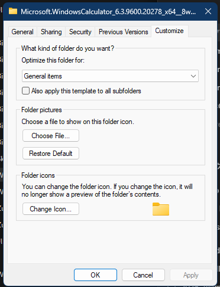

# Customize property page

The Customize page edits folder presentation metadata: the folder template, an optional picture, and the folder icon. It is available only for folders whose provider supports the relevant customization stores.

> [!NOTE]
> The function addresses in this article apply to `shell32.dll` `10.0.26100.8521`, image base `0x180000000`.

## Screenshot

## UI region map

| UI region | Verified owner | Data or API path | ReFiles guidance |
| --- | --- | --- | --- |
| Optimize this folder for | `shell32!CFolderCustomize::_FillTemplateComboBox` at `0x1802962B0` | Current folder type from Shell folder metadata; display labels come from folder-type descriptions | Persist the canonical folder-type name, never the localized combo-box label. |
| Also apply this template to all subfolders | `shell32!CFolderCustomize::_ApplyChanges` at `0x180295B70` | Recursive view-state update | Keep recursion explicit, cancellable, and separate from the single-folder metadata write. |
| Choose File | `shell32!CFolderCustomize::_HandleWMCommand` at `0x1802966E8`, control `14182` | `SHGetFileNameFromBrowse` selects an image and stages its path as `Logo` | Do not persist until Apply/OK. |
| Restore Default picture | `shell32!CFolderCustomize::_HandleWMCommand` at `0x1802966E8`, control `14179` | Clears the staged `Logo` value | Use the Shell customization API to remove the value instead of editing `desktop.ini`. |
| Change Icon | `shell32!CFolderCustomize::_ChangeFolderIcon` at `0x180295E3C`, control `14183` | `_ProcessIconChange` (`0x180296BAC`) uses `PickIconDlgWithTitle` and `ExtractIconW`, then stages the resource path and index | `PickIconDlg` is the supported public counterpart for the picker UI. |
| Folder icon preview | `shell32!CFolderCustomize::_InitDialog` at `0x1802969A8` | Extracted icon for the staged or current icon resource | Release extracted icons through `DestroyIcon` after converting or rendering them. |

## Page construction

**Verified.** `shell32!CFolderCustomize::AddPages` at `0x1802957A0` creates the page from dialog resource `1124`. `shell32!CFolderCustomize::_InitDialog` at `0x1802969A8` loads the current folder template, thumbnail, and icon state.

Before creating the page, `CFolderCustomize::AddPages` calls `shell32!IsItemCustomizable` at `0x1800F5C30`. The analyzed eligibility path requires all of the following:

- `REST_NOCUSTOMIZETHISFOLDER`, `REST_CLASSICSHELL`, and `REST_NOCUSTOMIZEWEBVIEW` are clear;
- the item is not TopView-aware;
- `IShellItem::GetAttributes` reports `SFGAO_FILESYSANCESTOR | SFGAO_FOLDER | SFGAO_FILESYSTEM` and does not report `SFGAO_READONLY` for mask `0x70400000`;
- the filesystem path is neither the system drive nor a non-customizable known folder;
- `SHGetViewStatePropertyBag` can open the `Shell` property bag.

This is why a non-system ISO mount root can receive Customize even though the media itself is read-only. The Shell item's `SFGAO_READONLY` page-eligibility attribute is distinct from the volume's `FILE_READ_ONLY_VOLUME` filesystem flag.

## Persistence model

`_ApplyChanges` at `0x180295B70` calls `_ApplyChangesToBag` (`0x180295CDC`). The verified implementation uses cached folder-profile and view-state property bags. `_UpdateViewState` at `0x180297198` removes legacy `Mode` and `Vid` values and writes the canonical folder type as `FolderType` after resolving its description.

For the folder-local bag, `_GetPropBagForDesktopIni` (`0x180296600`) follows this path:

1. `Windows.Storage.dll!IsPathOwnedByCurrentUser` verifies ownership.
2. `Windows.Storage.dll!GetCachedIniForFolder` opens the cached profile object.
3. `QueryInterface` requests `ICachedPrivateProfile` `{B57046BC-32E5-428A-9887-19F712B907BF}`.
4. `shlwapi.dll` ordinal `626` (`SHCreatePropertyBagOnCachedProfileSection`) opens section `ViewState` in read/write mode and returns `IPropertyBag` `{55272A00-42CB-11CE-8135-00AA004BB851}`.
5. `propsys.dll!PSPropertyBag_Delete` removes `Mode` and `Vid`; `PSPropertyBag_WriteStr` writes `FolderType`.
6. `_DirTouch` (`0x180296094`) updates the directory write time and sends `SHChangeNotify(SHCNE_UPDATEITEM, SHCNF_PATHW, ...)` so Shell caches observe the change.

The apply-to-subfolders checkbox selects the inherited `Shell` property bag opened by `SHGetViewStatePropertyBag` with flag `0x10`. When it is clear, Explorer removes inherited `FolderType`, `Logo`, `Mode`, and `Vid`; when checked, it writes the selected canonical `FolderType` to that inherited bag.

These private bags explain Explorer's compatibility behavior, but a new implementation should prefer the documented `SHGetSetFolderCustomSettings` surface for folder picture, icon, tooltip, and related `desktop.ini`-backed settings. Preserve the required folder attribute and text encoding behavior through that API rather than editing `desktop.ini` with ad hoc string manipulation.

## Template identifiers

Template labels such as “General items,” “Documents,” or “Pictures” are localized presentation. The durable value is the folder-type identifier/canonical name. Unknown types must survive a read/edit/save cycle even when ReFiles cannot display a friendly label.

## Related content

- [General page](general.md)
- [Property-sheet overview](README.md)
- [Property-sheet window construction](construction.md)
