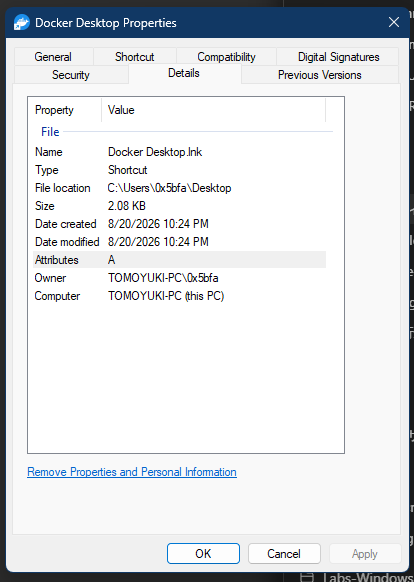

# Details property page

The Details page is a property-system view. It asks the selected item for a property-description list, retrieves each typed value, and formats it through the corresponding property description.

> [!NOTE]
> The function addresses in this article apply to `shell32.dll` `10.0.26100.8521`, image base `0x180000000`.

## Screenshot



## UI region map

| UI region | Verified owner | Data or API path | ReFiles guidance |
| --- | --- | --- | --- |
| Property and Value columns | `shell32!CSummaryPage::_PropertiesToUI` at `0x1803E4AC0` | `IShellItemArray::GetPropertyDescriptionList(PKEY_PropList_FullDetails)` produces the ordered schema | Preserve provider order; do not hard-code a universal Details list. |
| Section headers such as File | `CSummaryPage::_AddPropertiesFromPropListToUI` at `0x1803E3740` | Property-list grouping metadata | Treat headers as presentation, not property keys. |
| Property names | `CSummaryPage::_AddPropertyDescriptionToUI` at `0x1803E386C` | `IPropertyDescription::GetDisplayName`, with canonical-name fallback | Use the canonical name only as a diagnostic fallback because it is not localized. |
| Display values | `shell32!CSummaryPage::_GetValueAndValueString` at `0x1803E40E8` | Provider value retrieval followed by `IPropertyDescription::FormatForDisplay` | Retain the `PROPVARIANT` for logic and use the formatted value only for display. |
| Editable values | `shell32!CSummaryPage` edit-control path | Property-description editability and provider write support | Do not infer writability from a known property key. |
| Remove Properties and Personal Information | `shell32!CSummaryPage` command handler | Canonical `removeproperties` verb; property changes are applied through the Shell file-operation path | This is a destructive metadata operation and must show the resulting copy/in-place choice. |

## Page construction

**Verified.** `shell32!CSummaryPage::AddPages` at `0x1803E28B0` creates the Details page from dialog resource `16816` and supplies it through `CreatePropertySheetPageW`.

## Property enumeration

The verified enumeration path is:

```text
IShellItemArray::GetPropertyDescriptionList(PKEY_PropList_FullDetails)
  -> IPropertyDescriptionList::GetCount
  -> IPropertyDescriptionList::GetAt
  -> IPropertyDescription::GetPropertyKey
```

For each property, the page obtains a typed `PROPVARIANT` from the item/provider and calls `IPropertyDescription::FormatForDisplay`. A public reimplementation can use `IPropertyStore::GetValue` together with `PSGetPropertyDescription` and the same formatting interface.

`PKEY_PropList_FullDetails` is a property-list string interpreted by the property system. It can contain grouping markers and provider-selected keys. Missing values are normal and should not collapse the schema or shift unrelated rows.

## Editing and property removal

`CSummaryPage::_Save` at `0x1803E5438` builds an `IPropertyChangeArray` and applies it through the Shell file-operation path. The removal link invokes the canonical `removeproperties` workflow, which also builds property changes before applying them or creating a sanitized copy.

ReFiles should preserve the same separation:

1. read typed values through a property store;
2. stage edits as typed property changes;
3. validate provider writability;
4. submit changes through the operation layer;
5. refresh values from the item after completion.

Avoid converting an edited display string directly into a `PROPVARIANT`; use the property's documented/coercion interfaces and surface validation errors at the field.

## Related content

- [General page](general.md)
- [Digital Signatures page](digital-signatures.md)
- [Property-sheet window construction](construction.md)
