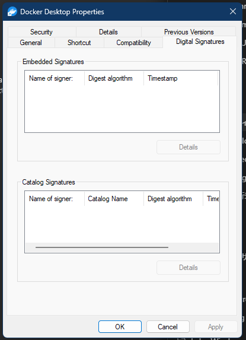

# Digital Signatures property page

The Digital Signatures page enumerates embedded Authenticode signatures and catalog signatures. It is added only when the selected file can participate in the CryptoAPI signature-view workflow.

> [!NOTE]
> The addresses in this article apply to `cryptext.dll` and `cryptui.dll` `10.0.26100.1`, each with image base `0x180000000`.

> [!WARNING]
> Enumerating a signature is not the same as establishing trust. Trust verification depends on policy, chain state, revocation configuration, catalog membership, timestamp state, and the file bytes at verification time.

## Screenshot

## UI region map

| UI region | Verified owner | Data or API path | ReFiles guidance |
| --- | --- | --- | --- |
| Embedded Signatures list | `cryptui!ViewPageViewSignatures` at `0x18003B1C0` | `CryptQueryObject`, `CryptMsgGetParam`, SIP discovery, and signer enumeration | Return structured signer data and verification state separately. |
| Name of signer | `cryptui!DisplaySignatures` at `0x18003A26C` | Signer certificate from the PKCS #7 message, formatted for display | Certificate subject display names are not unique identities. |
| Digest algorithm | `cryptui!DisplaySignatures` at `0x18003A26C` | Signer information and digest algorithm OID | Preserve the OID even when no friendly name is known. |
| Timestamp | `cryptui!DisplaySignatures` at `0x18003A26C` | Countersignature/RFC 3161 data, including secondary signatures | Distinguish signing time from a cryptographically validated timestamp. |
| Embedded Details | `cryptui!ViewPageViewSignatures` at `0x18003B1C0` | `WinVerifyTrustEx`, `WTHelperProvDataFromStateData`, and `CryptUIDlgViewSignerInfoW`/extended variants | Close trust state with the matching `WTD_STATEACTION_CLOSE` operation. |
| Catalog Signatures list | `cryptui!SetCatalogSignaturesStruct` at `0x18003AAFC` | Catalog-admin context, file hash calculation, catalog enumeration, and catalog metadata | Hashing can be expensive; bind results to file identity and modification state. |
| Catalog Details | `cryptui!ViewPageViewSignatures` at `0x18003B1C0` | Opens signer/catalog certificate details | Treat the system dialog as an optional presentation path, not the primary data reader. |

## Page construction

**Verified.** `cryptext!CCryptSig::Initialize` at `0x180003650` accepts a single non-directory item from `CF_HDROP`. `CCryptSig::AddPages` at `0x1800042F0` probes the file with `CryptQueryObject` for a PKCS #7 signed object. It then calls `cryptui!CryptUIGetViewSignaturesPagesW` at `0x18003C9A0`; CryptoUI creates the actual `PROPSHEETPAGEW` and passes it through `CreatePropertySheetPageW`.

The provider therefore has two layers: `cryptext.dll` is the Shell extension and eligibility gate, while `cryptui.dll` owns signature enumeration and the page UI.

## Embedded signatures

The verified implementation calls `CryptSIPRetrieveSubjectGuid` and `CryptSIPLoad` to select the Subject Interface Package for the file type. It reads the signed message with CryptoAPI and enumerates primary and secondary signatures. The nested-signature OID observed by the implementation is `1.3.6.1.4.1.311.2.4.1`.

A safe reader must own and release each `HCERTSTORE`, `HCRYPTMSG`, certificate context, SIP dispatch table, and trust-state handle according to the API that created it. Never keep pointers into a message buffer after closing the message.

## Catalog signatures

The catalog path uses `CryptCATAdminAcquireContext2`, calculates the subject hash, enumerates matching catalogs, and reads catalog information. Every catalog-admin context and catalog handle has a distinct release function. Catalog membership should be re-evaluated if file size, write time, or identity changes during the read.

## Verification boundary

Use `WinVerifyTrust`/`WinVerifyTrustEx` for policy evaluation and CryptoAPI for extraction. Report at least these states independently:

- signature present;
- signature structure readable;
- certificate chain result;
- file digest result;
- timestamp presence and result;
- catalog versus embedded source.

## Related content

- [Details page](details.md)
- [Property-sheet overview](README.md)
- [Property-sheet window construction](construction.md)
