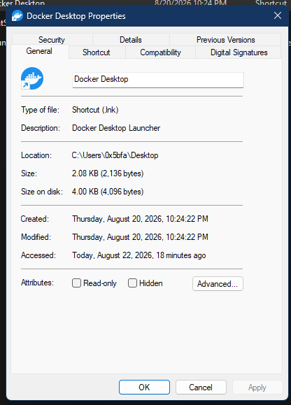

# General property page

The General page is the filesystem summary page. It combines Shell display metadata with direct filesystem measurements and exposes a small set of writable values: the item name and selected file attributes.

> [!NOTE]
> The function addresses in this article apply to `shell32.dll` `10.0.26100.8521`, image base `0x180000000`. They are evidence, not a supported ABI.

## Screenshot

## UI region map

| UI region | Verified owner | Data or API path | ReFiles guidance |
| --- | --- | --- | --- |
| Large icon | `shell32!CFilePropSheetPage` | Shell item icon/thumbnail resolution; the supported projection is `IShellItemImageFactory::GetImage` or `SHGetFileInfoW` | Request an icon at the rendered size and release the returned native bitmap or icon with its matching owner contract. |
| Editable name | `shell32!CFilePropSheetPage::s_SingleFilePrshtDlgProc` | Shell display name; supported callers can use `IShellItem2::GetDisplayName` and rename through the existing file-operation boundary | Do not rename while the user is typing. Stage the value and apply it on OK or Apply. |
| Type of file | `shell32!CFilePropSheetPage::s_SingleFilePrshtDlgProc` | Shell type text and property descriptions; `SHGetFileInfoW` with `SHGFI_TYPENAME` is the direct supported route | Treat this as localized display text, not a stable type identifier. |
| Description | `shell32!CFilePropSheetPage::s_SingleFilePrshtDlgProc` | For shortcuts, `IShellLinkW::GetDescription`; executable targets can supply the version-resource `FileDescription` | Empty descriptions are valid. Do not substitute the file name. |
| Location | `shell32!CFilePropSheetPage::s_SingleFilePrshtDlgProc` | Parent Shell display name or filesystem parent path | Preserve Shell parsing names separately from the localized display value. |
| Size and size on disk | `shell32!CFilePropSheetPage::s_SingleFilePrshtDlgProc` | Logical size from file information; allocation/compressed size from `GetCompressedFileSizeW`; directory totals require enumeration | Calculate directory totals asynchronously and make cancellation visible to the owning view model. |
| Created, modified, and accessed | `shell32!CFilePropSheetPage::s_SingleFilePrshtDlgProc` | `GetFileInformationByHandleEx` or `GetFileAttributesExW`, followed by local-time display formatting | Keep the underlying values as UTC `FILETIME`; localization belongs in presentation. |
| Read-only and Hidden | `shell32!CFilePropSheetPage::s_SingleFilePrshtDlgProc` | `GetFileAttributesExW`; changes ultimately update filesystem attributes | A folder initializes Read-only to the indeterminate state and labels it “Only applies to files in folder.” Apply only changed bits and preserve unrelated attributes. |
| Advanced | `shell32!CFilePropSheetPage::s_SingleFilePrshtDlgProc` plus filesystem-specific dialogs | Compression, encryption, indexing, and archival options vary by item and volume | Expose only capabilities proven for the selected item. Do not infer support from the page being present. |

## Page construction

**Verified.** `shell32!FileSystem_AddPages` at `0x180377820` allocates the filesystem property-page object, prepares a `PROPSHEETPAGEW`, assigns `CFilePropSheetPage::s_SingleFilePrshtDlgProc`, and passes the descriptor to `CreatePropertySheetPageW`. Common Controls creates the child dialog only when the page is activated. See [Property-sheet window construction](construction.md).

## Read and write behavior

The page does not have one all-purpose “General page API.” It is an aggregation layer over the Shell namespace, property system, and filesystem APIs. A robust reimplementation separates these concerns:

1. Resolve the item once as an `IShellItem2` and retain its stable identity.
2. Read cheap display values immediately.
3. Read allocation size, directory totals, and optional description data asynchronously.
4. Stage rename and attribute edits.
5. Apply edits through the existing ReFiles operation service after validation.

`GetCompressedFileSizeW` returns allocation/compressed size in low and high parts and reports failure through `GetLastError`. The value is not equivalent to recursive directory “size on disk,” and sparse, compressed, cloud, and remote items can require provider-specific handling.

## Advanced Attributes dialog

**Verified from resources.** The analyzed `shell32.dll.mui` contains two extended dialog templates:

| Selection | Dialog resource | Size | Intro behavior |
| --- | ---: | ---: | --- |
| File | `1054` | `252 × 161` dialog units | “Choose the options you want for this file.” |
| Folder or selected items | `1055` | `252 × 190` dialog units | Explains that OK or Apply will ask whether changes should include subfolders and files. |

Both dialogs are top-level modal dialogs titled **Advanced Attributes**, rather than controls embedded in the General page. Their control layout is:

| Section/control | Resource control ID | Native state or operation |
| --- | ---: | --- |
| Archive | `13077` | `FILE_ATTRIBUTE_ARCHIVE`; written while preserving every other attribute bit |
| Allow contents to be indexed | `13158` | Inverse of `FILE_ATTRIBUTE_NOT_CONTENT_INDEXED` |
| Compress contents | `13105` | Enabled when `GetVolumeInformationW` reports `FILE_FILE_COMPRESSION`; changed with `DeviceIoControl(FSCTL_SET_COMPRESSION)` |
| Encrypt contents | `13159` | Enabled when the volume reports `FILE_SUPPORTS_ENCRYPTION`; changed with `EncryptFileW` or `DecryptFileW` |
| Encryption details | `13154` | Enabled for an already encrypted single file and opens the EFS details UI |

The file template labels its first group **File attributes**. The folder template labels it **Archive and Index attributes** and uses folder-specific archive and indexing text. Compression and encryption are mutually exclusive: selecting one clears the other before the change is staged.

The child-scope choice is a later **Confirm Attribute Changes** dialog, not a checkbox in Advanced Attributes. ReFiles mirrors that separation and performs recursive changes only after the user explicitly selects the subfolders-and-files option.

## ReFiles boundary

Use `WindowsShellPropertySheetReader` only to compose typed page data. Keep icon ownership, COM calls, handle lifetime, and filesystem error translation in `Files.Core`; keep labels, date/size formatting, and pending-edit state in `Files`.

## Related content

- [Property-sheet overview](README.md)
- [Details page](details.md)
- [Property-sheet window construction](construction.md)
