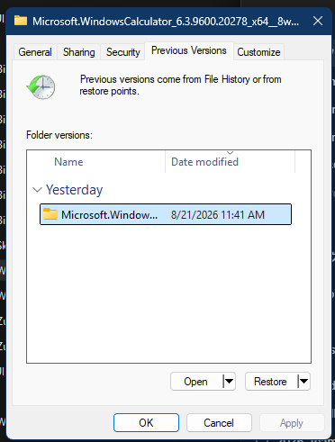

# Previous Versions property page

The Previous Versions page merges point-in-time filesystem snapshots with File History and other recovery providers. The rows can look uniform even though their discovery and restore paths are different.

> [!NOTE]
> The function addresses in this article apply to `twext.dll` `10.0.26100.8117`, image base `0x180000000`.

## Screenshot

## UI region map

| UI region | Verified owner | Data or API path | ReFiles guidance |
| --- | --- | --- | --- |
| Introductory text and clock icon | `twext!CTimeWarpProp` dialog procedure | Static dialog resources selected for the item type | Keep explanatory copy separate from snapshot state. |
| Folder versions list | `CTimeWarpProp::_OnInit` at `0x180010B8C` | A private Explorer Browser navigates to a previous-versions Shell view; enumeration merges shadow-copy, File History, and SafeDocs items | Model each row with a provider kind and stable provider identity, not just a date and path. |
| Name and Date modified columns | `twext!CTimeWarpProp` hosted Shell view | Shell properties exposed by the provider item | Preserve the provider's timestamp; do not assume it equals the source item's modification time. |
| Open | `twext!CTimeWarpProp` command handling | Opens the selected provider item or snapshot namespace item | Opening should be read-only unless the provider explicitly supports writes. |
| Restore | `twext!CTimeWarpProp::_OnRevert` at `0x180010EA4` | `_CopySnapShot` at `0x18001044C` creates `CLSID_FileOperation` and uses `IFileOperation` | Require confirmation and surface overwrite, elevation, and partial-failure results. |

## Page construction

**Verified.** `twext!CTimeWarpProp::AddPages` at `0x18000E9C0` selects dialog resource `101` or `102` and title resource `1024`, then supplies the page through `CreatePropertySheetPageW`.

During initialization, `_OnInit` creates `CLSID_ExplorerBrowser` and invokes the private `NavigateToPreviousVersionsOfItem` path. This is why the list behaves like a Shell view rather than a conventional owner-data list control.

## Version discovery

`EnumSnapshots` at `0x180013B14` combines three internal sources:

1. snapshot Shell items;
2. File History Shell items;
3. SafeDocs recovery items.

### Local shadow-copy snapshots

The verified internal chain begins at `twext!SHEnumSnapshotsForPath` (`0x18001BFA4`). It opens the item with `CreateFileW`, including `FILE_FLAG_BACKUP_SEMANTICS` for directories, sends a filesystem control request through `NtFsControlFile`, and parses returned snapshot names in the `@GMT-yyyy.MM.dd-HH.mm.ss` form. `BuildSnapshots` at `0x18001A824` converts those names into Shell items with a time-warp bind context.

The observed filesystem control code is `0x00144064`. It and the time-warp bind-context contract are undocumented. ReFiles must version-guard this path and return an empty result when the filesystem or build does not support it.

### File History

The provider constructs a File History query bind context, sets source-path and duplicate-date behavior, and binds through `CLSID_FhFolder`. This is also private implementation. A ReFiles implementation should isolate it behind a Windows-only adapter and never treat File History availability as implied by NTFS snapshot support.

## Restore semantics

Explorer restores the chosen provider item through `IFileOperation`, preserving the normal Shell conflict and progress model. ReFiles should reuse its operation service so a restore participates in the same elevation, collision, cancellation, and error-reporting contracts as copy and replace operations.

## Related content

- [General page](general.md)
- [Property-sheet overview](README.md)
- [Property-sheet window construction](construction.md)
