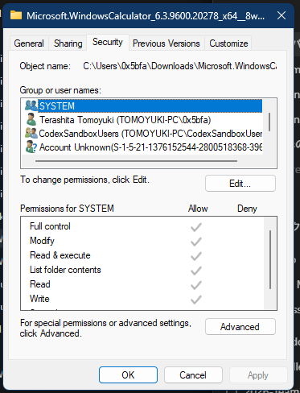

# Security property page

The Security page is assembled by the Remote Shell Extension (`rshx32.dll`) and rendered by ACLUI (`aclui.dll`). It exposes the object's security descriptor as principals, effective access rows, and edit workflows.

> [!NOTE]
> The addresses in this article apply to `rshx32.dll` `10.0.26100.1` and `aclui.dll` `10.0.26100.8115`, each with image base `0x180000000`.

> [!WARNING]
> Security-descriptor writes are high risk. Preserve control bits, canonical ACL ordering, inheritance semantics, and the distinction between absent and null ACLs.

## Screenshot



## UI region map

| UI region | Verified owner | Data or API path | ReFiles guidance |
| --- | --- | --- | --- |
| Object name | `rshx32!CSecurityInformation::GetObjectInformation` at `0x18000CE30`; displayed by ACLUI | Shell parsing/filesystem name passed through `SI_OBJECT_INFO` | Display only; do not use localized text as the write target. |
| Group or user names | `aclui!CPermPage::InitializePrincipalsList` at `0x18004C1EC` | SIDs from owner/group/DACL; account resolution is cached internally and ultimately uses LSA/account lookup services | Use `LookupAccountSidW` for a supported implementation and retain the SID as identity when lookup fails. |
| Permissions matrix | `rshx32!CNTFSSecurity::GetAccessRights` at `0x1800072B0`; displayed by ACLUI | Generic and file/directory access masks mapped to named permission rows | Evaluate masks against the row definitions; a checked box is not necessarily one ACE. |
| Edit | `rshx32!CSecurityExtension::OpenEditor` at `0x18000A640`; elevated entry is `CNTFSSecurity::OpenElevatedEditor` at `0x180007C40` | ACL editor over the provider's `ISecurityInformation` implementation | Use the Shell editor. Request elevation only when `READ_CONTROL` and `WRITE_DAC` cannot both be opened. |
| Advanced | `rshx32!CSecurityExtension::OpenEditor` at `0x18000A640` with `SI_PAGE_ADVPERM` | Owner, auditing, effective access, inheritance, and advanced ACEs | Open the normal provider first so viewing advanced state does not require elevation. |

## Page construction

**Verified.** `rshx32!CSecurityExtension::AddPages` at `0x180009680` calls `_CreateSI` (`0x18000B0A8`) to create an NTFS `ISecurityInformation` provider. `_AddSecurityPage` at `0x18000ADE0` passes that provider to `aclui!CreateSecurityPage` at `0x18004E680`. ACLUI returns the `HPROPSHEETPAGE` consumed by the parent sheet.

This indirection is important: `rshx32.dll` owns object-specific security reads and writes; `aclui.dll` owns the user interface and edit semantics.

## Principal images

**Verified.** ACLUI does not use stock WinUI glyphs for the principal list. `CPermPage::InitializePrincipalsList` calls `GetBestSidImageResource` (`0x180046064`) and loads an image strip from the `"Image"` resource in `aclui.dll`. Resource `101` is the 16-pixel strip used at standard DPI. Larger resources `103` through `109` cover 20, 24, 32, 40, 48, 64, and 256 pixels.

`aclui!GetSidImageIndex` at `0x1800462A4` selects a cell from that strip:

| SID kind | Image index |
| --- | ---: |
| Unknown, deleted, invalid, or domain | `0` |
| Computer | `1` |
| Group, alias, or well-known group | `2` |
| User | `4` or `5`, depending on the resolved-name metadata |
| Capability SID | `6` |
| Package SID | `7` |

ReFiles loads resource `101` from the system `aclui.dll`, retains the resolved `SID_NAME_USE`, and clips the original strip at the corresponding index. Account lookup failure keeps the SID and uses image index `0`.

## Edit and elevation flow

`rshx32!CheckFileAccess` at `0x1800068FC` probes `READ_CONTROL` (`0x00020000`), `WRITE_DAC` (`0x00040000`), `WRITE_OWNER`, and `ACCESS_SYSTEM_SECURITY` separately. `_CheckForSecurity` at `0x18000AE94` marks the permissions UI read-only or elevation-required when `READ_CONTROL | WRITE_DAC` is unavailable.

The normal editor is available through the private interface `74807F67-0058-440D-8600-65541A7FBBEA` on `CLSID_NTFSSecurityExt` (`1F2E5C40-9550-11CE-99D2-00AA006E086C`). Its `OpenEditor` method creates the same `CNTFSSecurity` provider and calls `aclui!EditSecurity` or `EditSecurityAdvanced`.

When elevation is required, `CNTFSSecurity::OpenElevatedEditor` calls `CoGetObject` with:

```text
Elevation:Administrator!new:{1F2E5C40-9550-11CE-99D2-00AA006E086C}
  -> IID 74807F67-0058-440D-8600-65541A7FBBEA
  -> OpenEditor(owner, path, objectName, isContainer, SI_PAGE_PERM)
```

The owner is supplied through `BIND_OPTS3.hwnd`, so the UAC prompt and the ACL editor remain owned by the ReFiles property window.

## Reading security

The verified read chain is:

```text
rshx32!CNTFSSecurity::GetSecurity (0x1800077C0)
  -> CSecurityInformation::GetSecurity (0x18000CE80)
  -> ReadObjectSecurity (0x18000D350)
  -> advapi32!GetNamedSecurityInfoW
```

The supported equivalent is `GetNamedSecurityInfoW` or `GetSecurityInfo`, followed by the documented security-descriptor and ACL traversal APIs. Memory returned by `GetNamedSecurityInfoW` is released with `LocalFree`.

The standard access rows observed in this build use the following masks:

| Row | Access mask |
| --- | ---: |
| Full control | `0x000F01FF` |
| Modify | `0x000301BF` |
| Read & execute / List folder contents | `0x000200A9` |
| Read | `0x00020089` |
| Write | `0x00000116` |

These masks are context-sensitive. Directory and file labels can differ even when their masks overlap.

## Writing security

The verified write chain is:

```text
rshx32!CSecurityInformation::SetSecurity (0x18000D3F0)
  -> WriteObjectSecurity (0x18000D5A0)
  -> advapi32!SetNamedSecurityInfoW
```

Recursive application from `CNTFSSecurity::SetSecurityLocal` at `0x18000807C` reaches `TreeSetNamedSecurityInfoW`. ReFiles should avoid recursive mutation unless the user explicitly requested it and the operation layer can report partial failures and cancellation without pretending the operation was atomic.

## Related content

- [Sharing page](sharing.md)
- [Property-sheet overview](README.md)
- [Property-sheet window construction](construction.md)
