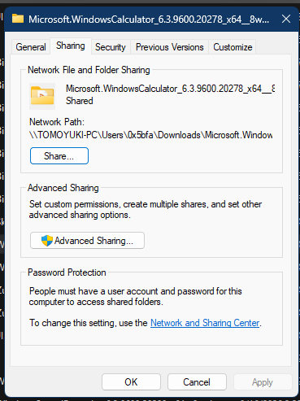

# Sharing property page

The Sharing page displays SMB sharing state and launches the Windows sharing workflows. Its provider is Network Sharing UI, not the core filesystem page in `shell32.dll`.

> [!NOTE]
> The function addresses in this article apply to `ntshrui.dll` `10.0.26100.8117`, image base `0x180000000`.

## Screenshot



## UI region map

| UI region | Verified owner | Data or API path | ReFiles guidance |
| --- | --- | --- | --- |
| Shared item name and state | `ntshrui!CSharingPropertyPage::_InitializeControls` at `0x180067350` | A Shell item is created with `SHCreateItemFromParsingName`; the private sharing manager selects an SMB, in-place, or library sharing engine | Ignore administrative shares such as `C$`; report `Not Shared` when no ordinary disk share contains the item. |
| Network Path | `ntshrui!CSharingPropertyPage::_GetSharingInfo` at `0x18006714C` | Private sharing engine resolves the active share and UNC path | Compose and show the UNC path only when a matching ordinary share exists. |
| Share | `ntshrui!CSharingPropertyPage::_ShowSharingWizard` at `0x18006835C` | The provider's named export `ShowShareFolderUI(HWND, PCWSTR)` reaches the same sharing manager | Invoke the export only from an explicit button action. |
| Advanced Sharing | `ntshrui!CSharingPropertyPage::_OnCommand` at `0x180067AC8` | `CLSID_MultiObjectElevationFactory` creates an elevated sharing manager | Keep the undocumented ABI isolated and invoke it only from an explicit button action. |
| Password Protection text | `ntshrui!CSharingPropertyPage::_InitializeControls` at `0x180067350` | `IsOS(OS_DOMAINMEMBER)` and a blank-password Guest logon determine visibility and text | Hide the section on domain members and present it as read-only guidance elsewhere. |
| Network and Sharing Center link | `ntshrui!CSharingPropertyPage::_ShowNetCenter` at `0x1800682E0` | `IOpenControlPanel::Open` | Opening the system page is separate from reading share state. |

## Page construction

**Verified.** `ntshrui!CShare::AddPages` at `0x180037300` supplies dialog resource `1000`, title resource `3200`, and `CSharingPropertyPage::DlgProcPage` through `CreatePropertySheetPageW`.

Before creating the page, `AddPages` applies these conditions:

1. `IsDiscretionarySharingDisabled` rejects the page unless the `LanmanServer` service is running or start-pending.
2. `CanShareSMB` requires a filesystem folder (`SFGAO_FOLDER | SFGAO_FILESYSTEM`) on a removable, fixed, or CD-ROM drive.
3. The provider's share cache must contain at least one disk share. `CShareCache::RefreshNoCritSec` uses `NetShareEnum` level 503 and accepts a record only when `(shi503_type & 0xBFFFFFFF) == STYPE_DISKTREE`. This permits temporary disk shares but excludes `STYPE_SPECIAL` administrative shares.

The named `CanShareFolder(PCWSTR)` export performs the provider's item-level private-manager check and returns an `HRESULT` (`S_OK` means the item can be shared).

The provider creates `CLSID_SharingConfigurationManager` and selects one of its internal engines, including SMB, in-place, and library sharing engines. These classes explain Explorer's behavior, but their interfaces and vtable layouts are undocumented and version-specific.

## Initialization and display conditions

`CSharingPropertyPage::_InitializeControls` obtains a `SHARE_MODE` from the sharing manager. Control `1059` (Share) is enabled when the mode is not `3`. It then asks the SMB engine first; modes `1` and `2` permit a fallback to the in-place or library engine respectively.

When the engine reports a shared item, string resource `3202` (`Shared`) and the returned UNC path are displayed. When both attempts fail, resource `3203` (`Not Shared`) is used and no Network Path row should be presented by a reconstructed UI.

Control `1060` (Advanced Sharing) is not disabled during initialization. `_OnInitDialog` sends `BCM_SETSHIELD` to add the elevation shield. Its command handler uses this call flow:

```text
CoCreateInstance(CLSID_MultiObjectElevationFactory, IID 6fabda16-031e-47e3-b2a2-2339c05ccb9e)
  -> prepare CLSID_SharingElevatedFactory (72a7994a-3092-4054-b6be-08ff81aeeffc)
  -> create elevated CLSID_SharingConfigurationManager (49f371e1-8c5c-4d9c-9a3b-54a6827f513c)
  -> sharing-manager vtable slot 10: ShowAdvancedSharing(HWND, path)
```

Password Protection is hidden by calling `ShowWindow(SW_HIDE)` for controls `1056` and `1061` when `IsOS(OS_DOMAINMEMBER)` is true. Otherwise the provider attempts a network logon for the local Guest account with an empty password. Success selects resource `5102`; failure selects resource `5103`, the normal "user account and password" guidance.

The settings hyperlink creates `CLSID_OpenControlPanel` and calls:

```text
IOpenControlPanel::Open(L"Microsoft.NetworkAndSharingCenter", L"Advanced", nullptr)
```

## User-initiated actions

The basic sharing experience does not require reconstructing the modal wizard. `ntshrui.dll` exports `ShowShareFolderUI`, whose verified signature is:

```cpp
HRESULT ShowShareFolderUI(HWND owner, PCWSTR path);
```

The function parses the path, creates a one-item `IShellItemArray`, activates `CLSID_SharingConfigurationManager`, and calls its wizard method. The Advanced Sharing editor has no equivalent named export in this build; Explorer uses the elevation-factory path above.

## Supported data boundary

For an SMB-backed local folder, the supported management APIs are the Network Management functions in `Netapi32.dll`:

| Operation | API |
| --- | --- |
| Enumerate local shares | `NetShareEnum` |
| Read one share | `NetShareGetInfo` |
| Create a share | `NetShareAdd` |
| Update a share | `NetShareSetInfo` |
| Remove a share | `NetShareDel` |
| Inspect mapped connections when relevant | `NetUseEnum` / `NetUseGetInfo` |

Share enumeration can be remote, privileged, or slow. Run it off the UI thread, support cancellation at the orchestration layer, and free returned network-management buffers with `NetApiBufferFree` exactly once.

## Related content

- [Security page](security.md)
- [Property-sheet overview](README.md)
- [Property-sheet window construction](construction.md)
