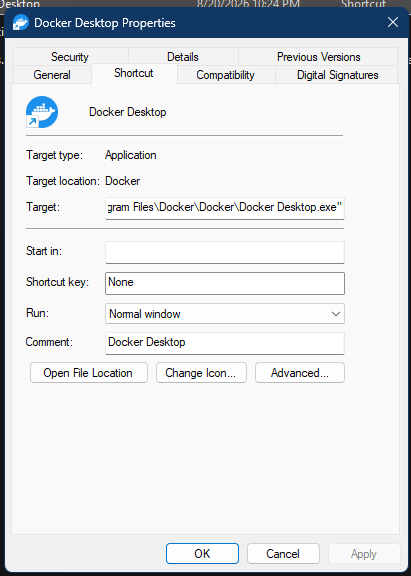

# Shortcut property page

The Shortcut page is provided for Shell link (`.lnk`) items. It reads and edits the link object rather than the target file itself.

> [!NOTE]
> The function addresses in this article apply to `shell32.dll` `10.0.26100.8521`, image base `0x180000000`.

## Screenshot

## UI region map

| UI region | Verified owner | Data or API path | ReFiles guidance |
| --- | --- | --- | --- |
| Icon and link name | `shell32!_LinkDlgProc` | Link icon from `IShellLinkW::GetIconLocation`; item name from the Shell item | Keep link identity separate from target identity. |
| Target type | `shell32!_UpdateLinkDlg` at `0x180469298` | Resolved target type; `SHGetFileInfoW(SHGFI_TYPENAME)` supplies supported display text | A broken or non-filesystem target may have no type text. |
| Target location | `shell32!_UpdateLinkDlg` | Parent path derived from the target path with Shell path helpers | Do not use the displayed parent as the target used for launch or save. |
| Target | `shell32!_UpdateLinkDlg` | `IShellLinkW::GetPath(SLGP_RAWPATH)` with a normal `GetPath` fallback; arguments remain a separate link field | Preserve environment variables and quoting when the raw form is available. |
| Start in | `shell32!_UpdateLinkDlg` | `IShellLinkW::GetWorkingDirectory` | An empty working directory is valid. |
| Shortcut key | `shell32!_UpdateLinkDlg` | `IShellLinkW::GetHotkey` and `SetHotkey` | The link field is not a system-wide registration guarantee. |
| Run | `shell32!_UpdateLinkDlg` | `IShellLinkW::GetShowCmd` and `SetShowCmd` | Map only documented `SW_*` values and preserve unknown values. |
| Comment | `shell32!_UpdateLinkDlg` | `IShellLinkW::GetDescription`; indirect resource strings can be expanded by `SHLoadIndirectString` for display | Save the source link field, not the expanded localized string, unless the user edits it. |
| Open File Location | `shell32!_LinkDlgProc` command handling | Resolve the link target and open/select its containing Shell folder | Disable for unresolved or non-browsable targets. |
| Change Icon | `shell32!_DoPickIcon` at `0x1804683E8` | `GetIconLocation`, `PickIconDlg`, `ExtractIconW`, then `SetIconLocation` | The picker is UI; icon extraction and persisted location belong in the Windows boundary. |
| Advanced | `shell32!_LinkDlgProc` command handling | Link-specific elevated/run options | Query capability before displaying the command. |

## Page construction

**Verified.** `shell32!AddLinkPage` at `0x18046A368` selects dialog resource `1040`, installs `_LinkDlgProc`, and submits the resulting `PROPSHEETPAGEW` to `CreatePropertySheetPageW`. The initial control population is performed by `_UpdateLinkDlg`.

## Saving a link

The internal save path reaches `shell32!SaveLinkWithElevation` at `0x18046A6A8`. It applies the edited `IShellLinkW` fields and persists the object through `IPersistFile::Save`; an elevation path is available when the link cannot be written in the caller's context.

For ReFiles, keep the normal path explicit:

1. Instantiate the Shell link COM object and load the `.lnk` through `IPersistFile::Load`.
2. Read link fields through `IShellLinkW`.
3. Stage edits in typed data.
4. Call the matching setters and `IPersistFile::Save` only on OK or Apply.
5. Report access denial instead of silently launching an undocumented elevated helper.

Arguments are not safely reconstructed by splitting the displayed target string. Read them with `IShellLinkW::GetArguments`; the property-system value `PKEY_Link_Arguments` is useful when composing the Details view.

## Related content

- [General page](general.md)
- [Details page](details.md)
- [Property-sheet window construction](construction.md)
