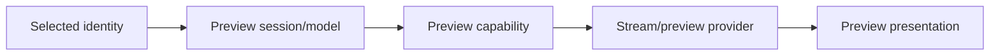

# Preview subsystem

Preview provides richer content for the currently selected item without making browse enumeration depend on preview availability.

## Responsibilities

- choose/resolve an appropriate preview capability/provider;
- manage preview resource lifetime;
- cancel stale preview requests when selection/navigation changes;
- expose UI-independent preview data/contracts to presentation;
- isolate Windows Shell preview handlers behind a platform boundary.

## Non-responsibilities

Preview must not delay folder enumeration or own visual layout. A failed preview must not invalidate the underlying storage item.

## Flow

## Lifetime

Only work for the current selection should publish. When selection changes, cancel prior work and release streams, temporary resources, COM handlers, or other owned objects according to their contracts.

## Windows Shell preview handlers

Third-party preview handlers are environment-dependent and may involve COM/out-of-process behavior. Keep handler-specific lifetime/threading in the Windows integration layer and treat representative installed-handler tests as scenario/manual tests.

## Security and robustness

Previewing untrusted content crosses a high-risk parser/handler boundary. Avoid granting unnecessary ownership/privilege, bound data where possible, and treat handler crashes/failures as preview failures rather than app-state corruption.

## Tests

Use deterministic preview doubles for selection coordination, cancellation, ownership, stream limits, and stale-result rejection. Keep third-party handler compatibility outside deterministic CI tests.
