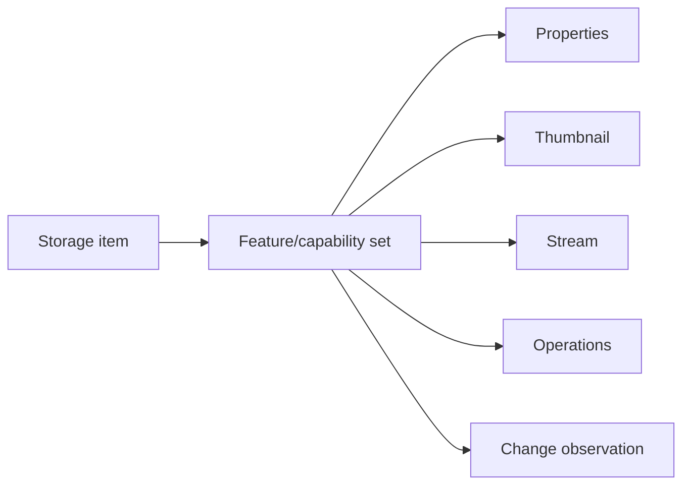

# Storage providers

Storage providers adapt a backend to the common Core storage model.

## Provider contract

A provider is responsible for the semantics it knows best:

- reference/address parsing and resolution;
- item identity;
- hierarchy/enumeration;
- stream access;
- optional properties, thumbnails, preview, search, operations, and notifications;
- backend-specific cancellation and cleanup.

Generic browse/presentation code is responsible for consuming those contracts, not for recognizing provider implementations.

## Capability composition

Not all backends support the same behavior. Prefer optional item features over a large interface whose members throw `NotSupportedException` for many providers.

## Provider isolation

Avoid provider checks in generic code. If FTP, archives, Windows Shell, or a future cloud provider require different behavior, first ask whether the difference belongs in a provider contract/capability.

## Identity

Define identity before implementing UI. Consider rename/move behavior, case sensitivity, server/backend identifiers, and whether a path is stable enough for the provider.

## Threading

A provider defines the constraints of its backend. Windows Shell uses the Shell scheduler/STA rules; remote providers must avoid blocking UI threads on network I/O; archives may serialize access around shared streams. Generic callers should not need to reproduce these details.

## Failure and cancellation

Normalize provider outcomes enough that callers can distinguish cancellation, unsupported behavior, missing/inaccessible items, and actual failures. Do not hide backend details needed for diagnostics, but do not expose credentials/secrets in logs or public results.

## Adding a provider

Use [`../development/adding-a-storage-provider.md`](../development/adding-a-storage-provider.md) as the contributor checklist. Add deterministic tests for provider-independent contracts and isolated integration tests for backend-dependent behavior.

## Review questions

- Does the provider preserve a meaningful identity?
- Can enumeration stream progressively?
- Are optional behaviors capabilities rather than branches elsewhere?
- Is lifetime/stream ownership explicit?
- Are blocking/backend-specific requirements isolated?
- Are secrets excluded from addresses, diagnostics, snapshots, and CI output?
