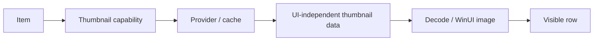

# Thumbnail pipeline

Thumbnails are visual enrichment and must not block initial folder content.

## Boundary

Core/provider code owns thumbnail retrieval/caching semantics. Presentation owns conversion into WinUI-specific image objects.

## Priorities

Thumbnail work should prioritize visible and near-visible rows. Large append-only enumeration must not constantly cancel useful thumbnail work for rows that remain current.

## Concurrency

Both provider retrieval and image decoding need bounded concurrency. Increasing parallelism without profiling can increase contention, Shell-handler pressure, memory usage, and UI publication overhead.

## Caching

Cache keys must reflect identity/content validity strongly enough to avoid displaying stale thumbnails. Cache ownership, eviction, and invalidation are part of the contract.

## Presentation

Do not decode every thumbnail on the UI thread. Publish decoded images in bounded/coalesced updates and reject results for rows that no longer represent the same item/content generation.

## Failure

A missing/failed thumbnail is not a browse failure. Fall back to an appropriate icon/empty state and preserve row responsiveness.

## Tests

Protect cache hit/miss/eviction/invalidation, cancellation races, stale-result rejection, viewport priority, bounded decoding/publication, and navigation-away cleanup.
