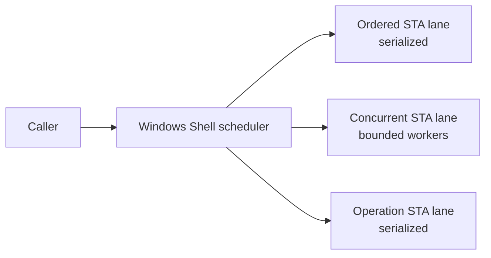

# Windows Shell subsystem

Windows filesystem/Shell integration is a platform subsystem with COM apartment, message-pump, ordering, and lifetime constraints. It must not be treated like ordinary thread-pool work.

## Responsibilities

- resolve Windows/Shell storage identities and items;
- enumerate Shell/filesystem-backed folders;
- retrieve Shell properties and thumbnails;
- consume Shell change notifications;
- execute Shell-dependent operations where appropriate;
- schedule COM work on suitable STA workers.

## Concurrency model

Conceptually the Shell scheduler separates work by ordering/concurrency needs:

The exact pool sizes are implementation details. The architectural requirements are:

- Shell work requiring STA runs on an STA with the required message pumping;
- ordering-sensitive work remains serialized;
- safe independent queries may use bounded concurrency;
- operation work cannot starve ordinary browse/metadata work;
- cancellation does not permit unsafe reuse of apartment-bound state.

## Why not `Task.Run`?

`Task.Run` schedules arbitrary thread-pool threads, normally MTA, and does not provide the scheduler's apartment/message-pump/ordering guarantees. It is not a drop-in replacement for Shell scheduling.

## COM lifetime

Assume a Shell COM object may be apartment-bound unless its contract/agility proves otherwise. Prefer carrying stable identifiers/data across async boundaries and reacquiring the COM object on a valid scheduler lane rather than retaining raw COM objects indefinitely.

## Enumeration

Windows enumeration should expose items progressively and keep expensive identity/metadata work bounded. Do not turn every enumerated item into a UI dispatch or perform all property/thumbnail work before publishing basic rows.

## Properties and thumbnails

Shell property/thumbnail APIs can invoke handlers outside ReFiles' direct control. Treat them as potentially expensive. Use bounded concurrency, cancellation/current-state checks, and caching where appropriate.

## Change notifications

Shell notifications can be bursty and race with navigation/enrichment. Convert them to storage/browse-level changes by stable identity where possible. Do not let Shell notification objects or COM details leak into presentation.

## Errors

Windows paths can disappear, become inaccessible, cross reparse points, represent special Shell locations, or be handled by third-party extensions. Failures must not leave scheduler resources or COM references retained.

## Tests

Windows integration tests should cover resolution/identity, enumeration, typed properties, thumbnail extraction, scheduler apartment behavior/concurrency, `SHChangeNotifyRegister` behavior, and create/rename/case-only rename/copy/move/delete scenarios.

Environment-dependent third-party preview/Shell handler behavior belongs in manual/scenario testing rather than deterministic unit tests.

## Common mistakes

- calling Shell COM from arbitrary worker threads;
- blocking an STA worker waiting for work that needs the same lane;
- sharing apartment-bound COM objects across workers;
- doing metadata work synchronously on the UI thread;
- assuming a path is always a stable identity;
- treating third-party Shell handlers as deterministic test dependencies.
