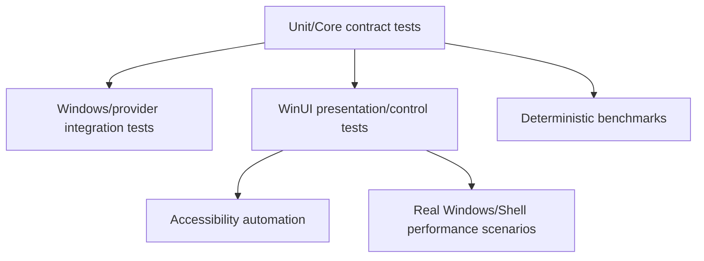

# Testing strategy

ReFiles tests behavior at the lowest deterministic layer that can prove the contract, while keeping Windows/UI/environment-dependent behavior in explicit integration/scenario boundaries.

## Test layers

## What belongs where

- **Unit/Core tests:** deterministic model, ownership, navigation, capability, operation, archive/FTP logic using doubles.
- **Windows integration:** actual temp files and Shell APIs for identity, enumeration, properties, thumbnails, scheduler, notifications, and file operations.
- **UI tests:** presentation adapters, incremental collections, controls, realization/layout contracts, and app-facing behavior requiring WinUI.
- **Axe/accessibility:** automation accessibility boundary.
- **Benchmarks:** deterministic CPU/allocation/notification architecture costs.
- **Scenarios:** real Shell/disk/network/installed-handler performance or compatibility.

## Invariant-to-test mapping

| Invariant | Protection |
|---|---|
| First rows can appear before enumeration completes | browse presentation pipeline tests |
| Superseded navigation cannot publish stale items | navigation cancellation/generation tests |
| One UI batch does not become per-item collection spam | bulk/presentation notification tests |
| Property enrichment preserves row identity | progressive enrichment tests |
| Ownership graph disposes asynchronously | model/session disposal tests |
| Shell work uses correct apartment/concurrency behavior | Windows Shell scheduler integration tests |
| Archive paths cannot escape root | archive path safety tests |
| FTP path/root/session behavior is isolated | FTP unit/integration tests |
| Large lists remain virtualized/responsive | performance work in issue #5 |

## Test design rules

- Protect contracts, not private implementation accidents.
- Avoid sleeps when a deterministic synchronization point can be used.
- Give every owned resource a cleanup path in the test.
- Do not use public network endpoints for normal integration tests.
- Serialize tests that mutate shared process-level Shell state.
- Separate informational performance timings from reliable structural regression assertions.

## Related docs

- [`unit-tests.md`](unit-tests.md)
- [`integration-tests.md`](integration-tests.md)
- [`ui-tests.md`](ui-tests.md)
- [`performance-tests.md`](performance-tests.md)
