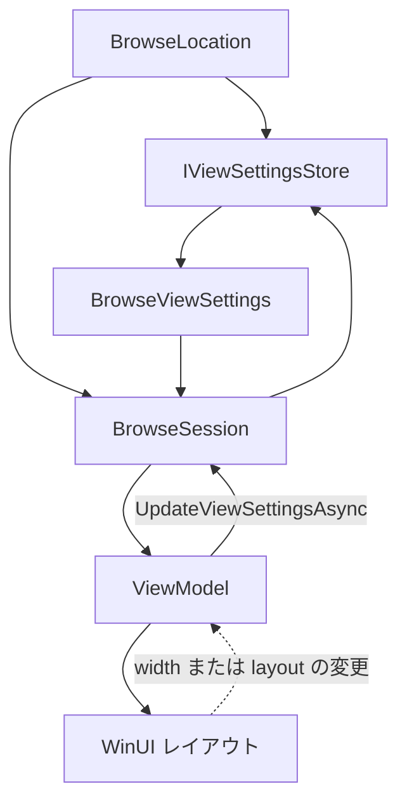
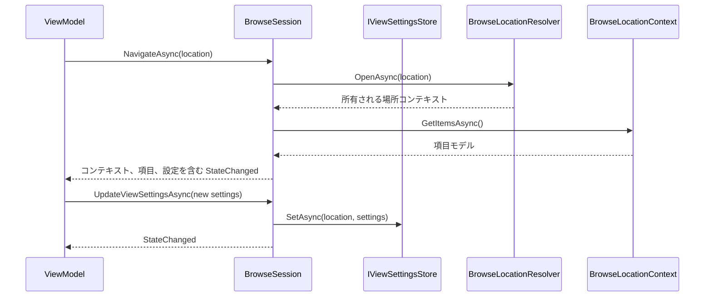
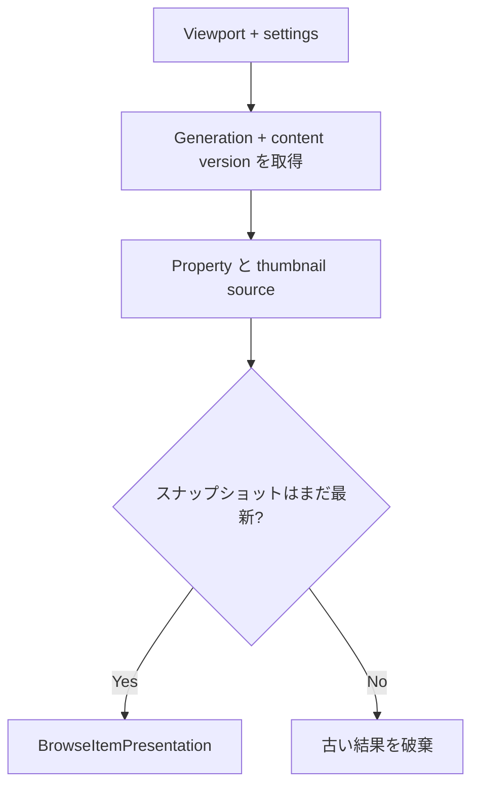

# 参照ビュー設定

詳細ビューの列幅、レイアウトモード、並べ替えの選択、項目サイズは、参照場所の表示方法を表します。
1 つのストレージ項目のプロパティや項目機能ではありません。

そのため `Files.Core` では `IBrowseSession` に配置し、`IViewSettingsStore` を通して保存します。

## モデル

現在の `BrowseViewSettings` には次が含まれます。

- `ViewLayoutMode`（`Details`、`List`、`Grid`、`Columns`）。
- プロパティ ID、幅、順序、表示状態を持つ順序付き `ViewColumnSettings`。
- 並べ替えプロパティ ID と方向。
- 任意の項目サイズ。

列 ID には `IPropertySource` が返す安定した識別子と同じものを使います。ViewModel はその ID をローカライズされたラベルと WinUI 列オブジェクトへ変換します。

列定義自体は `BrowseViewSettings` に保存しません。Files の `ColumnCatalog` が現在の場所に対して Shell、Files 基本、Tags、Git、Cloud の列セットを合成し、
設定はその結果に幅、順序、表示状態を適用します。保存済みの列が現在の場所で利用できなくても設定から削除しません。
詳細な合成規則とプロパティ ID は [Files の項目機能とアクティブ化](files-app-features.md#列の合成) を参照してください。

## ナビゲーションフロー

セッションにストアを直接渡さない場合は、`BrowseLocation` ごとにメモリ内の値を保持します。`FilesCoreBuilder` は既定で `InMemoryViewSettingsStore` を渡します。
Files は Files の設定データベースをバックエンドにした永続ストアを注入してください。

セッションは新しいコンテキストの読み込みが完了した後にだけ、アクティブなコンテキストと項目リストを置き換えます。
ナビゲーションが失敗またはキャンセルされた場合は、新しいコンテキストと部分的な項目を破棄し、現在のコンテキストと項目を保持します。
セッションを置き換えるか破棄すると、項目モデルと場所モデルを所有するコンテキストも破棄します。

アクティブなコンテキストが `IFolderChangeSource` を公開する場合、セッションは項目列挙の前に `Changed` と `Faulted` を購読します。
範囲を限定したキューが変更の詳細な順序を保持します。更新ポンプは完全な作成、削除、名前変更、更新通知を差分適用します。
不完全、曖昧、オーバーフロー、ディレクトリ全体の通知では、完全更新を 1 回要求します。準備中のコンテキストからの変更は、そのコンテキストがアクティブになるまで保留し、何度も消費しません。
更新に失敗しても表示中のコンテキストと項目を残し、`Error` を設定します。

## 投影と選択

`BrowseSession` は UI 非依存の順序付き投影を所有します。不変の項目スナップショットと、バージョン付き `BrowseItemChange` 値を公開します。
追加、削除、置換、単一項目の位置変更は細粒度のまま保ちます。設定またはプロパティ値による再並べ替えでは `BrowseItemsReset` を公開します。
コンシューマーがレコードを順番に適用すると、最終インデックスの移動レコードの集合は一般に有効でないためです。

投影は `name` と `System.ItemNameDisplay` を `IStorableModel.Name` から直接並べ替えます。その他のプロパティ ID には、`BrowseItemPresentation` にすでに公開されている値を使います。
利用できない値はどちらの方向でも最後に置き、名前と安定した識別情報を決定論的なタイブレーカーにします。

選択はモデル参照やアドレスではなく、安定した `StorableKey` の値として保存します。同期的な UI 選択の更新は、1 つの `ItemsVersion` に対して正規化します。
変更がその正規化と競合したら、新しいスナップショットに対して再試行します。名前変更で選択を移行するのは、ソース識別情報が変わった場合だけです。

セッションイベントは各購読者の例外を分離し、後続の購読者へ継続します。そのため壊れた observer が、すでに確定したモデル遷移をロールバックすることはできません。
ハンドラーは短く保ち、別のセッション変更を同期的に待たず、後続処理を非同期にスケジュールします。

## ビューポートの先読み

`BrowsePrefetchCoordinator` は最初に表示範囲を処理し、その前後から限られた数の項目を処理します。大きなフォルダーの残りを走査しません。
各ビューポート要求は前の要求を置き換えます。

セッションは独立した 2 つのカウンターを使います。

- `Generation` は参照コンテキストが置き換わったときに変化します。
- 内部コンテンツバージョンは、そのコンテキスト内で項目モデルの所属またはモデルスナップショットが変化するたびに変化します。

コーディネーターは、待機する項目機能呼び出しの前後で両方を確認します。セッションもさらに両方を確認し、まったく同じモデルインスタンスがまだ存在することを検証してから結果を受け入れます。
そのため差分の名前変更、更新、削除、作成は `Generation` が変わらなくても古い処理をキャンセルします。

受け入れたプロパティとコピー済みのサムネイルバイトは `BrowseItemPresentation` に保持します。コンシューマーは `TryGetPresentation` で読み、`ItemPresentationChanged` を監視します。
プロパティに基づく並べ替えは、要求された値が届くたびに再評価します。このストアはスナップショット単位で、モデルの置換時にクリアまたは無効化されます。
共有キャッシュを提供する項目機能ラッパーがなくても、先読み結果を有効に利用できます。

## `FolderModel.Get<IViewSettings>()` ではない理由

- Home、検索、タグページにはビュー設定がありますが、フォルダーにはありません。
- 同じフォルダーを 2 つのペインで開いた場合、一時的な表示状態は独立します。
- ストレージソースは列のピクセル幅やユーザーの好みのレイアウトを知るべきではありません。
- 項目機能は項目モデルとともに消えますが、保存済みのビュー設定はモデルを再作成しても残る必要があります。

セッションは現在の状態と UI 非依存の投影を所有し、ストアは永続化を所有します。ViewModel はバージョン付きのモデル変更と表示値を、WinUI コレクションと画像オブジェクトへ適応します。
