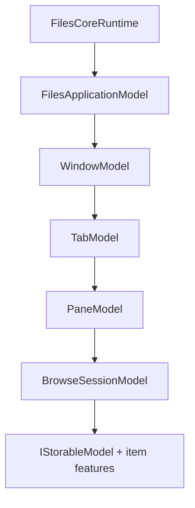

# Files.Core

Files.Core is the UI-independent model, storage, item feature, and application
state foundation for the next Files.App.

## Public entry point

Construct one `FilesCoreRuntime` at process startup:

```csharp
await using var runtime = new FilesCoreBuilder(
		persistedViewSettings,
		thumbnailCache)
	.AddWindowsStorage(
		streamPreviewPolicy: streamPolicy,
		shellPreviewPolicy: shellPolicy)
	.Build();

var window = await runtime.Application.CreateWindowAsync(
	HomeLocation.Instance,
	cancellationToken);
```

The runtime exposes explicit roots for application models, data/source
resolution, storage operations, view settings, thumbnail caching, and Windows
Shell preview sessions.

## Implemented model graph



Implemented areas:

- stable source and item identity with recovery addresses;
- OwlCore.Storage CoreModels wrapped by Files AppModels;
- lazy per-item feature factories, combiners, wrappers, and ownership;
- application, window, tab, split-pane, navigation-history, and browse models;
- home/folder/archive locations plus extensible search/tag location contracts;
- immutable item snapshots, selection, sorting, granular changes, and
  viewport prefetch;
- in-memory and pluggable view settings;
- cached encoded thumbnails, typed properties, and folder changes;
- stream previews and hosted Windows Shell preview sessions;
- Shell-first archive browsing with SevenZip fallback and UI-independent
  credential requests;
- FTP/FTPS sources with credential-free identity, owned remote streams,
  listing properties, and same-source storage operations;
- create, rename, copy, move, delete, collision, and progress contracts;
- one composition root with deterministic asynchronous disposal;
- Windows integration tests, architecture benchmarks, and Core CI.

## Windows vertical slice

`AddWindowsStorage` supplies:

- filesystem and virtual Shell resolution;
- versioned filesystem identity and encoded virtual-item identity;
- managed PIDL locators without exposing COM interfaces;
- parent lookup, bounded folder enumeration, and affine virtual streams;
- message-pumped STA lanes for metadata, extraction, operations, and preview;
- PNG thumbnails, typed Shell properties, and shared folder notifications;
- stream and Shell preview loaders;
- `IFileOperation` create/rename/copy/move/delete.
- Windows Shell archive folders with SevenZipSharp fallback on Windows 10,
  encrypted archives, unsupported Shell formats, and remote streams.

Files.Core targets Windows and owns its source-generated CsWin32 interop. It
does not reference WinUI.

## FTP vertical slice

`AddFtpStorage` supplies one source per saved connection:

- plain FTP, explicit TLS, and implicit TLS profiles;
- credentials supplied separately through `IFtpCredentialResolver`;
- normalized remote identities and credential-free recovery addresses;
- immutable files/folders, parent lookup, and one-listing enumeration;
- data streams that retain and complete their FTP control session;
- listing-backed properties and create/rename/copy/move/permanent-delete;
- automatic reuse of Core stream previews and archive browsing.

SFTP, runtime profile registration, polling changes, remote thumbnail policy,
and cross-source transfer coordination remain separate extension boundaries.

## Boundaries

- WinUI ViewModels, dispatcher adaptation, image decoding, media/document
  rendering, the preview child HWND, activation, drag/drop, and context menus
  belong to Files.App.
- Search/tag behavior needs a selected backend and custom location handler.
- Additional storage sources plug into the same storage, item feature,
  location, and operation contracts.
- Durable settings and window-session serialization are application policy.
- Retired storage projects no longer define competing contracts. The future of
  `Files.Shared` and migration of remaining Files.App consumers are separate
  concerns.

The complete design and Files.App implementation blueprint are in
[`docs/architecture`](../../docs/architecture/README.md).
